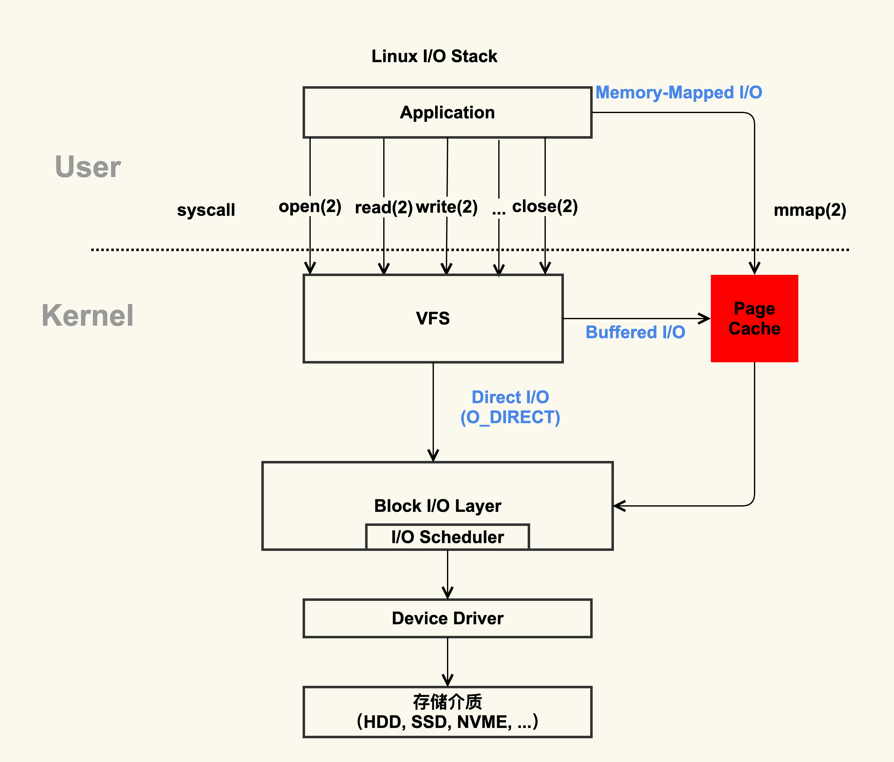
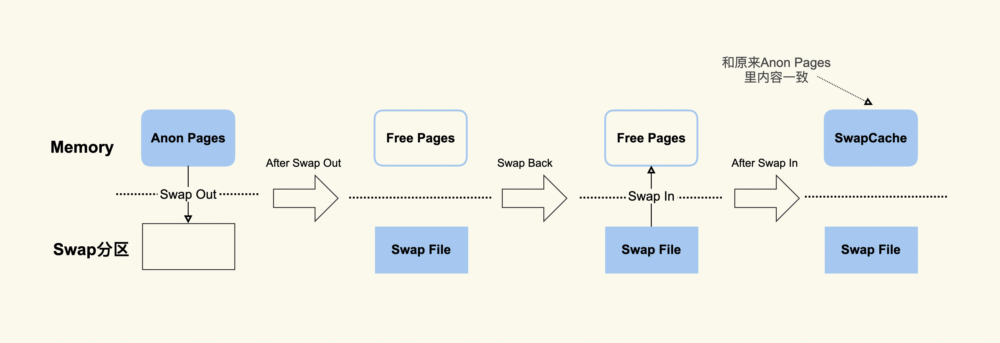
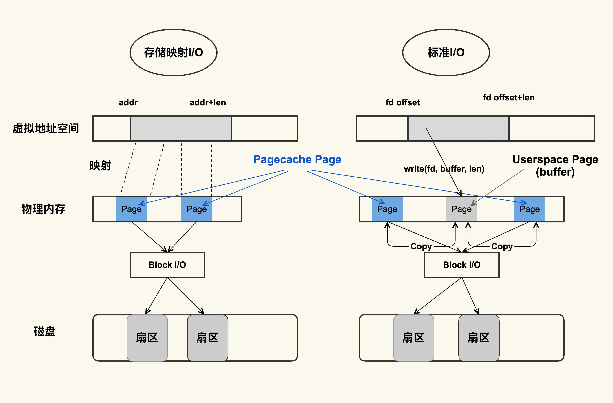
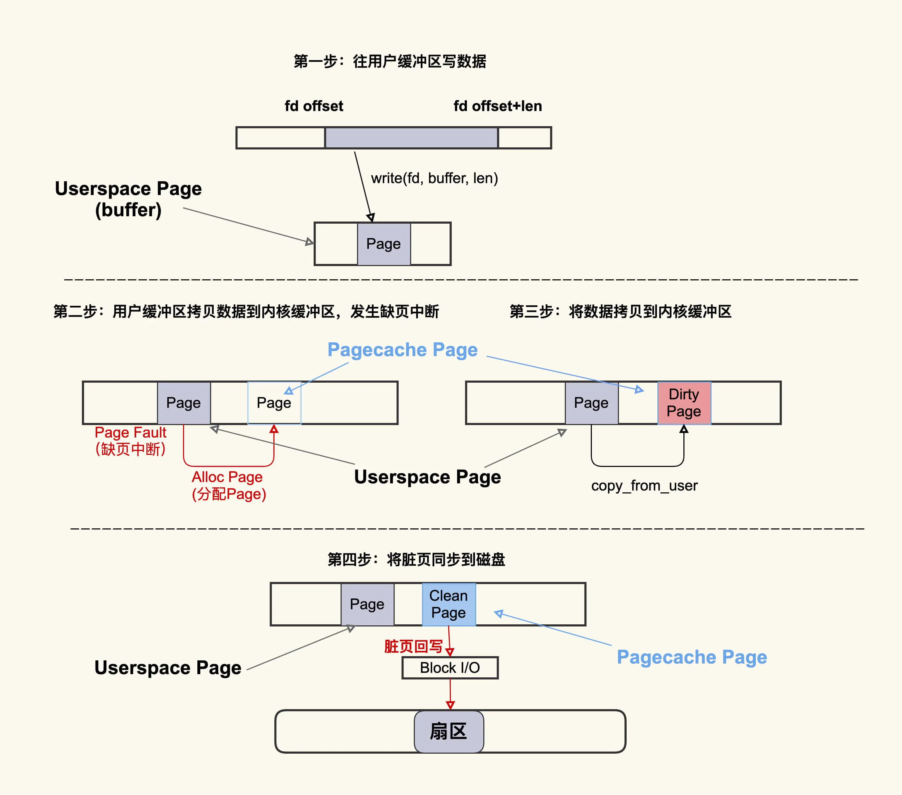
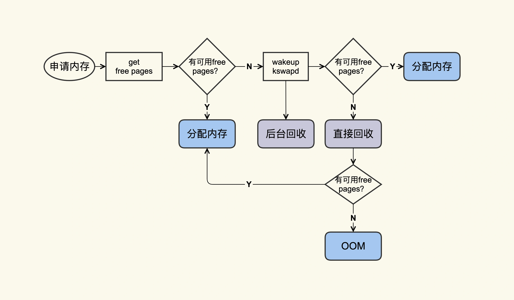
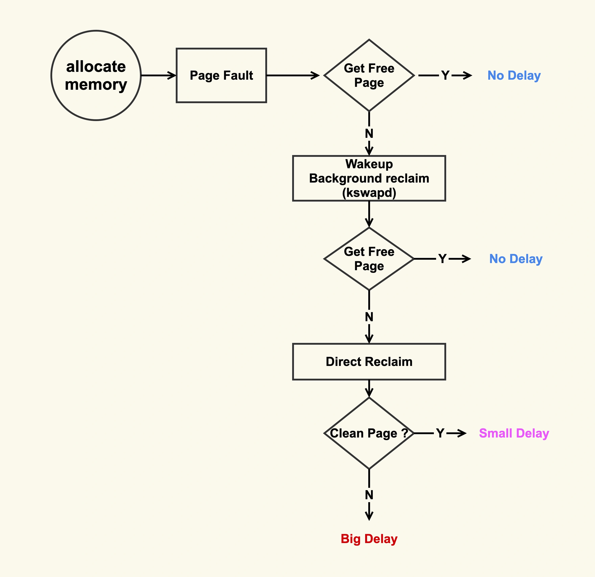
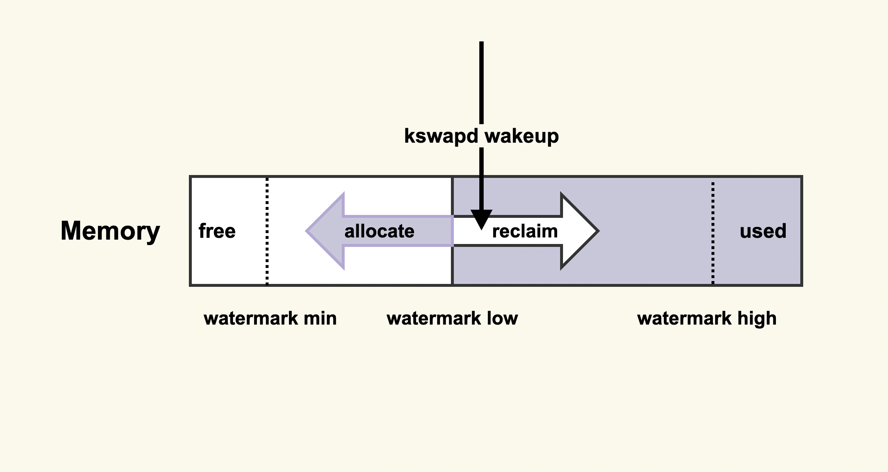
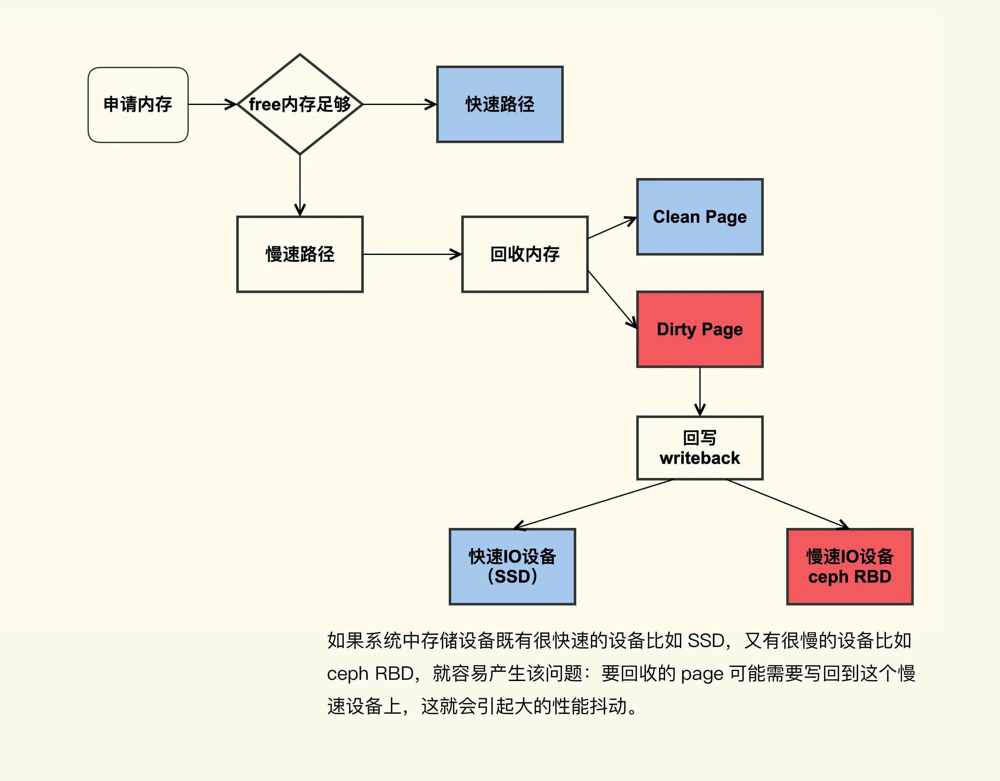
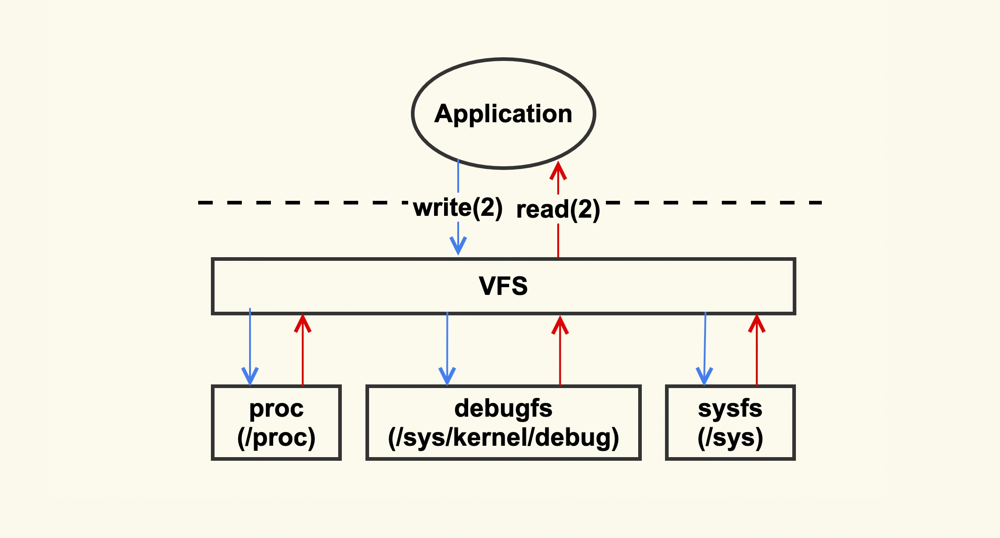

## 观测 PageCache

/proc/meminfo 含义可参考 [Kernel Documentation](https://www.kernel.org/doc/Documentation/filesystems/proc.rst)。

```bash
$ cat /proc/meminfo
...
Buffers:            1224 kB
Cached:           111472 kB
SwapCached:        36364 kB
Active:          6224232 kB
Inactive:         979432 kB
Active(anon):    6173036 kB
Inactive(anon):   927932 kB
Active(file):      51196 kB
Inactive(file):    51500 kB
...
Shmem:             10000 kB
...
SReclaimable:      43532 kB
...
```

Buffers + Cached + SwapCached = Active(file) + Inactive(file) + Shmem + SwapCached

这个等式中两边的内容就是 PageCache。

其中 Active(file) + Inactive(file) 是 File-backend page（与文件对应的内存）。使用 mmap() 内存映射方式和 buffered I/O 来消耗内存就是这部分，生产环境中容易产生问题。

SwapCached 是在打开了 Swap 分区后，把 Inactive(anon)+Active(anon) 这两项里的匿名页给交换到磁盘（swap out），然后在读入到内存(swap in)后分配的内存。由于读入到内存后原来的 Swap File 还在，所以 SwapCached 也可以认为是 File-backed page，即属于 Page Cache。这样做的目的是减少 I/O。



Shmem 是指匿名共享映射这种方式分配的内存（free 命令中 shared 这一项），比如 tmpfs（临时文件系统）。

free 命令[源码](https://gitlab.com/procps-ng/procps/-/blob/master/src/free.c?ref_type=heads)。

根据 procfs 源码里的 [proc/sysinfo.c](https://gitlab.com/procps-ng/procps/-/tree/master)这个文件，可以看到

buff/cache = Buffers + Cached + SReclaimable

其中 SReclaimable 是指可以被回收的内核内存，包括 dentry 和 inode 等。

应用本身消耗内存（RSS）不多的情况下，整个系统的内存使用率还是很高，那不妨去排查下是不是 Shmem(共享内存) 消耗了太多内存导致的。

```bash
$ cat /proc/vmstat | grep -E "dirty|writeback"
nr_dirty 1
nr_writeback 0
nr_writeback_temp 0
nr_dirty_threshold 97059
nr_dirty_background_threshold 3232
```

`nr_` 是 number 的缩写。

- `nr_dirty`：当前脏页，
- `nr_writeback`：当前正在回写（将脏页写入磁盘）的页的数量。页大小为 4KB。

### 测试生成PageCache

生成 1G 文件：
```bash
$ dd if=/dev/zero of=./dd.out bs=4096 count=$((1024*256))
```
然后清空 PageCache
```bash
$ sync && echo 3 | sudo tee /proc/sys/vm/drop_caches
```

第一次读取文件耗时：

```bash
$ time cat ./dd.out &> /dev/null

real    0m7.990s
user    0m0.009s
sys     0m1.355s
```

第二次读取文件耗时：
```bash
$ time cat ./dd.out &> /dev/null

real    0m0.550s
user    0m0.008s
sys     0m0.540s
```

## PageCache 产生

Page Cache 的产生有两种不同的方式：
* Buffered I/O（标准 I/O）；
* Memory-Mapped I/O（存储映射 I/O）。



注意这里面标准 I/O 下读写 `write(2)`/`read(2)` 都会产生内核和用户空间之间互相拷贝，而存储映射 I/O 则不会。



会有两种状态，Dirty/Clean

## PageCache 回收(Page Reclaim)




回收的方式主要是两种：直接回收和后台回收。

观测 Page Cache 直接回收和后台回收：

```bash
$ sar -B 1
Linux 5.15.0-107-generic (iZ2ze5ybozvutjqtoe2zk3Z)      10/01/2024      _x86_64_        (2 CPU)

12:17:33 PM  pgpgin/s pgpgout/s   fault/s  majflt/s  pgfree/s pgscank/s pgscand/s pgsteal/s    %vmeff
12:17:34 PM      0.00     80.00      2.00      0.00      0.00      0.00      0.00      0.00      0.00
12:17:35 PM      0.00      0.00      5.00      0.00      0.00      0.00      0.00      0.00      0.00
12:17:36 PM      0.00      0.00      0.00      0.00      0.00      0.00      0.00      0.00      0.00
12:17:37 PM      0.00      0.00      0.00      0.00      1.00      0.00      0.00      0.00      0.00
^C
Average:         0.00     20.00      1.75      0.00      0.25      0.00      0.00      0.00      0.00
```

## PageCache 引起系统负载升高

大多是有三种情况：
- 直接内存回收引起的 load 飙高；
- 系统中脏页积压过多引起的 load 飙高；
- 系统 NUMA 策略配置不当引起的 load 飙高。

### 直接内存回收引起 load 飙高或者业务时延抖动

直接内存回收是指在进程上下文同步进行内存回收。

直接内存回收是在进程申请内存的过程中同步进行的回收，而这个回收过程可能会消耗很多时间，进而导致进程的后续行为都被迫等待，这样就会造成很长时间的延迟，以及系统的 CPU 利用率会升高，最终引起 load 飙高。



在开始内存回收后，首先进行后台异步回收（上图中蓝色标记的地方），这不会引起进程的延迟；如果后台异步回收跟不上进程内存申请的速度，就会开始同步阻塞回收，导致延迟（上图中红色和粉色标记的地方，这就是引起 load 高的地址）。

解决方案是及早地触发后台回收来避免应用程序进行直接内存回收。

后台回收的原理：当内存水位低于 watermark low 时，就会唤醒 kswapd 进行后台回收，然后 kswapd 会一直回收到 watermark high。


增大 min_free_kbytes 这个配置选项来及早地触发后台回收。
```bash
vm.min_free_kbytes = 4194304
```
对于大于等于 128G 的系统而言，将 `min_free_kbytes` 设置为 4G 比较合理，这是一个经验值，既不造成较多的内存浪费，又能避免掉绝大多数的直接内存回收。该值的设置和总的物理内存并没有一个严格对应的关系，如果配置不当会引起一些副作用，所以在调整该值之前，可以渐进式地增大该值，比如先调整为 1G，观察 `sar -B` 中 `pgscand` 是否还有不为 0 的情况；如果存在不为 0 的情况，继续增加到 2G，再次观察是否还有不为 0 的情况来决定是否增大，以此类推。

注意提高了内存水位后，应用程序可以直接使用的内存量就会减少，这在一定程度上浪费了内存。所以在调整这一项之前，你需要先思考一下，应用程序更加关注什么，如果关注延迟那就适当地增大该值，如果关注内存的使用量那就适当地调小该值。

调整的效果你可以通过 /proc/zoneinfo 来观察， min、low、high 分别对应上图中的三个内存水位。

```bash
$ grep -E "min|low|high" /proc/zoneinfo
        min      105
        low      131
        high     157
              high:  65
              high:  65
        min      11158
        low      13947
        high     16736
              high:  6973
              high:  6973
        min      0
        low      0
        high     0
        min      0
        low      0
        high     0
        min      0
        low      0
        high     0
```

### 系统中脏页过多引起 load 飙高

直接回收过程中，如果存在较多脏页就可能涉及在回收过程中进行回写，这可能会造成非常大的延迟，而且因为这个过程本身是阻塞式的，所以又可能进一步导致系统中处于 D 状态的进程数增多，最终的表现就是系统的 load 值很高。



如果系统中既有快速 I/O 设备，又有慢速 I/O 设备（比如图中的 ceph RBD 设备，或者其他慢速存储设备比如 HDD），直接内存回收过程中遇到了正在往慢速 I/O 设备回写的 page，就可能导致非常大的延迟。

解决方案是控制好系统中积压的脏页数据。

```bash
$ sar -r 1
Linux 5.15.0-107-generic (iZ2ze5ybozvutjqtoe2zk3Z)      10/01/2024      _x86_64_        (2 CPU)

01:10:08 PM kbmemfree   kbavail kbmemused  %memused kbbuffers  kbcached  kbcommit   %commit  kbactive   kbinact   kbdirty
01:10:09 PM     92888   1248424    250716     14.63     22908   1256848    991952     57.90    899648    525432         0
01:10:10 PM     92888   1248424    250716     14.63     22908   1256848    991952     57.90    899648    525432         0
01:10:11 PM     92888   1248424    250716     14.63     22908   1256848    991952     57.90    899648    525432         0
01:10:12 PM     92888   1248424    250716     14.63     22908   1256848    991952     57.90    899648    525432         0
^C
Average:        92888   1248424    250716     14.63     22908   1256848    991952     57.90    899648    525432         0
```

- `kbmemfree`：以千字节为单位的可用内存大小。
- `kbmemused`：以千字节为单位的已使用内存大小。
- `%memused`：已使用内存占总内存的百分比。
- `kbbuffers`：以千字节为单位的缓冲区内存大小。
- `kbcached`：以千字节为单位的缓存内存大小。
- `kbcommit`：以千字节为单位的已提交虚拟内存大小。
- `%commit`：已提交虚拟内存占总内存和交换空间总和的百分比。

kbdirty 就是系统中的脏页大小，它同样也是对 /proc/vmstat 中 nr_dirty 的解析。你可以通过调小如下设置来将系统脏页个数控制在一个合理范围:

```bash
vm.dirty_background_bytes = 0
vm.dirty_background_ratio = 10
vm.dirty_bytes = 0
vm.dirty_expire_centisecs = 3000
vm.dirty_ratio = 20
```

调大这些值会导致脏页的积压，但是同时也可能减少了 I/O 的次数，从而提升单次刷盘的效率；调小这些值可以减少脏页的积压，但是同时也增加了 I/O 的次数，降低了 I/O 的效率。

至于这些值调整大多少比较合适，也是因系统和业务的不同而异，建议一边调整一边观察，将这些值调整到业务可以容忍的程度就可以了，即在调整后需要观察业务的服务质量 (SLA)，要确保 SLA 在可接受范围内。调整的效果你可以通过 `/proc/vmstat` 来查看：

```bash
$ grep "nr_dirty_" /proc/vmstat
nr_dirty_threshold 366998
nr_dirty_background_threshold 183275
```

### 系统 NUMA 策略配置不当引起的 load 飙高

推荐将 zone_reclaim_mode 配置为 0。
```bash
vm.zone_reclaim_mode = 0
```
因为相比内存回收的危害而言，NUMA 带来的性能提升几乎可以忽略，所以配置为 0，利远大于弊。

- `echo 1 > /proc/sys/vm/drop_caches`，释放掉 Page Cache 中的 clean pages (干净页)。
- `echo 2 > /proc/sys/vm/drop_caches`，释放掉 Slab，包括 dentry、inode 等。
- `echo 3 > /proc/sys/vm/drop_caches`，释放 Page Cache，又释放 Slab。

## PageCache 问题定位



- 怀疑 Page Cache 问题，读 /proc/vmstat
- pgscan （Page Cache 的内存回收行为）相关指标变化较大，那就可能是 Page Cache 引起的，意味着系统内存压力很紧张


`/proc/vmstat` 指标：

- Page Cache回收
  - pgscan_kswapd：kswapd后台扫描的Page个数
  - pgsteal_kswapd：kswapd后台回收的Page个数
  - pgscan_direct：进程直接扫描的Page个数
  - pgsteal_direct：进程直接回收的Page个数
- 碎片整理
  - compact_stall：直接碎片整理的次数
  - compact_fail：直接碎片整理失败的次数
  - fail：直接碎片整理成功的次数
- 脏页回写
  - nr_dirty：脏页个数
- drop cache
  - drop_pagecache：执行drop_cache来drop page cache的次数
  - drop_slab：执行drop_cache来drop slab的次
- pginodesteal
  - pginodesteal：直接回收inode过程中回收的page cahe个数
- kswapd_inodesteal
  - kswapd_inodesteal：kswapd后台回收inode过程中回收的page cahe个数
- I/O
  - pgpgin：从磁盘读文件读了多少page到内存
  - pgpgout：内存中多少page被写回磁盘
- SWAP I/O
  - pswpin：从swap分区读了多少page到内存
  - pswpout：内存中多少page被责
- workingset
  - workingset_refault：Page被释放后短时间内再次从磁盘被读入到内存
  - workingset_ Restore：Page被回收前又被检测为活跃Page从而避免被回收

比如说，当我们发现，单位时间内 compact_fail 变化很大时，那往往意味着系统内存碎片很严重，已经很难申请到连续物理内存了，这时你就需要去调整碎片指数或者手动触发内存规整，来减缓因为内存碎片引起的压力了。

有的时候，我们还需要知道是什么东西在进行连续内存的申请，从而来做更加有针对性的调整，这就需要进行进一步的观察了。我们可以利用内核预置的相关 tracepoint 来做更加细致的分析。

- Page Cache回收
  - tracepoint：mm_vmscan_direct_reclaim_begin，mm_vmscan_direct_reclaim_end
  - 解释：直接回收开始/结束
- 碎片整理
  - tracepoint：mm_compaction_begin，mm_compaction_end
  - 解释：碎片整理开始/结束
- 脏页回写
  - tracepoint：writeback_start，writeback_written
  - 解释：回写开始/结束
- 内存节点回收
  - tracepoint：mm_vmscan_node_reclaim_begin，mm_vmscan_node_reclaim_end
  - 解释：内存节点回收开始/结束
- 磁盘I/O
  - tracepoint：block_rq_insert，block_rq_issue，block_bio_complete
  - 解释：块请求插入/发出/结束

以内存规整 (memory compaction) 为例，来看下如何利用 tracepoint 来对它进行观察：

```bash
#首先来使能compcation相关的一些tracepoing
$ echo 1 >
/sys/kernel/debug/tracing/events/compaction/mm_compaction_begin/enable
$ echo 1 >
/sys/kernel/debug/tracing/events/compaction/mm_compaction_end/enable 

#然后来读取信息，当compaction事件触发后就会有信息输出
$ cat /sys/kernel/debug/tracing/trace_pipe
           <...>-49355 [037] .... 1578020.975159: mm_compaction_begin: 
zone_start=0x2080000 migrate_pfn=0x2080000 free_pfn=0x3fe5800 
zone_end=0x4080000, mode=async
           <...>-49355 [037] .N.. 1578020.992136: mm_compaction_end: 
zone_start=0x2080000 migrate_pfn=0x208f420 free_pfn=0x3f4b720 
zone_end=0x4080000, mode=async status=contended
```

我们可以看到是 49355 这个进程触发了 compaction，begin 和 end 这两个 tracepoint 触发的时间戳相减，就可以得到 compaction 给业务带来的延迟，我们可以计算出这一次的延迟为 17ms。

很多时候由于采集的信息量太大，需要借助一些自动化分析的工具来分析。可以参考 Brendan Gregg 基于 bcc(eBPF) 写的 [direct reclaim snoop](https://github.com/iovisor/bcc/blob/master/tools/drsnoop.py) 来观察进程因为 direct reclaim 而导致的延迟。