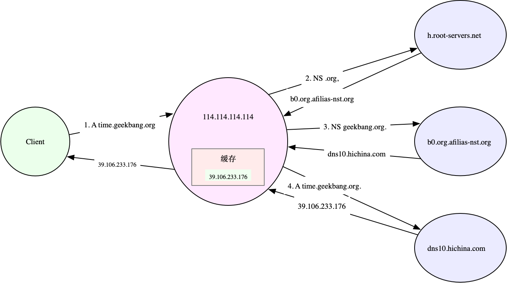

[nslookup 域名结果正确，但是 ping 域名 返回 unknown host](https://plantegg.github.io/2019/01/09/nslookup-OK-but-ping-fail/)

```bash
$ cat /etc/resolv.conf
nameserver 114.114.114.114
```

DNS 服务通过资源记录的方式，来管理所有数据，它支持 A、CNAME、MX、NS、PTR 等多种类型的记录。比如：

* A 记录，用来把域名转换成 IP 地址；
* CNAME 记录，用来创建别名；
* 而 NS 记录，则表示该域名对应的域名服务器地址。


```bash
$ nslookup time.geekbang.org
# 域名服务器及端口信息
Server:    114.114.114.114
Address:  114.114.114.114#53

# 非权威查询结果
Non-authoritative answer:
Name:  time.geekbang.org
Address: 39.106.233.17
```

如果没有命中缓存，DNS 查询实际上是一个递归过程，那有没有方法可以知道整个递归查询的执行呢？

dig ，就提供了 trace 功能，可以展示递归查询的整个过程。比如你可以执行下面的命令，得到查询结果：

```bash
# +trace表示开启跟踪查询
# +nodnssec表示禁止DNS安全扩展
$ dig +trace +nodnssec time.geekbang.org

; <<>> DiG 9.11.3-1ubuntu1.3-Ubuntu <<>> +trace +nodnssec time.geekbang.org
;; global options: +cmd
.      322086  IN  NS  m.root-servers.net.
.      322086  IN  NS  a.root-servers.net.
.      322086  IN  NS  i.root-servers.net.
.      322086  IN  NS  d.root-servers.net.
.      322086  IN  NS  g.root-servers.net.
.      322086  IN  NS  l.root-servers.net.
.      322086  IN  NS  c.root-servers.net.
.      322086  IN  NS  b.root-servers.net.
.      322086  IN  NS  h.root-servers.net.
.      322086  IN  NS  e.root-servers.net.
.      322086  IN  NS  k.root-servers.net.
.      322086  IN  NS  j.root-servers.net.
.      322086  IN  NS  f.root-servers.net.
;; Received 239 bytes from 114.114.114.114#53(114.114.114.114) in 1340 ms

org.      172800  IN  NS  a0.org.afilias-nst.info.
org.      172800  IN  NS  a2.org.afilias-nst.info.
org.      172800  IN  NS  b0.org.afilias-nst.org.
org.      172800  IN  NS  b2.org.afilias-nst.org.
org.      172800  IN  NS  c0.org.afilias-nst.info.
org.      172800  IN  NS  d0.org.afilias-nst.org.
;; Received 448 bytes from 198.97.190.53#53(h.root-servers.net) in 708 ms

geekbang.org.    86400  IN  NS  dns9.hichina.com.
geekbang.org.    86400  IN  NS  dns10.hichina.com.
;; Received 96 bytes from 199.19.54.1#53(b0.org.afilias-nst.org) in 1833 ms

time.geekbang.org.  600  IN  A  39.106.233.176
;; Received 62 bytes from 140.205.41.16#53(dns10.hichina.com) in 4 ms
```

dig trace 的输出，主要包括四部分。

- 第一部分，是从 114.114.114.114 查到的一些根域名服务器（.）的 NS 记录。
- 第二部分，是从 NS 记录结果中选一个（h.root-servers.net），并查询顶级域名 org. 的 NS 记录。
- 第三部分，是从 org. 的 NS 记录中选择一个（b0.org.afilias-nst.org），并查询二级域名 geekbang.org. 的 NS 服务器。
- 最后一部分，就是从 geekbang.org. 的 NS 服务器（dns10.hichina.com）查询最终主机 time.geekbang.org. 的 A 记录。

这个输出里展示的各级域名的 NS 记录，其实就是各级域名服务器的地址。



当然，不仅仅是发布到互联网的服务需要域名，很多时候，我们也希望能对局域网内部的主机进行域名解析（即内网域名，大多数情况下为主机名）。Linux 也支持这种行为。

你可以把主机名和 IP 地址的映射关系，写入本机的 /etc/hosts 文件中。这样，指定的主机名就可以在本地直接找到目标 IP。比如，你可以执行下面的命令来操作：

```bash
$ cat /etc/hosts
127.0.0.1   localhost localhost.localdomain
::1         localhost6 localhost6.localdomain6
192.168.0.100 domain.com
```

还可以在内网中，搭建自定义的 DNS 服务器，专门用来解析内网中的域名。而内网 DNS 服务器，一般还会设置一个或多个上游 DNS 服务器，用来解析外网的域名。

## 常见优化方法

- 对 DNS 解析的结果进行缓存。缓存是最有效的方法，但要注意，一旦缓存过期，还是要去 DNS 服务器重新获取新记录。不过，这对大部分应用程序来说都是可接受的。
- 对 DNS 解析的结果进行预取。这是浏览器等 Web 应用中最常用的方法，也就是说，不等用户点击页面上的超链接，浏览器就会在后台自动解析域名，并把结果缓存起来。
- 使用 HTTPDNS 取代常规的 DNS 解析。这是很多移动应用会选择的方法，特别是如今域名劫持普遍存在，使用 HTTP 协议绕过链路中的 DNS 服务器，就可以避免域名劫持的问题。
- 基于 DNS 的全局负载均衡（GSLB）。这不仅为服务提供了负载均衡和高可用的功能，还可以根据用户的位置，返回距离最近的 IP 地址。

## 案例

```bash
$ docker pull feisky/dnsutils
Using default tag: latest
...
Status: Downloaded newer image for feisky/dnsutils:latest

$ cat /etc/resolv.conf
nameserver 114.114.114.114
```

### DNS 解析失败

```bash
# 进入案例环境的SHELL终端中
$ docker run -it --rm -v $(mktemp):/etc/resolv.conf feisky/dnsutils bash
root@7e9ed6ed4974:/#
```

续在容器终端中，执行 DNS 查询命令，我们还是查询 time.geekbang.org 的 IP 地址：

```bash
/# nslookup time.geekbang.org
;; connection timed out; no servers could be reached
```

网络不通了？我们用 ping 工具检查试试。执行下面的命令，就可以测试本地到 114.114.114.114 的连通性：

```bash
/# ping -c3 114.114.114.114
PING 114.114.114.114 (114.114.114.114): 56 data bytes
64 bytes from 114.114.114.114: icmp_seq=0 ttl=56 time=31.116 ms
64 bytes from 114.114.114.114: icmp_seq=1 ttl=60 time=31.245 ms
64 bytes from 114.114.114.114: icmp_seq=2 ttl=68 time=31.128 ms
--- 114.114.114.114 ping statistics ---
3 packets transmitted, 3 packets received, 0% packet loss
round-trip min/avg/max/stddev = 31.116/31.163/31.245/0.058 ms
```

这个输出中，你可以看到网络是通的。那要怎么知道 nslookup 命令失败的原因呢？这里其实有很多方法，最简单的一种，就是开启 nslookup 的调试输出，查看查询过程中的详细步骤，排查其中是否有异常。

```bash
/# nslookup -debug time.geekbang.org
;; Connection to 127.0.0.1#53(127.0.0.1) for time.geekbang.org failed: connection refused.
;; Connection to ::1#53(::1) for time.geekbang.org failed: address not available.
```

这次的输出可以看到，nslookup 连接环回地址（127.0.0.1 和 ::1）的 53 端口失败。这里就有问题了，为什么会去连接环回地址，而不是我们的先前看到的 114.114.114.114 呢？

有可能是因为容器中没有配置 DNS 服务器

```bash
/# cat /etc/resolv.conf # 没有输出
```

在 /etc/resolv.conf 文件中，配置上 DNS 服务器

```bash
/# echo "nameserver 114.114.114.114" > /etc/resolv.conf
/# nslookup time.geekbang.org
Server:    114.114.114.114
Address:  114.114.114.114#53

Non-authoritative answer:
Name:  time.geekbang.org
Address: 39.106.233.176
```

### DNS 解析不稳定

```bash
$ docker run -it --rm --cap-add=NET_ADMIN --dns 8.8.8.8 feisky/dnsutils bash
root@0cd3ee0c8ecb:/#
```

```bash
/# time nslookup time.geekbang.org
Server:    8.8.8.8
Address:  8.8.8.8#53

Non-authoritative answer:
Name:  time.geekbang.org
Address: 39.106.233.176

real  0m10.349s
user  0m0.004s
sys  0m0.0
```

这次解析非常慢，居然用了 10 秒。如果你多次运行上面的 nslookup 命令，可能偶尔还会碰到下面这种错误：

```bash
/# time nslookup time.geekbang.org
;; connection timed out; no servers could be reached

real  0m15.011s
user  0m0.006s
sys  0m0.006s
```

我们知道，DNS 解析，说白了就是客户端与服务器交互的过程，并且这个过程还使用了 UDP 协议。

对于整个流程来说，解析结果不稳定，就有很多种可能的情况了。比方说：

- DNS 服务器本身有问题，响应慢并且不稳定；
- 或者是，客户端到 DNS 服务器的网络延迟比较大；
- 或者是，DNS 请求或者响应包，在某些情况下被链路中的网络设备弄丢了。

现在客户端连接的 DNS 是 8.8.8.8，这是 Google 提供的 DNS 服务。对 Google 我们还是比较放心的，DNS 服务器出问题的概率应该比较小。基本排除了 DNS 服务器的问题，那是不是第二种可能，本机到 DNS 服务器的延迟比较大呢？

```bash
/# ping -c3 8.8.8.8
PING 8.8.8.8 (8.8.8.8): 56 data bytes
64 bytes from 8.8.8.8: icmp_seq=0 ttl=31 time=137.637 ms
64 bytes from 8.8.8.8: icmp_seq=1 ttl=31 time=144.743 ms
64 bytes from 8.8.8.8: icmp_seq=2 ttl=31 time=138.576 ms
--- 8.8.8.8 ping statistics ---
3 packets transmitted, 3 packets received, 0% packet loss
round-trip min/avg/max/stddev = 137.637/140.319/144.743/3.152 ms
```

从 ping 的输出可以看到，这里的延迟已经达到了 140ms，这也就可以解释，为什么解析这么慢了。实际上，如果你多次运行上面的 ping 测试，还会看到偶尔出现的丢包现象。

```bash
$ ping -c3 8.8.8.8
PING 8.8.8.8 (8.8.8.8): 56 data bytes
64 bytes from 8.8.8.8: icmp_seq=0 ttl=30 time=134.032 ms
64 bytes from 8.8.8.8: icmp_seq=1 ttl=30 time=431.458 ms
--- 8.8.8.8 ping statistics ---
3 packets transmitted, 2 packets received, 33% packet loss
round-trip min/avg/max/stddev = 134.032/282.745/431.458/148.713 ms
```

这也进一步解释了，为什么 nslookup 偶尔会失败，正是网络链路中的丢包导致的。

既然延迟太大，那就换一个延迟更小的 DNS 服务器，比如电信提供的 114.114.114.114。

配置之前，我们可以先用 ping 测试看看，它的延迟是不是真的比 8.8.8.8 好。执行下面的命令，你就可以看到，它的延迟只有 31ms：

```bash
/# ping -c3 114.114.114.114
PING 114.114.114.114 (114.114.114.114): 56 data bytes
64 bytes from 114.114.114.114: icmp_seq=0 ttl=67 time=31.130 ms
64 bytes from 114.114.114.114: icmp_seq=1 ttl=56 time=31.302 ms
64 bytes from 114.114.114.114: icmp_seq=2 ttl=56 time=31.250 ms
--- 114.114.114.114 ping statistics ---
3 packets transmitted, 3 packets received, 0% packet loss
round-trip min/avg/max/stddev = 31.130/31.227/31.302/0.072 ms
```

更换 DNS 服务器，然后，再次执行 nslookup 解析命令：

```bash
/# echo nameserver 114.114.114.114 > /etc/resolv.conf
/# time nslookup time.geekbang.org
Server:    114.114.114.114
Address:  114.114.114.114#53

Non-authoritative answer:
Name:  time.geekbang.org
Address: 39.106.233.176

real    0m0.064s
user    0m0.007s
sys     0m0.006s
```

现在只需要 64ms 就可以完成解析，比刚才的 10s 要好很多。

不过，如果你多次运行 nslookup 命令，估计就不是每次都有好结果了。比如，在我的机器中，就经常需要 1s 甚至更多的时间。

```bash
/# time nslookup time.geekbang.org
Server:    114.114.114.114
Address:  114.114.114.114#53

Non-authoritative answer:
Name:  time.geekbang.org
Address: 39.106.233.176

real  0m1.045s
user  0m0.007s
sys  0m0.004s
```

1s 的 DNS 解析时间还是太长了，对很多应用来说也是不可接受的。那么，该怎么解决这个问题呢？我想你一定已经想到了，那就是使用 DNS 缓存。这样，只有第一次查询时需要去 DNS 服务器请求，以后的查询，只要 DNS 记录不过期，使用缓存中的记录就可以了。

不过要注意，我们使用的主流 Linux 发行版，除了最新版本的 Ubuntu （如 18.04 或者更新版本）外，其他版本并没有自动配置 DNS 缓存。

想要为系统开启 DNS 缓存，就需要你做额外的配置。比如，最简单的方法，就是使用 dnsmasq。

dnsmasq 是最常用的 DNS 缓存服务之一，还经常作为 DHCP 服务来使用。它的安装和配置都比较简单，性能也可以满足绝大多数应用程序对 DNS 缓存的需求。

在刚才的容器终端中，执行下面的命令，就可以启动 dnsmasq：

```bash
/# /etc/init.d/dnsmasq start
 * Starting DNS forwarder and DHCP server dnsmasq                    [ OK ]
```

然后，修改 /etc/resolv.conf，将 DNS 服务器改为 dnsmasq 的监听地址，这儿是 127.0.0.1。接着，重新执行多次 nslookup 命令：

```bash
/# echo nameserver 127.0.0.1 > /etc/resolv.conf
/# time nslookup time.geekbang.org
Server:    127.0.0.1
Address:  127.0.0.1#53

Non-authoritative answer:
Name:  time.geekbang.org
Address: 39.106.233.176

real  0m0.492s
user  0m0.007s
sys  0m0.006s

/# time nslookup time.geekbang.org
Server:    127.0.0.1
Address:  127.0.0.1#53

Non-authoritative answer:
Name:  time.geekbang.org
Address: 39.106.233.176

real  0m0.011s
user  0m0.008s
sys  0m0.003s
```

现在我们可以看到，只有第一次的解析很慢，需要 0.5s，以后的每次解析都很快，只需要 11ms。并且，后面每次 DNS 解析需要的时间也都很稳定。

