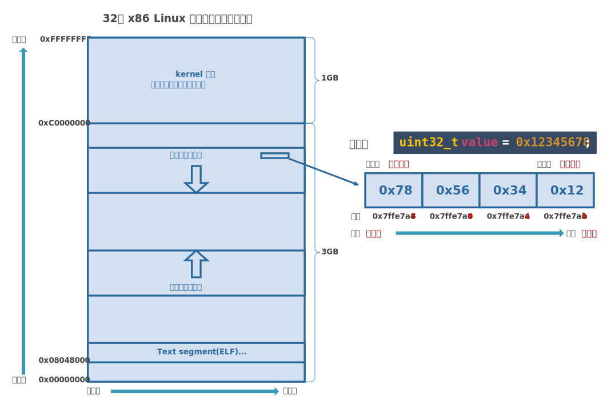

## 网络字节序、主机字节序

### 小端字节序

**小端字节序**指整数中**低位字节**存储在内存的**低地址**，**大端字节序**反之。



**网络字节序**是大端字节序，**主机字节序**是小端字节序。小端字节序将整数中每个字节反过来，看似反人类，但是也有不少好处。例如将较小的数据类型向较大的数据类型转换时不需要额外拷贝（当然不保证新类型高位字节值正确）。

import Foldable from '@site/src/components/Foldable';

<Foldable title='测试机器字节序' defaultOpen={true} >
```c
#include <stdbool.h>
#include <stdint.h>
#include <stdio.h>

bool isLittleEnd() {
    uint32_t value = 0x12345678;
    char *arr = (char *)&value;
    return arr[0] == 0x78;
}

int main() {
    uint32_t value = 0x12345678;
    char *arr = (char *)&value;
    printf("addr[0] %p：%x\n", arr, arr[0]);     // addr[0] 0x7fff088dbd2c：78
    printf("addr[1] %p：%x\n", arr + 1, arr[1]); // addr[1] 0x7fff088dbd2d：56
    printf("addr[2] %p：%x\n", arr + 2, arr[2]); // addr[2] 0x7fff088dbd2e：34
    printf("addr[3] %p：%x\n", arr + 3, arr[3]); // addr[3] 0x7fff088dbd2f：12

    printf("isLittleEnd：%d\n", isLittleEnd()); // isLittleEnd：1
    return 0;
}
```
</Foldable>

### 字节序转换

小端机通过网络发送整数值时，需要先将小端字节序转换为网络字节序。不过一般只需要转换整形的 IP 和端口号即可，buffer 都是按从左到右顺序表示的，不需要额外转换。

```c title="arpa/inet.h"
// 将主机字节序的 16 位或 32 位整数转换为网络字节序（大端序）
uint32_t htonl(uint32_t hostlong); // 用于 32 位 IP 地址转换
uint16_t htons(uint16_t hostshort);  // 用于 16 位端口号转换

// 网络字节序的 16 位或 32 位整数转换为主机字节序
uint32_t ntohl(uint32_t netlong); // 用于 32 位 IP 地址转换
uint16_t ntohs(uint16_t netshort); // 用于 16 位端口号转换
```

示例：
```c
#include <arpa/inet.h>
#include <stdio.h>

int main() {
    {
        uint16_t port = htons(80);  // 主机字节序到网络字节序
        uint32_t ip = htonl(0xC0A80101);  // 192.168.1.1 in hex
        printf("port：0x%x, ip：0x%x\n", port, ip); // port：0x5000, ip：0x101a8c0
    }

    {
        uint16_t port = ntohs(0x5000);  // 网络字节序到主机字节序（8080）
        uint32_t ip = ntohl(0x101A8C0);  // 网络字节序转换为 192.168.1.1
        printf("port：%u, ip：0x%x\n", port, ip); // port：80, ip：0xc0a80101
    }
    
    uint32_t v = 0x12345678;
    printf("host to net long, htonl(0x%x)：0x%x\n", v, htonl(v)); // htonl(0x12345678)：0x78563412

    uint16_t v2 = 0x1234;
    printf("htons, host to net short(0x%x)：0x%x\n", v2, htons(v2)); // htons(0x1234)：0x3412

    uint32_t v3 = 0x12345678;
    printf("ntohl, net to host long(0x%x)：0x%x\n", v3, ntohl(v3)); // ntohl(0x12345678)：0x78563412
    
    uint16_t v4 = 0x1234;
    printf("ntohl, net to host short(0x%x)：0x%x\n", v4, ntohs(v4)); // ntohl(0x1234)：0x3412
    return 0;
}
```

## IP 转换函数

### 字符串 ==> 整数（网络字节序）

```c title="arpa/inet.h"
int inet_pton(int af, const char *src, void *dst);
```

* `af`：地址族，`AF_INET` 表示 IPv4，`AF_INET6` 表示 IPv6。
* `src`：字符串形式的 IP 地址，如 "192.168.1.1"（IPv4）或 "2001:db8::1"（IPv6）。
* `dst`：指向存储结果的缓冲区，通常是 `struct in_addr`（IPv4）或 `struct in6_addr`（IPv6）。注意转换成的值是网络字节序。
* 返回值：成功返回 1，输入无效返回 0，出错返回 -1。

示例：
```c
struct in_addr addr;
inet_pton(AF_INET, "192.168.1.1", &addr);
```

### 整数（网络字节序） ==> 字符串

```c title="arpa/inet.h"
const char *inet_ntop(int af, const void *src, char *dst, socklen_t size);
```

* `af`：地址族，`AF_INET` 表示 IPv4，`AF_INET6` 表示 IPv6。
* `src`：二进制形式的 IP 地址，通常是 `struct in_addr`（IPv4）或 `struct in6_addr`（IPv6）。
* `dst`：存储转换后的字符串的缓冲区。
* `size`：缓冲区的大小。在头文件 **arpa/inet.h** 定义了长度：
  * `#define INET_ADDRSTRLEN 16`
  * `#define INET6_ADDRSTRLEN 46`
* 返回值：成功返回指向 `dst` 的指针，出错返回 `NULL`。

示例：
```c
char str[INET_ADDRSTRLEN];  // INET_ADDRSTRLEN is typically 16 for IPv4
inet_ntop(AF_INET, &addr, str, INET_ADDRSTRLEN);
```

### 字符串 ==> in_addr（网络字节序）

```c title="arpa/inet.h"
int inet_aton(const char *cp, struct in_addr *inp);
```

* `cp`: 字符串形式的 IPv4 地址。
* `inp`: 指向 `struct in_addr`，用于存储结果。
* 返回值: 成功返回非零值，输入无效返回 0。

示例：

```c
struct in_addr addr;
inet_aton("192.168.1.1", &addr);
```

### in_addr（网络字节序）==> 字符串

```c title="arpa/inet.h"
char *inet_ntoa(struct in_addr in);
```

注意该函数不可重入。

* `in`: `struct in_addr`，包含二进制形式的 IPv4 地址。
* 返回值: 返回转换后的 IPv4 地址字符串的指针，静态缓冲区，可能会被后续调用覆盖。

示例：

```c
struct in_addr addr;
addr.s_addr = htonl(0xC0A80101);  // 192.168.1.1 in hex
char *ip = inet_ntoa(addr);
addr.s_addr = htonl(0xC0A80102);  // 192.168.1.2 in hex
char *ip2 = inet_ntoa(addr);
printf("ip : %s\n", ip);  // ip : 192.168.1.2，
printf("ip2: %s\n", ip2); // ip2: 192.168.1.2
```

## 通用 socket 地址

### sockaddr

结构体 `socketaddr` 用来表示 socket 地址：

```c title="sys/socket.h"
struct sockaddr {
    sa_family_t sa_family;
    char sa_data[14];
}
```

#### sa_family

字段 `sa_family` 表示地址族类型，地址族类型通常与协议族类型对应，常见协议族（protocol family，也称 domain）和地址族如下：

|协议族（protocol family）|地址族（addr family）|描述|
|:-:|:-:|:-:|
|**PF_UNIX**|**AF_UNIX**| Unix 本地域协议族|
|**PF_INET**|**AF_INET**| TCP/IPv4 协议族|
|**PF_INET6**|**AF_INET6**| TCP/IPv6 协议族|

宏 **PF_\*** 和 **AF_\*** 都定义在 **sys/socket.h** 中，两者值完全相等，所以经常混用。

#### sa_data

字段 `sa_data` 用来存放 socket 地址，不同协议族的地址值是不同的：

|协议族（protocol family）|描述|
|:-:|:-:|
|**PF_UNIX**|文件的路径名，长度可达 108 字节|
|**PF_INET**|16 位端口号和 32 位 IPv4 地址，共 6 字节|
|**PF_INET6**|16 位端口号，32 位流标识，128 位 IPv6 地址，32 位范围 ID，共 26 字节|

### sockaddr_storage

14 字节的 `sa_data` 无法完全容纳多数协议族的地址值，所以 Linux 定义了新的通用 socket 地址结构体 `sockaddr_storage`：

```c title="sys/socket.h"
struct sockaddr_storage {
    sa_family_t sa_family;
    unsigned long int __ss_align;
    char __ss_padding[128-sizeof(__ss_align)];
}
```

## 专用 socket 地址

通用 socket 地址非常难用，所以各个协议族又有专门的 socket 地址结构体。

### sockaddr_un

Unix 本地域协议族的专用 socket 地址结构体定义：

```c title="sys/un.h"
struct sockaddr_un {
    sa_family_t sun_family; // 地址族，一般为 AF_UNIX 或 AF_LOCAL
    char sun_path[108];     // 文件路径，表示 socket 文件的位置
};
```

### sockaddr_in

IPv4 的专用 socket 地址结构体定义：

```c title="netinet/in.h"
struct sockaddr_in {
    sa_family_t    sin_family;  // 地址族，必须设置为 AF_INET (IPv4)
    uint16_t       sin_port;    // 16 位端口号（网络字节序）
    struct in_addr sin_addr;    // 32 位 IPv4 地址（网络字节序）
};

// IPv4 地址结构
struct in_addr {
    uint32_t s_addr;  // 32 位 IPv4 地址（网络字节序）
};
```

### sockaddr_in6

IPv6 的专用 socket 地址结构体定义：

```c title="netinet/in.h"
struct sockaddr_in6 {
    sa_family_t     sin6_family;   // 地址族，必须设置为 AF_INET6 (IPv6)
    uint16_t        sin6_port;     // 16 位端口号（网络字节序）
    uint32_t        sin6_flowinfo; // IPv6 流标识（通常为 0）
    struct in6_addr sin6_addr;     // 128 位 IPv6 地址
    uint32_t        sin6_scope_id; // 标识作用域的接口，通常用于 link-local 地址
};

// IPv6 地址结构体
struct in6_addr {
    unsigned char s6_addr[16];     // 128 位 IPv6 地址
};
```

所有专用的 socket 地址在实际使用时都需要转换成 `sockaddr` 才行，因为所有 socket 编程接口使用的地址参数类型都是 `sockaddr`。

## host 和 ip 转换

### host ==> ip

```c title="netdb.h"
int getaddrinfo(const char *node, const char *service, const struct addrinfo *hints, struct addrinfo **res);
int getnameinfo(const struct sockaddr *sa, socklen_t salen, char *host, size_t hostlen, char *serv,
    size_t servlen, int flags);
```

其中 `struct addrinfo` 结构体定义如下：
```c title="netdb.h"
struct addrinfo {
    int              ai_flags;      // 指定选项
    int              ai_family;     // 地址族（AF_INET、AF_INET6 等）
    int              ai_socktype;   // 套接字类型（SOCK_STREAM、SOCK_DGRAM 等）
    int              ai_protocol;   // 协议类型（通常为 0 表示任意协议）
    socklen_t        ai_addrlen;    // 地址结构体的长度
    struct sockaddr *ai_addr;       // 套接字地址
    char            *ai_canonname;  // 主机的规范名称
    struct addrinfo *ai_next;       // 下一个 addrinfo 结构的指针
};
```

示例：

```c
struct addrinfo hints, *res;
memset(&hints, 0, sizeof(hints));
hints.ai_family = AF_INET;  // IPv4
hints.ai_socktype = SOCK_STREAM;
getaddrinfo("www.baidu.com", "80", &hints, &res);

char host[NI_MAXHOST];
getnameinfo(res->ai_addr, res->ai_addrlen, host, sizeof(host), NULL, 0, NI_NUMERICHOST);
```