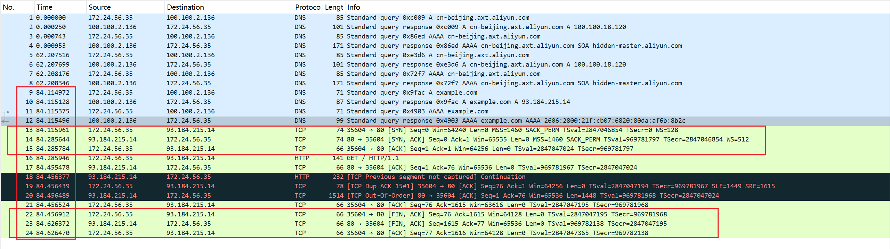

tcpdump 基于 [libpcap](https://www.tcpdump.org/)，利用内核中的 `AF_PACKET` 套接字，抓取网络接口中传输的网络包；并提供了强大的过滤规则，帮你从大量的网络包中，挑出最想关注的信息。

tcpdump 为你展示了每个网络包的详细细节，这就要求，在使用前，你必须要对网络协议有基本了解。而要了解网络协议的详细设计和实现细节， [RFC](https://www.rfc-editor.org/rfc-index.html) 当然是最权威的资料。

## 用法

```bash
tcpdump [选项] [过滤表达式]
```

查看 tcpdump 的[手册](https://www.tcpdump.org/manpages/tcpdump.1.html) ，以及 [pcap-filter](https://www.tcpdump.org/manpages/pcap-filter.7.html) 的手册，你会发现，tcpdump 提供了大量的选项以及各式各样的过滤表达式。

### tcpdump 常用选项

- `-i`：`tcpdump -i eth0`，指定网络接口，默认是 0 号接口（如 eth0），any 表示所有接口。
- `-nn`：`tcpdump -nn`，不解析 IP 地址和端口号的名称。
- `-c`：`tcpdump -c 5`，限制要抓取网络包的个数。
- `-A`：`tcpdump -A`，以 ASCII 格式显示网络包内容（不指定时只显示头部信息）。
- `-w`：`tcpdump -w file.pcap`，保存到文件中，文件名通常以 .pcap 为后缀。
- `-e`：`tcpdump -e`，输出链路层的头部信息。

### tcpdump 常用过滤表达式

- 主机过滤：`host`、`src host`、`dst host`
  - `tcpdump -nn host 35.190.27.188`
  - `tcpdump -nn src host 192.168.1.1`
- 网络过滤：`net`、`src net`、`dst net`
  - `tcpdump -nn net 192.168.0.0`
- 端口过滤：`port`、`portrange`、`src port`、`dst port`
  - `tcpdump -nn dst port 80`
  - `tcpdump -nn portrange 1024-2048`
- 协议过滤：`ip`、`ip6`、`arp`、`tcp`、`udp`、`icmp`
  - `tcpdump -nn tcp`
- 逻辑表达式：`and`、`or`、`not`
  - `tcpdump -nn icmp or udp`
  - `tcpdump -nn tcp and port 80`
  - `tcpdump -nn not port 22`
- 特定状态的 TCP 包：`tcp[tcpflags]`
  - `tcpdump -nn "tcp[tcpflags] & tcp-syn != 0"`
  - `tcpdump -nn "tcp[tcpflags] & tcp-ack != 0"`
  - `tcpdump -nn "tcp[tcpflags] & tcp-rst != 0"`

### tcpdump 输出格式

```bash
时间戳 协议 源地址.源端口 > 目的地址.目的端口 网络包详细信息
```

络包的详细信息取决于协议，不同协议展示的格式也不同。更详细的使用方法，还是去查询 tcpdump 的 [man 手册](https://www.tcpdump.org/manpages/tcpdump.1.html)。

根据 IP 地址反查域名、根据端口号反查协议名称，是很多网络工具默认的行为，而这往往会导致性能工具的工作缓慢。所以，通常，网络性能工具都会提供一个选项（比如 -n 或者 -nn），来禁止名称解析。


## Wireshark

tcpdump 可以用 `-w` 参数保存 .pcap 文件，然后倒入到 Wireshark 中。

```bash
# 保存 .pcap 文件
$ tcpdump -nn udp port 53 or host 35.190.27.188 -w ping.pcap
$ scp host-ip/path/ping.pcap .
```

## 案例 1

执行下面的命令，再试一下 ping

```bash
# 禁止接收从DNS服务器发送过来并包含googleusercontent的包
$ iptables -I INPUT -p udp --sport 53 -m string --string googleusercontent --algo bm -j DROP
```

```bash
# ping 3 次（默认每次发送间隔1秒）
# 假设DNS服务器还是上一期配置的114.114.114.114
$ ping -c3 geektime.org
PING geektime.org (35.190.27.188) 56(84) bytes of data.
64 bytes from 35.190.27.188 (35.190.27.188): icmp_seq=1 ttl=109 time=188 ms
64 bytes from 35.190.27.188 (35.190.27.188): icmp_seq=2 ttl=109 time=199 ms
64 bytes from 35.190.27.188: icmp_seq=3 ttl=109 time=189 ms

--- geektime.org ping statistics ---
3 packets transmitted, 3 received, 0% packet loss, time 12400ms
rtt min/avg/max/mdev = 188.389/192.151/199.190/4.980 ms
```

根据 ping 的输出，你可以发现，geektime.org 解析后的 IP 地址是 35.190.27.188，而后三次 ping 请求都得到了响应，延迟（RTT）都是 30ms 多一点。

但汇总的地方，就有点儿意思了。3 次发送，收到 3 次响应，没有丢包，但三次发送和接受的总时间居然超过了 12s（12400ms）。

可能是 DNS 解析延迟导致的吗？看 ping 的输出，三次 ping 请求中，用的都是 IP 地址，说明 ping 只需要在最开始运行时，解析一次得到 IP，后面就可以只用 IP 了。

```bash
$ time nslookup geektime.org
Server:    114.114.114.114
Address:  114.114.114.114#53

Non-authoritative answer:
Name:  geektime.org
Address: 35.190.27.188


real  0m0.044s
user  0m0.006s
sys  0m0.003s
```

可以看到，域名解析还是很快的，只需要 44ms，显然比 12s 短了很多。

这时候就可以用 tcpdump 抓包，查看 ping 在收发哪些网络包。

```bash
$ tcpdump -nn udp port 53 or host 35.190.27.188
```

- `-nn` ，表示不解析抓包中的域名（即不反向解析）、协议以及端口号。
- `udp port 53` ，表示只显示 UDP 协议的端口号（包括源端口和目的端口）为 53 的包。
- `host 35.190.27.188` ，表示只显示 IP 地址（包括源地址和目的地址）为 35.190.27.188 的包。
- 这两个过滤条件中间的“ or ”，表示或的关系，也就是说，只要满足上面两个条件中的任一个，就可以展示出来。


```bash
$ ping -c3 geektime.org
...
--- geektime.org ping statistics ---
3 packets transmitted, 3 received, 0% packet loss, time 11095ms
rtt min/avg/max/mdev = 81.473/81.572/81.757/0.130 ms
```

查看 tcpdump 的输出：

```bash
tcpdump: verbose output suppressed, use -v or -vv for full protocol decode
listening on eth0, link-type EN10MB (Ethernet), capture size 262144 bytes
14:02:31.100564 IP 172.16.3.4.56669 > 114.114.114.114.53: 36909+ A? geektime.org. (30)
14:02:31.507699 IP 114.114.114.114.53 > 172.16.3.4.56669: 36909 1/0/0 A 35.190.27.188 (46)
14:02:31.508164 IP 172.16.3.4 > 35.190.27.188: ICMP echo request, id 4356, seq 1, length 64
14:02:31.539667 IP 35.190.27.188 > 172.16.3.4: ICMP echo reply, id 4356, seq 1, length 64
14:02:31.539995 IP 172.16.3.4.60254 > 114.114.114.114.53: 49932+ PTR? 188.27.190.35.in-addr.arpa. (44)
14:02:36.545104 IP 172.16.3.4.60254 > 114.114.114.114.53: 49932+ PTR? 188.27.190.35.in-addr.arpa. (44)
14:02:41.551284 IP 172.16.3.4 > 35.190.27.188: ICMP echo request, id 4356, seq 2, length 64
14:02:41.582363 IP 35.190.27.188 > 172.16.3.4: ICMP echo reply, id 4356, seq 2, length 64
14:02:42.552506 IP 172.16.3.4 > 35.190.27.188: ICMP echo request, id 4356, seq 3, length 64
14:02:42.583646 IP 35.190.27.188 > 172.16.3.4: ICMP echo reply, id 4356, seq 3, length 64
```

输出前两行，表示 tcpdump 的选项以及接口的基本信息；从第三行开始，就是抓取到的网络包的输出。这些输出的格式，都是 `时间戳 协议 源地址.源端口 > 目的地址.目的端口 网络包详细信息`（这是最基本的格式，可以通过选项增加其他字段）。

前面的字段，都比较好理解。但网络包的详细信息，本身根据协议的不同而不同。所以，要理解这些网络包的详细含义，就要对常用网络协议的基本格式以及交互原理，有基本的了解。

实际上，这些内容都会记录在 IETF（ 互联网工程任务组）发布的 [RFC](https://www.rfc-editor.org/rfc-index.html)（请求意见稿）中。

比如，第一条就表示，从本地 IP 发送到 114.114.114.114 的 A 记录查询请求，它的报文格式记录在 [RFC1035](https://www.ietf.org/rfc/rfc1035.txt) 中。在这个 tcpdump 的输出中，

- 36909+ 表示查询标识值，它也会出现在响应中，加号表示启用递归查询。
- A? 表示查询 A 记录。
- geektime.org. 表示待查询的域名。
- 30 表示报文长度。

接下来的一条，则是从 114.114.114.114 发送回来的 DNS 响应——域名 geektime.org. 的 A 记录值为 35.190.27.188。

第三条和第四条，是 ICMP echo request 和 ICMP echo reply，响应包的时间戳 14:02:31.539667，减去请求包的时间戳 14:02:31.508164 ，就可以得到，这次 ICMP 所用时间为 30ms。这看起来并没有问题。

但随后的两条反向地址解析 PTR 请求，就比较可疑了。因为我们只看到了请求包，却没有应答包。仔细观察它们的时间，你会发现，这两条记录都是发出后 5s 才出现下一个网络包，两条 PTR 记录就消耗了 10s。

再往下看，最后的四个包，则是两次正常的 ICMP 请求和响应，根据时间戳计算其延迟，也是 30ms。

到这里，其实我们也就找到了 ping 缓慢的根源，正是两次 PTR 请求没有得到响应而超时导致的。PTR 反向地址解析的目的，是从 IP 地址反查出域名，但事实上，并非所有 IP 地址都会定义 PTR 记录，所以 PTR 查询很可能会失败。

所以，在你使用 ping 时，如果发现结果中的延迟并不大，而 ping 命令本身却很慢，不要慌，有可能是背后的 PTR 在搞鬼。

知道问题后，解决起来就比较简单了，只要禁止 PTR 就可以。还是老路子，执行 man ping 命令，查询使用手册，就可以找出相应的方法，即加上 `-n` 选项禁止名称解析。比如，我们可以在终端中执行如下命令：

```bash
$ ping -n -c3 geektime.org
PING geektime.org (35.190.27.188) 56(84) bytes of data.
64 bytes from 35.190.27.188: icmp_seq=1 ttl=43 time=33.5 ms
64 bytes from 35.190.27.188: icmp_seq=2 ttl=43 time=39.0 ms
64 bytes from 35.190.27.188: icmp_seq=3 ttl=43 time=32.8 ms

--- geektime.org ping statistics ---
3 packets transmitted, 3 received, 0% packet loss, time 2002ms
rtt min/avg/max/mdev = 32.879/35.160/39.030/2.755 ms
```

案例最后，如果你在开始时，执行了 iptables 命令，那也不要忘了删掉它：

```bash
$ iptables -D INPUT -p udp --sport 53 -m string --string googleusercontent --algo bm -j DROP
```

不过，删除后你肯定还有疑问，明明我们的案例跟 Google 没啥关系，为什么要根据 googleusercontent ，这个毫不相关的字符串来过滤包呢？

实际上，如果换一个 DNS 服务器，就可以用 PTR 反查到 35.190.27.188 所对应的域名：

```bash
 $ nslookup -type=PTR 35.190.27.188 8.8.8.8
Server:  8.8.8.8
Address:  8.8.8.8#53
Non-authoritative answer:
188.27.190.35.in-addr.arpa  name = 188.27.190.35.bc.googleusercontent.com.
Authoritative answers can be found from:
```

虽然查到了 PTR 记录，但结果并非 geekbang.org，而是 188.27.190.35.bc.googleusercontent.com。其实，这也是为什么，案例开始时将包含 googleusercontent 的丢弃后，ping 就慢了。因为 iptables ，实际上是把 PTR 响应给丢了，所以会导致 PTR 请求超时。

## 案例 2

```bash
$ dig +short example.com
93.184.215.14
$ tcpdump -nn host 93.184.215.14 -w web.pcap
```

```bash
$ curl http://example.com
```

使用 wireshark 打开 web.pcap

可以看到：



打开菜单栏 -> 统计 -> 流量图，可以看到更直观的：


找出访问 example.com 时间附近的包，TCP 三次握手和四次挥手。值得注意的是这里只看到三次挥手，从服务端返回的包中 ACK 和 FIN 合并成了一个包。

Wireshark 官[方文档](https://www.wireshark.org/docs/)和 [wiki](https://wiki.wireshark.org/)。


