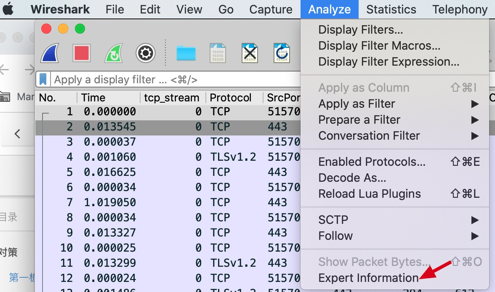
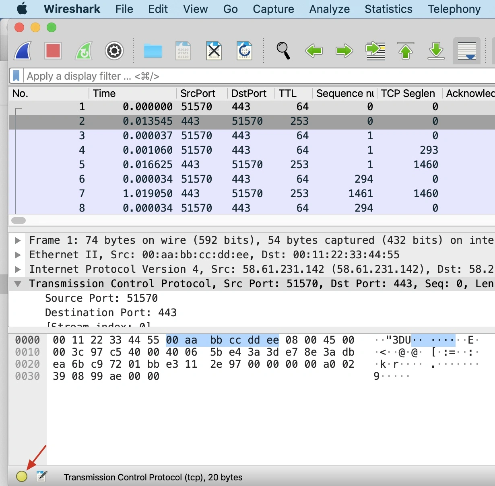
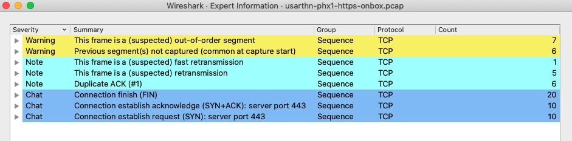
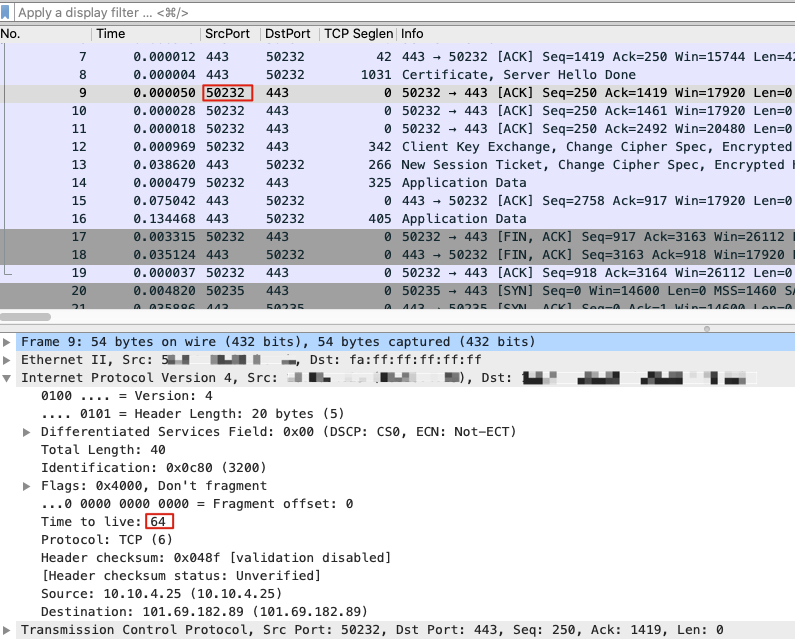
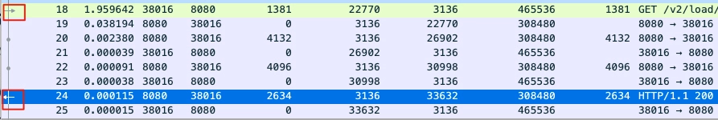

Wireshark 是一款广泛使用的网络数据包分析工具，它提供了强大的过滤功能，可以帮助用户快速定位和分析感兴趣的数据包。

## 过滤条件

- 过滤协议
  - `tcp`：筛 TCP 包
  - `udp`：筛 UDP 包
  - `tcp and http`：筛含 TCP 和 HTTP 包

- 过滤 IP
  - `ip.src == 192.168.1.100`：筛来自 192.168.1.100 的包
  - `ip.src == 192.168.1.100 and ip.dst == 192.168.1.1`：筛从 192.168.1.100 发往 192.168.1.1 的包

- 过滤端口
  - `tcp.srcport == 8080`：筛 TCP 源端口为 8080 的包
  - `tcp.dstport == 80`：筛 TCP 目的端口为 80 的包
  - `udp.srcport >= 1000 and udp.srcport <= 2000`：筛 UDP 源端口在 1000 - 2000 范围的包

- 过滤 TCP
  - `tcp.flags.reset == 1`
  - `tcp.ack == my_num`, `tcp.seq == my_num`
  - `tcp.len eq 长度`
  - `tcp.flags.fin eq 1`
  - `tcp.payload eq 数据`

- 内容过滤
  - `http contains "HelloWorld"`：筛含特定字符串的 HTTP 包
  - `frame contains 0x123456`：筛含特定十六进制值的包
  - `ip contains "id=abcdafeafeagfeagfaraera1242dfea"`
  - `tcp contains "id=abcdafeafeagfeagfaraera1242dfea"`

- 时间过滤
  - `frame.time >="dec 01, 2015 15:49:48" and frame.time <="dec 01, 2015 15:49:49"`

- 逻辑运算符
  - `and`, `or`
  - `not http`, `! http`：非 http 包

更多筛选条件：
- https://www.wireshark.org/docs/dfref/t/tcp.html
- https://www.wireshark.org/docs/dfref/i/ip.html
- https://www.wireshark.org/docs/dfref/f/frame.html

## 使用技巧

#### Expert Information（专家信息）

菜单栏 `->` Analyze `->` Export Information



或窗口左下角小圆圈





- Warning 条目的底色是黄色，意味着可能有问题，应重点关注。如图有 7 个乱序（Out-of-Order）的 TCP 报文，6 个未抓到的报文（如果是在抓包开始阶段，这种未抓到报文的情况也属正常）。
- Note 条目的底色是浅蓝色，是在允许范围内的小问题，也要关注。什么叫“允许范围内的小问题”呢？举个例子，TCP 本身就是容许一定程度的重传的，那么这些重传报文，就属于“允许范围内”。如图有 1 个怀疑是快速重传，5 个是重传（一般是超时重传），6 个重复确认。
- Chat 条目的底色是正常蓝色，属于 TCP/UDP 的正常行为，可以作为参考。比如你可以了解到，这次通信里 TCP 握手和挥手分别有多少次，等等。如图有 TCP 挥手阶段的 20 个 FIN 包，握手阶段的 10 个 SYN 包和 10 个 SYN+ACK 包。

一般**乱序**是应该被重点关注的。因为正常情况下，发送端的报文是按照先后顺序发送的，如果到了接收端发生了乱序，那么很可能是中间设备出现了问题，比如中间的交换机路由器、防火墙做了一些处理，引发了报文乱序。

#### 怎么知道抓包文件是在哪一端抓取的？

**利用 IP 的 TTL 属性**。报文在发出时，其 TTL 就是原始值，也就是 64、128、255 中的某一个。而对端报文的 TTL，因为会经过若干个网络跳数，所以一般都会比 64、128、255 这几个数值要小一些。

我们只要看一下抓包文件中任何一个客户端报文（也就是源端口为高端口）的 TTL，如果它是 64、128 或 255，那说明这个抓包文件就是在客户端做的。反之，就是在服务端做的。



##### TTL

不同的操作系统其初始 TTL 值不同，一般来说 Windows 是 128，Linux 是 64。如果你客户端收到的返回的 TTL 就是 64，说明服务端和客户端之间没有三层设备，是三层直连的。如果 2 个包 TTL 相差很大，说明不是同一个服务端发送的或者不是同一个路线。公网包返回的 TTL 变动很正常。内网的包中 TTL 一般不会变化，如果有变化，说明有问题。

此外可以通过 TTL 的值推导出对端的 OS 类型。用 ping 可以查看 ttl，如下 `ttl=50`，百度服务端应该是 Linux，64 - 50 = 14，这个回包在公网经过了 14 跳路由设备（三层设备）。如果是服务器是 Windows，那么相当于经过了 128 - 50 = 78 跳，这是几乎不可能的。
```bash
$ ping baidu.com
PING baidu.com (110.242.68.66) 56(84) bytes of data.
64 bytes from 110.242.68.66 (110.242.68.66): icmp_seq=1 ttl=50 time=13.1 ms
64 bytes from 110.242.68.66 (110.242.68.66): icmp_seq=2 ttl=50 time=13.1 ms
```

`ping microsoft.com` 返回的 `ttl=102`，服务端应该是 windows。
```bash
$ ping microsoft.com
PING microsoft.com (20.70.246.20) 56(84) bytes of data.
64 bytes from 20.70.246.20 (20.70.246.20): icmp_seq=1 ttl=102 time=160 ms
64 bytes from 20.70.246.20 (20.70.246.20): icmp_seq=2 ttl=102 time=160 ms
```

#### 自定义列

wireshark 支持自定义列


#### 如何定位到应用层的请求和返回的报文？

只要选中请求报文，Wireshark 就会自动帮我们匹配到对应的响应报文，反过来也一样。从图上看，应用层请求（这里是 HTTP 请求）是一个向右的箭头，表示数据是进来的方向；应用层响应是一个向左的箭头，表示数据是出去的方向。



#### 乱序一定会引起问题吗？

乱序（Out-of-Order）是否是问题，**取决于乱序的严重程度**。

一般如果乱序报文达到 **10% 以上**，就是严重的传输质量问题了，甚至可能导致传输失败，或者应用层的各种卡顿、报错等症状。所以，你可以统计一下乱序包的占比，如果它超过了 10%，就要重视了。

