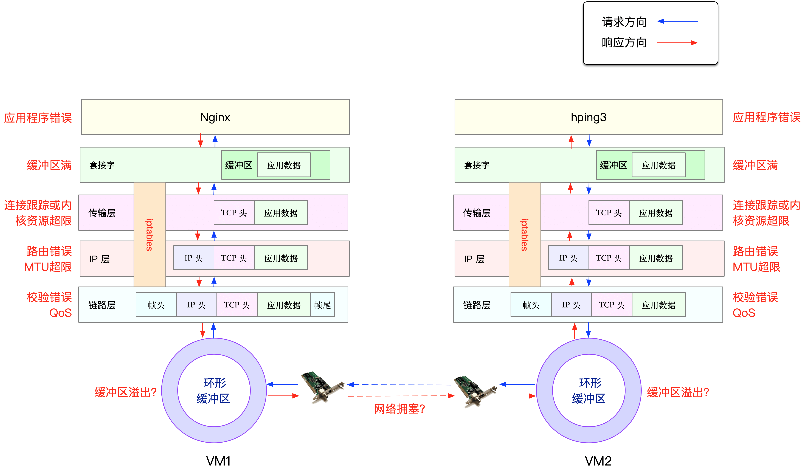

丢包可能情况如图：



## 链路层

当缓冲区溢出等原因导致网卡丢包时，Linux 会在网卡收发数据的统计信息中，记录下收发错误的次数。

通过 ethtool 或者 netstat ，来查看网卡的丢包记录。比如，可以在容器中执行下面的命令，查看丢包情况：

```bash
root@nginx:/# netstat -i
Kernel Interface table
Iface      MTU    RX-OK RX-ERR RX-DRP RX-OVR    TX-OK TX-ERR TX-DRP TX-OVR Flg
eth0       100       31      0      0 0             8      0      0      0 BMRU
lo       65536        0      0      0 0             0      0      0      0 LRU
```

输出中的 RX-OK、RX-ERR、RX-DRP、RX-OVR ，分别表示接收时的总包数、总错误数、进入 Ring Buffer 后因其他原因（如内存不足）导致的丢包数以及 Ring Buffer 溢出导致的丢包数。

TX-OK、TX-ERR、TX-DRP、TX-OVR 也代表类似的含义，只不过是指发送时对应的各个指标。

:::tip
由于 Docker 容器的虚拟网卡，实际上是一对 veth pair，一端接入容器中用作 eth0，另一端在主机中接入 docker0 网桥中。veth 驱动并没有实现网络统计的功能，所以使用 ethtool -S 命令，无法得到网卡收发数据的汇总信息。
:::

要注意，如果用 tc 等工具配置了 QoS，那么 tc 规则导致的丢包，就不会包含在网卡的统计信息中。

检查一下 eth0 上是否配置了 tc 规则，并查看有没有丢包

```bash
root@nginx:/# tc -s qdisc show dev eth0
qdisc netem 800d: root refcnt 2 limit 1000 loss 30%
 Sent 432 bytes 8 pkt (dropped 4, overlimits 0 requeues 0)
 backlog 0b 0p requeues 0
```
从 tc 的输出中可以看到， eth0 上面配置了一个网络模拟排队规则（qdisc netem），并且配置了丢包率为 30%（loss 30%）。再看后面的统计信息，发送了 8 个包，但是丢了 4 个。
这里，导致 Nginx 回复的响应包，被 netem 模块给丢了。

解决方法也就很简单了，直接删掉 netem 模块就可以了。我们可以继续在容器终端中，执行下面的命令，删除 tc 中的 netem 模块：

```bash
root@nginx:/# tc qdisc del dev eth0 root netem loss 30%
```

## 网络层和传输层


在网络层和传输层中，引发丢包的因素非常多。不过，其实想确认是否丢包，是非常简单的事，因为 Linux 已经为我们提供了各个协议的收发汇总情况。

```bash
root@nginx:/# netstat -s
Ip:
    Forwarding: 1          //开启转发
    31 total packets received    //总收包数
    0 forwarded            //转发包数
    0 incoming packets discarded  //接收丢包数
    25 incoming packets delivered  //接收的数据包数
    15 requests sent out      //发出的数据包数
Icmp:
    0 ICMP messages received    //收到的ICMP包数
    0 input ICMP message failed    //收到ICMP失败数
    ICMP input histogram:
    0 ICMP messages sent      //ICMP发送数
    0 ICMP messages failed      //ICMP失败数
    ICMP output histogram:
Tcp:
    0 active connection openings  //主动连接数
    0 passive connection openings  //被动连接数
    11 failed connection attempts  //失败连接尝试数
    0 connection resets received  //接收的连接重置数
    0 connections established    //建立连接数
    25 segments received      //已接收报文数
    21 segments sent out      //已发送报文数
    4 segments retransmitted    //重传报文数
    0 bad segments received      //错误报文数
    0 resets sent          //发出的连接重置数
Udp:
    0 packets received
    ...
TcpExt:
    11 resets received for embryonic SYN_RECV sockets  //半连接重置数
    0 packet headers predicted
    TCPTimeouts: 7    //超时数
    TCPSynRetrans: 4  //SYN重传数
  ...
```

netstat 汇总了 IP、ICMP、TCP、UDP 等各种协议的收发统计信息。不过，我们的目的是排查丢包问题，所以这里主要观察的是错误数、丢包数以及重传数。

根据上面的输出，你可以看到，只有 TCP 协议发生了丢包和重传，分别是：
- 11 次连接失败重试（11 failed connection attempts）
- 4 次重传（4 segments retransmitted）
- 11 次半连接重置（11 resets received for embryonic SYN_RECV sockets）
- 4 次 SYN 重传（TCPSynRetrans）
- 7 次超时（TCPTimeouts）

说明 TCP 协议有多次超时和失败重试，并且主要错误是半连接重置。换句话说，主要的失败，都是三次握手失败。

## iptables

```bash
# 主机终端中查询内核配置
$ sysctl net.netfilter.nf_conntrack_max
net.netfilter.nf_conntrack_max = 262144
$ sysctl net.netfilter.nf_conntrack_count
net.netfilter.nf_conntrack_count = 182
```

连接跟踪数只有 182，而最大连接跟踪数则是 262144。显然，这里的丢包，不可能是连接跟踪导致的。

可以通过 iptables -nvL 命令，查看各条规则的统计信息。比如，你可以执行下面的 docker exec 命令，进入容器终端；然后再执行下面的 iptables 命令，就可以看到 filter 表的统计数据了：

```bash
# 在主机中执行
$ docker exec -it nginx bash

# 在容器中执行
root@nginx:/# iptables -t filter -nvL
Chain INPUT (policy ACCEPT 25 packets, 1000 bytes)
 pkts bytes target     prot opt in     out     source               destination
    6   240 DROP       all  --  *      *       0.0.0.0/0            0.0.0.0/0            statistic mode random probability 0.29999999981

Chain FORWARD (policy ACCEPT 0 packets, 0 bytes)
 pkts bytes target     prot opt in     out     source               destination

Chain OUTPUT (policy ACCEPT 15 packets, 660 bytes)
 pkts bytes target     prot opt in     out     source               destination
    6   264 DROP       all  --  *      *       0.0.0.0/0            0.0.0.0/0            statistic mode random probability 0.29999999981
```

从 iptables 的输出中，你可以看到，两条 DROP 规则的统计数值不是 0，它们分别在 INPUT 和 OUTPUT 链中。这两条规则实际上是一样的，指的是使用 statistic 模块，进行随机 30% 的丢包。

再观察一下它们的匹配规则。0.0.0.0/0 表示匹配所有的源 IP 和目的 IP，也就是会对所有包都进行随机 30% 的丢包。看起来，这应该就是导致部分丢包的“罪魁祸首”了。

既然找出了原因，接下来的优化就比较简单了。比如，把这两条规则直接删除就可以了。我们可以在容器终端中，执行下面的两条 iptables 命令，删除这两条 DROP 规则：

```bash
root@nginx:/# iptables -t filter -D INPUT -m statistic --mode random --probability 0.30 -j DROP
root@nginx:/# iptables -t filter -D OUTPUT -m statistic --mode random --probability 0.30 -j DROP
```

