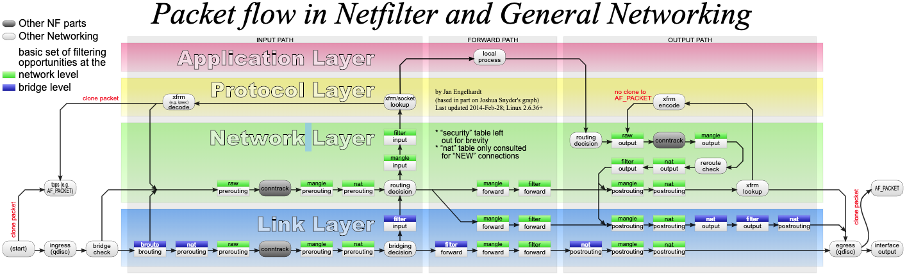
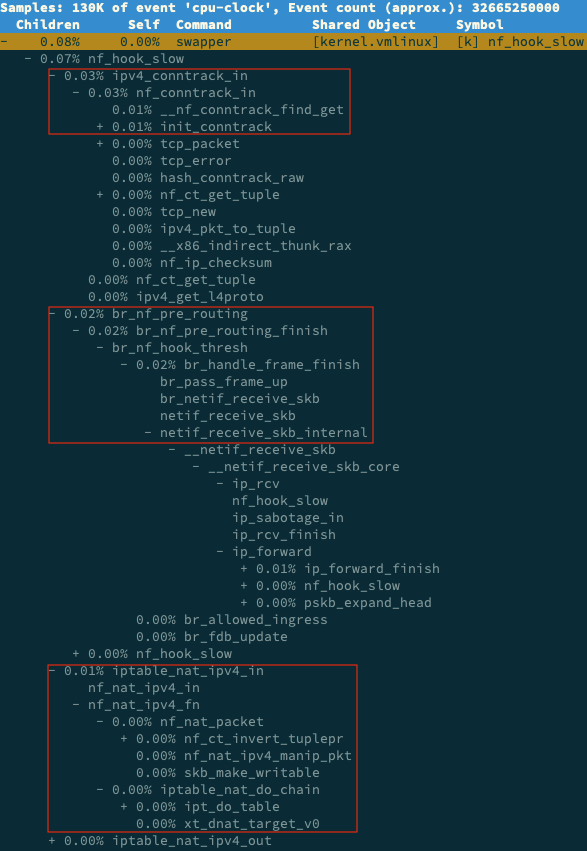

## NAT 原理

网络地址转换（Network Address Translation），缩写为 NAT。NAT 技术可以重写 IP 数据包的源 IP 或者目的 IP，被普遍地用来解决公网 IP 地址短缺的问题。它的主要原理就是，网络中的多台主机，通过共享同一个公网 IP 地址，来访问外网资源。同时，由于 NAT 屏蔽了内网网络，自然也就为局域网中的机器提供了安全隔离。

你既可以在支持网络地址转换的路由器（称为 NAT 网关）中配置 NAT，也可以在 Linux 服务器中配置 NAT。如果采用第二种方式，Linux 服务器实际上充当的是“软”路由器的角色。

NAT 的主要目的，是实现地址转换。根据实现方式的不同，NAT 可以分为三类：

- 静态 NAT，即内网 IP 与公网 IP 是一对一的永久映射关系；
- 动态 NAT，即内网 IP 从公网 IP 池中，动态选择一个进行映射；
- 网络地址端口转换 NAPT（Network Address and Port Translation），即把内网 IP 映射到公网 IP 的不同端口上，让多个内网 IP 可以共享同一个公网 IP 地址。

NAPT 是目前最流行的 NAT 类型，我们在 Linux 中配置的 NAT 也是这种类型。而根据转换方式的不同，我们又可以把 NAPT 分为三类。

- 源地址转换 SNAT，即目的地址不变，只替换源 IP 或源端口。SNAT 主要用于，多个内网 IP 共享同一个公网 IP ，来访问外网资源的场景。
- 目的地址转换 DNAT，即源 IP 保持不变，只替换目的 IP 或者目的端口。DNAT 主要通过公网 IP 的不同端口号，来访问内网的多种服务，同时会隐藏后端服务器的真实 IP 地址。
- 双向地址转换，即同时使用 SNAT 和 DNAT。当接收到网络包时，执行 DNAT，把目的 IP 转换为内网 IP；而在发送网络包时，执行 SNAT，把源 IP 替换为外部 IP。

双向地址转换，其实就是外网 IP 与内网 IP 的一对一映射关系，所以常用在虚拟化环境中，为虚拟机分配浮动的公网 IP 地址。

## iptables 与 NAT

Linux 内核提供的 Netfilter 框架，允许对网络数据包进行修改（比如 NAT）和过滤（比如防火墙）。在这个基础上，iptables、ip6tables、ebtables 等工具，又提供了更易用的命令行接口，以便系统管理员配置和管理 NAT、防火墙的规则。


其中，iptables 就是最常用的一种配置工具。要掌握 iptables 的原理和使用方法，最核心的就是弄清楚，网络数据包通过 Netfilter 时的工作流向，下面这张图就展示了这一过程。



（图片来自 [Wikipedia](https://www.wikiwand.com/en/articles/Iptables)）

绿色背景的方框，表示表（table），用来管理链。Linux 支持 4 种表，包括 filter（用于过滤）、nat（用于 NAT）、mangle（用于修改分组数据） 和 raw（用于原始数据包）等。

跟 table 一起的白色背景方框，则表示链（chain），用来管理具体的 iptables 规则。每个表中可以包含多条链，比如：

- filter 表中，内置 INPUT、OUTPUT 和 FORWARD 链；
- nat 表中，内置 PREROUTING、POSTROUTING、OUTPUT 等。

当然，你也可以根据需要，创建你自己的链。

灰色的 conntrack，表示连接跟踪模块。它通过内核中的连接跟踪表（也就是哈希表），记录网络连接的状态，是 iptables 状态过滤（-m state）和 NAT 的实现基础。

iptables 的所有规则，就会放到这些表和链中，并按照图中顺序和规则的优先级顺序来执行。

要实现 NAT 功能，主要是在 nat 表进行操作。而 nat 表内置了三个链：

- PREROUTING，用于路由判断前所执行的规则，比如，对接收到的数据包进行 DNAT。
- POSTROUTING，用于路由判断后所执行的规则，比如，对发送或转发的数据包进行 SNAT 或 MASQUERADE。
- OUTPUT，类似于 PREROUTING，但只处理从本机发送出去的包。

熟悉 iptables 中的表和链后，相应的 NAT 规则就比较简单了。我们还以 NAPT 的三个分类为例，来具体解读一下。

### SNAT

SNAT 需要在 nat 表的 POSTROUTING 链中配置。我们常用两种方式来配置它。

第一种方法，是为一个子网统一配置 SNAT，并由 Linux 选择默认的出口 IP。这实际上就是经常说的 MASQUERADE：

```bash
$ iptables -t nat -A POSTROUTING -s 192.168.0.0/16 -j MASQUERADE
```

第二种方法，是为具体的 IP 地址配置 SNAT，并指定转换后的源地址：

```bash
$ iptables -t nat -A POSTROUTING -s 192.168.0.2 -j SNAT --to-source 100.100.100.100
```

### DNAT

DNAT 需要在 nat 表的 PREROUTING 或者 OUTPUT 链中配置，其中， PREROUTING 链更常用一些（因为它还可以用于转发的包）。

```bash
$ iptables -t nat -A PREROUTING -d 100.100.100.100 -j DNAT --to-destination 192.168.0.2
```

### 双向地址转换

双向地址转换，就是同时添加 SNAT 和 DNAT 规则，为公网 IP 和内网 IP 实现一对一的映射关系，即：

```bash
$ iptables -t nat -A POSTROUTING -s 192.168.0.2 -j SNAT --to-source 100.100.100.100
$ iptables -t nat -A PREROUTING -d 100.100.100.100 -j DNAT --to-destination 192.168.0.2
```

在使用 iptables 配置 NAT 规则时，Linux 需要转发来自其他 IP 的网络包，所以你千万不要忘记开启 Linux 的 IP 转发功能。

你可以执行下面的命令，查看这一功能是否开启。如果输出的结果是 1，就表示已经开启了 IP 转发：

```bash
$ sysctl net.ipv4.ip_forward
net.ipv4.ip_forward = 1
```
如果还没开启，你可以执行下面的命令，手动开启：

```bash
$ sysctl -w net.ipv4.ip_forward=1
net.ipv4.ip_forward = 1
```

为了避免重启后配置丢失，不要忘记将配置写入 /etc/sysctl.conf 文件中：

```bash
$ cat /etc/sysctl.conf | grep ip_forward
net.ipv4.ip_forward=1
```

Linux 中的 NAT ，基于内核的连接跟踪模块实现。所以，它维护每个连接状态的同时，也会带来很高的性能成本。


## 案例

[SystemTap](https://sourceware.org/systemtap/) 是 Linux 的一种动态追踪框架，它把用户提供的脚本，转换为内核模块来执行，用来监测和跟踪内核的行为。

## 问题复现

为了对比 NAT 带来的性能问题，我们首先运行一个不用 NAT 的 Nginx 服务，并用 ab 测试它的性能。

vm1 执行下面的命令，启动 Nginx，注意选项 --network=host ，表示容器使用 Host 网络模式，即不使用 NAT：

```bash
$ docker run --name nginx-hostnet --privileged --network=host -itd feisky/nginx:80
```

vm2 执行 curl 命令，确认 Nginx 正常启动：

```bash
$ curl http://192.168.0.30/
...
<p><em>Thank you for using nginx.</em></p>
</body>
</html>
```

执行 ab 命令，对 Nginx 进行压力测试。不过在测试前要注意，Linux 默认允许打开的文件描述数比较小，比如在我的机器中，这个值只有 1024：

```bash
# open files
$ ulimit -n
1024
```

执行 ab 前，先要把这个选项调大，比如调成 65536:
```bash
# 临时增大当前会话的最大文件描述符数
$ ulimit -n 65536
```

执行 ab 命令，进行压力测试：

```bash
# -c表示并发请求数为5000，-n表示总的请求数为10万
# -r表示套接字接收错误时仍然继续执行，-s表示设置每个请求的超时时间为2s
$ ab -c 5000 -n 100000 -r -s 2 http://192.168.0.30/
...
Requests per second:    6576.21 [#/sec] (mean)
Time per request:       760.317 [ms] (mean)
Time per request:       0.152 [ms] (mean, across all concurrent requests)
Transfer rate:          5390.19 [Kbytes/sec] received

Connection Times (ms)
              min  mean[+/-sd] median   max
Connect:        0  177 714.3      9    7338
Processing:     0   27  39.8     19     961
Waiting:        0   23  39.5     16     951
Total:          1  204 716.3     28    7349
...
```

每秒请求数（Requests  per second）为 6576；每个请求的平均延迟（Time per request）为 760ms；建立连接的平均延迟（Connect）为 177ms。

这几个数值，这将是接下来案例的基准指标。

vm1 停止这个未使用 NAT 的 Nginx 应用：

```bash
$ docker rm -f nginx-hostnet
```

启动今天的案例应用。案例应用监听在 8080 端口，并且使用了 DNAT ，来实现 Host 的 8080 端口，到容器的 8080 端口的映射关系：

```bash
$ docker run --name nginx --privileged -p 8080:8080 -itd feisky/nginx:nat
```

Nginx 启动后，你可以执行 iptables 命令，确认 DNAT 规则已经创建：

```bash
$ iptables -nL -t nat
Chain PREROUTING (policy ACCEPT)
target     prot opt source               destination
DOCKER     all  --  0.0.0.0/0            0.0.0.0/0            ADDRTYPE match dst-type LOCAL

...

Chain DOCKER (2 references)
target     prot opt source               destination
RETURN     all  --  0.0.0.0/0            0.0.0.0/0
DNAT       tcp  --  0.0.0.0/0            0.0.0.0/0            tcp dpt:8080 to:172.17.0.2:8080
```

可以看到，在 PREROUTING 链中，目的为本地的请求，会转到 DOCKER 链；而在 DOCKER 链中，目的端口为 8080 的 tcp 请求，会被 DNAT 到 172.17.0.2 的 8080 端口。其中，172.17.0.2 就是 Nginx 容器的 IP 地址。

vm2 中执行 curl 命令，确认 Nginx 已经正常启动：
```bash
$ curl http://192.168.0.30:8080/
...
<p><em>Thank you for using nginx.</em></p>
</body>
</html>
```

再次执行上述的 ab 命令，不过这次注意，要把请求的端口号换成 8080：

```bash
# -c表示并发请求数为5000，-n表示总的请求数为10万
# -r表示套接字接收错误时仍然继续执行，-s表示设置每个请求的超时时间为2s
$ ab -c 5000 -n 100000 -r -s 2 http://192.168.0.30:8080/
...
apr_pollset_poll: The timeout specified has expired (70007)
Total of 5602 requests completed
```

刚才正常运行的 ab ，现在失败了，还报了连接超时的错误。运行 ab 时的 -s 参数，设置了每个请求的超时时间为 2s，而从输出可以看到，这次只完成了 5602 个请求。

既然是为了得到 ab 的测试结果，我们不妨把超时时间延长一下试试，比如延长到 30s。延迟增大意味着要等更长时间，为了快点得到结果，我们可以同时把总测试次数，也减少到 10000:

```bash
$ ab -c 5000 -n 10000 -r -s 30 http://192.168.0.30:8080/
...
Requests per second:    76.47 [#/sec] (mean)
Time per request:       65380.868 [ms] (mean)
Time per request:       13.076 [ms] (mean, across all concurrent requests)
Transfer rate:          44.79 [Kbytes/sec] received

Connection Times (ms)
              min  mean[+/-sd] median   max
Connect:        0 1300 5578.0      1   65184
Processing:     0 37916 59283.2      1  130682
Waiting:        0    2   8.7      1     414
Total:          1 39216 58711.6   1021  130682
...
```

这次的结果显示：每秒请求数（Requests per second）为 76；每个请求的延迟（Time per request）为 65s；建立连接的延迟（Connect）为 1300ms。每个指标都比前面差了很多。

要保证 NAT 正常工作，就至少需要两个步骤：

* 第一，利用 Netfilter 中的钩子函数（Hook），修改源地址或者目的地址。
* 第二，利用连接跟踪模块 conntrack ，关联同一个连接的请求和响应。

由于今天案例是在压测场景下，并发请求数大大降低，并且我们清楚知道 NAT 是罪魁祸首。所以，我们有理由怀疑，内核中发生了丢包现象。

vm1 中创建一个 dropwatch.stp 的脚本文件，并写入下面的内容：

```bash
#! /usr/bin/env stap

############################################################
# Dropwatch.stp
# Author: Neil Horman <nhorman@redhat.com>
# An example script to mimic the behavior of the dropwatch utility
# http://fedorahosted.org/dropwatch
############################################################

# Array to hold the list of drop points we find
global locations

# Note when we turn the monitor on and off
probe begin { printf("Monitoring for dropped packets\n") }
probe end { printf("Stopping dropped packet monitor\n") }

# increment a drop counter for every location we drop at
probe kernel.trace("kfree_skb") { locations[$location] <<< 1 }

# Every 5 seconds report our drop locations
probe timer.sec(5)
{
  printf("\n")
  foreach (l in locations-) {
    printf("%d packets dropped at %s\n",
           @count(locations[l]), symname(l))
  }
  delete locations
}
```

这个脚本，跟踪内核函数 kfree_skb() 的调用，并统计丢包的位置。文件保存好后，执行下面的 stap 命令，就可以运行丢包跟踪脚本。这里的 stap，是 SystemTap 的命令行工具：

```bash
$ stap --all-modules dropwatch.stp
Monitoring for dropped packets
```

当你看到 probe begin 输出的 “Monitoring for dropped packets” 时，表明 SystemTap 已经将脚本编译为内核模块，并启动运行了。

接着，vm2 中再次执行 ab 命令：

```bash
$ ab -c 5000 -n 10000 -r -s 30 http://192.168.0.30:8080/
```

vm1 中观察 stap 命令的输出：

```bash
10031 packets dropped at nf_hook_slow
676 packets dropped at tcp_v4_rcv

7284 packets dropped at nf_hook_slow
268 packets dropped at tcp_v4_rcv
```

你会发现，大量丢包都发生在 nf_hook_slow 位置。看到这个名字，你应该能想到，这是在 Netfilter Hook 的钩子函数中，出现丢包问题了。但是不是 NAT，还不能确定。接下来，我们还得再跟踪  nf_hook_slow 的执行过程，这一步可以通过 perf 来完成。

vm2 再次执行 ab：
```bash
$ ab -c 5000 -n 10000 -r -s 30 http://192.168.0.30:8080/
```

vm1 执行 perf record 和 perf report 命令

```bash
# 记录一会（比如30s）后按Ctrl+C结束
$ perf record -a -g -- sleep 30

# 输出报告
$ perf report -g graph,0
```

在 perf report 界面中，输入查找命令 / 然后，在弹出的对话框中，输入 nf_hook_slow；最后再展开调用栈，就可以得到下面这个调用图：



从这个图我们可以看到，nf_hook_slow 调用最多的有三个地方，分别是 ipv4_conntrack_in、br_nf_pre_routing 以及 iptable_nat_ipv4_in。换言之，nf_hook_slow 主要在执行三个动作。

- 第一，接收网络包时，在连接跟踪表中查找连接，并为新的连接分配跟踪对象（Bucket）。
- 第二，在 Linux 网桥中转发包。这是因为案例 Nginx 是一个 Docker 容器，而容器的网络通过网桥来实现；
- 第三，接收网络包时，执行 DNAT，即把 8080 端口收到的包转发给容器。

到这里，我们其实就找到了性能下降的三个来源。这三个来源，都是 Linux 的内核机制，所以接下来的优化，自然也是要从内核入手。

根据以前各个资源模块的内容，我们知道，Linux 内核为用户提供了大量的可配置选项，这些选项可以通过 proc 文件系统，或者 sys 文件系统，来查看和修改。除此之外，你还可以用 sysctl 这个命令行工具，来查看和修改内核配置。

比如，我们今天的主题是 DNAT，而 DNAT 的基础是 conntrack，所以我们可以先看看，内核提供了哪些 conntrack 的配置选项。

vm1 执行下面的命令：
```bash
$ sysctl -a | grep conntrack
net.netfilter.nf_conntrack_count = 180
net.netfilter.nf_conntrack_max = 1000
net.netfilter.nf_conntrack_buckets = 65536
net.netfilter.nf_conntrack_tcp_timeout_syn_recv = 60
net.netfilter.nf_conntrack_tcp_timeout_syn_sent = 120
net.netfilter.nf_conntrack_tcp_timeout_time_wait = 120
...
```

这里最重要的三个指标：

- net.netfilter.nf_conntrack_count，表示当前连接跟踪数；
- net.netfilter.nf_conntrack_max，表示最大连接跟踪数；
- net.netfilter.nf_conntrack_buckets，表示连接跟踪表的大小。

这个输出告诉我们，当前连接跟踪数是 180，最大连接跟踪数是 1000，连接跟踪表的大小，则是 65536。

前面的 ab 命令，并发请求数是 5000，而请求数是 100000。显然，跟踪表设置成，只记录 1000 个连接，是远远不够的。

实际上，内核在工作异常时，会把异常信息记录到日志中。比如前面的 ab 测试，内核已经在日志中报出了 “nf_conntrack: table full” 的错误。执行 dmesg 命令，你就可以看到：

```bash
$ dmesg | tail
[104235.156774] nf_conntrack: nf_conntrack: table full, dropping packet
[104243.800401] net_ratelimit: 3939 callbacks suppressed
[104243.800401] nf_conntrack: nf_conntrack: table full, dropping packet
[104262.962157] nf_conntrack: nf_conntrack: table full, dropping packet
```

其中，net_ratelimit 表示有大量的日志被压缩掉了，这是内核预防日志攻击的一种措施。而当你看到 “nf_conntrack: table full” 的错误时，就表明 nf_conntrack_max 太小了。

那是不是，直接把连接跟踪表调大就可以了呢？调节前，你先得明白，连接跟踪表，实际上是内存中的一个哈希表。如果连接跟踪数过大，也会耗费大量内存。

其实，我们上面看到的 nf_conntrack_buckets，就是哈希表的大小。哈希表中的每一项，都是一个链表（称为 Bucket），而链表长度，就等于 nf_conntrack_max 除以 nf_conntrack_buckets。

比如，我们可以估算一下，上述配置的连接跟踪表占用的内存大小：

```bash
# 连接跟踪对象大小为376，链表项大小为16
nf_conntrack_max*连接跟踪对象大小+nf_conntrack_buckets*链表项大小 
= 1000*376+65536*16 B
= 1.4 MB
```

接下来，我们将 nf_conntrack_max 改大一些，比如改成 131072（即 nf_conntrack_buckets 的 2 倍）：

```bash
$ sysctl -w net.netfilter.nf_conntrack_max=131072
$ sysctl -w net.netfilter.nf_conntrack_buckets=65536
```

vm2 重新执行 ab。这次我们把超时时间也改回原来的 2s：

```bash
$ ab -c 5000 -n 100000 -r -s 2 http://192.168.0.30:8080/
...
Requests per second:    6315.99 [#/sec] (mean)
Time per request:       791.641 [ms] (mean)
Time per request:       0.158 [ms] (mean, across all concurrent requests)
Transfer rate:          4985.15 [Kbytes/sec] received

Connection Times (ms)
              min  mean[+/-sd] median   max
Connect:        0  355 793.7     29    7352
Processing:     8  311 855.9     51   14481
Waiting:        0  292 851.5     36   14481
Total:         15  666 1216.3    148   14645
```

现在每秒请求数（Requests per second）为 6315（不用 NAT 时为 6576）；每个请求的延迟（Time per request）为 791ms（不用 NAT 时为 760ms）；建立连接的延迟（Connect）为 355ms（不用 NAT 时为 177ms）。

这个结果，已经比刚才的测试好了很多，也很接近最初不用 NAT 时的基准结果了。

实际上，你可以用 conntrack 命令行工具，来查看连接跟踪表的内容。比如：

```bash
# -L表示列表，-o表示以扩展格式显示
$ conntrack -L -o extended | head
ipv4     2 tcp      6 7 TIME_WAIT src=192.168.0.2 dst=192.168.0.96 sport=51744 dport=8080 src=172.17.0.2 dst=192.168.0.2 sport=8080 dport=51744 [ASSURED] mark=0 use=1
ipv4     2 tcp      6 6 TIME_WAIT src=192.168.0.2 dst=192.168.0.96 sport=51524 dport=8080 src=172.17.0.2 dst=192.168.0.2 sport=8080 dport=51524 [ASSURED] mark=0 use=1
```

从这里你可以发现，连接跟踪表里的对象，包括了协议、连接状态、源 IP、源端口、目的 IP、目的端口、跟踪状态等。由于这个格式是固定的，所以我们可以用 awk、sort 等工具，对其进行统计分析。

比如，我们还是以 ab 为例。在终端二启动 ab 命令后，再回到终端一中，执行下面的命令：

```bash
# 统计总的连接跟踪数
$ conntrack -L -o extended | wc -l
14289

# 统计TCP协议各个状态的连接跟踪数
$ conntrack -L -o extended | awk '/^.*tcp.*$/ {sum[$6]++} END {for(i in sum) print i, sum[i]}'
SYN_RECV 4
CLOSE_WAIT 9
ESTABLISHED 2877
FIN_WAIT 3
SYN_SENT 2113
TIME_WAIT 9283

# 统计各个源IP的连接跟踪数
$ conntrack -L -o extended | awk '{print $7}' | cut -d "=" -f 2 | sort | uniq -c | sort -nr | head -n 10
  14116 192.168.0.2
    172 192.168.0.96
```

这里统计了总连接跟踪数，TCP 协议各个状态的连接跟踪数，以及各个源 IP 的连接跟踪数。你可以看到，大部分 TCP 的连接跟踪，都处于 TIME_WAIT 状态，并且它们大都来自于 192.168.0.2 这个 IP 地址（也就是运行 ab 命令的 VM2）。

这些处于 TIME_WAIT 的连接跟踪记录，会在超时后清理，而默认的超时时间是 120s，你可以执行下面的命令来查看：

```bash
$ sysctl net.netfilter.nf_conntrack_tcp_timeout_time_wait
net.netfilter.nf_conntrack_tcp_timeout_time_wait = 120
```
所以，如果你的连接数非常大，确实也应该考虑，适当减小超时时间。


除了上面这些常见配置，conntrack 还包含了其他很多配置选项，你可以根据实际需要，参考 nf_conntrack 的[文档](https://www.kernel.org/doc/Documentation/networking/nf_conntrack-sysctl.txt)来配置。

Linux 这种通过连接跟踪机制实现的 NAT，也常被称为有状态的 NAT，而维护状态，也带来了很高的性能成本。

除了调整内核行为外，在不需要状态跟踪的场景下（比如只需要按预定的 IP 和端口进行映射，而不需要动态映射），我们也可以使用无状态的 NAT （比如用 tc 或基于 DPDK 开发），来进一步提升性能。

