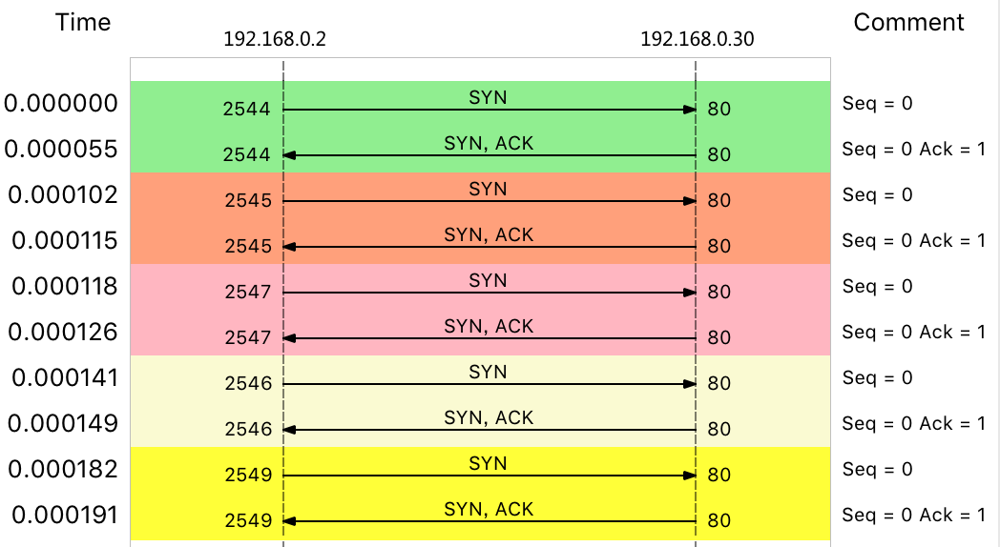

## DDoS

DDoS（Distributed Denial of Service） 则是在 DoS 的基础上，采用了分布式架构，利用多台主机同时攻击目标主机。这样，即使目标服务部署了网络防御设备，面对大量网络请求时，还是无力应对。

2018 年 2 月 Github 遭受的 [DDoS 攻击](https://github.blog/news-insights/company-news/ddos-incident-report/)，其峰值流量已经达到了 1.35Tbps，PPS 更是超过了 1.2 亿（126.9 million）。

从攻击的原理上来看，DDoS 可以分为下面几种类型。

- 第一种，耗尽带宽。无论是服务器还是路由器、交换机等网络设备，带宽都有固定的上限。带宽耗尽后，就会发生网络拥堵，从而无法传输其他正常的网络报文。
- 第二种，耗尽操作系统的资源。网络服务的正常运行，都需要一定的系统资源，像是 CPU、内存等物理资源，以及连接表等软件资源。一旦资源耗尽，系统就不能处理其他正常的网络连接。
- 第三种，消耗应用程序的运行资源。应用程序的运行，通常还需要跟其他的资源或系统交互。如果应用程序一直忙于处理无效请求，也会导致正常请求的处理变慢，甚至得不到响应。

比如，构造大量不同的域名来攻击 DNS 服务器，就会导致 DNS 服务器不停执行迭代查询，并更新缓存。这会极大地消耗 DNS 服务器的资源，使 DNS 的响应变慢。

## 案例

import ddoslabpng from './img/ddos-lab.png';


### 问题复现

vm1

```bash
# 运行Nginx服务并对外开放80端口
# --network=host表示使用主机网络（这是为了方便后面排查问题）
$ docker run -itd --name=nginx --network=host nginx
```

vm2, vm3

```bash
# -w表示只输出HTTP状态码及总时间，-o表示将响应重定向到/dev/null
$ curl -s -w 'Http code: %{http_code}\nTotal time:%{time_total}s\n' -o /dev/null http://192.168.0.30/
...
Http code: 200
Total time:0.002s
```

vm2 中运行 hping3 命令，来模拟 DoS 攻击：

```bash
# -S参数表示设置TCP协议的SYN（同步序列号），-p表示目的端口为80
# -i u10表示每隔10微秒发送一个网络帧
$ hping3 -S -p 80 -i u10 192.168.0.30
```

在 vm1 终端，现在不管执行什么命令，都慢了很多。不过，在实践时要注意

- 如果你的现象不那么明显，那么请尝试把参数里面的 u10 调小（比如调成 u1），或者加上–flood 选项；
- 如果你的终端一完全没有响应了，那么请适当调大 u10（比如调成 u30），否则后面就不能通过 SSH 操作 VM1。

vm3 中模拟正常客户端的连接：

```bash
# --connect-timeout表示连接超时时间
$ curl -w 'Http code: %{http_code}\nTotal time:%{time_total}s\n' -o /dev/null --connect-timeout 10 http://192.168.0.30
...
Http code: 000
Total time:10.001s
curl: (28) Connection timed out after 10000 milliseconds
```
在终端三中，正常客户端的连接超时了，并没有收到 Nginx 服务的响应。

### 问题解决

vm1 中使用 sar 观察 PPS（每秒收发的报文数）和 BPS（每秒收发的字节数）。

```bash
$ sar -n DEV 1
08:55:49        IFACE   rxpck/s   txpck/s    rxkB/s    txkB/s   rxcmp/s   txcmp/s  rxmcst/s   %ifutil
08:55:50      docker0      0.00      0.00      0.00      0.00      0.00      0.00      0.00      0.00
08:55:50         eth0  22274.00    629.00   1174.64     37.78      0.00      0.00      0.00      0.02
08:55:50           lo      0.00      0.00      0.00      0.00      0.00      0.00      0.00      0.00
```

网络接收的 PPS 已经达到了 20000 多，但是 BPS 却只有 1174 kB，这样每个包的大小就只有 54B（1174*1024/22274=54）。

这明显就是个小包了，不过具体是个什么样的包呢？那我们就用 tcpdump 抓包看看吧。

```bash
# -i eth0 只抓取eth0网卡，-n不解析协议名和主机名
# tcp port 80表示只抓取tcp协议并且端口号为80的网络帧
$ tcpdump -i eth0 -n tcp port 80
09:15:48.287047 IP 192.168.0.2.27095 > 192.168.0.30: Flags [S], seq 1288268370, win 512, length 0
09:15:48.287050 IP 192.168.0.2.27131 > 192.168.0.30: Flags [S], seq 2084255254, win 512, length 0
09:15:48.287052 IP 192.168.0.2.27116 > 192.168.0.30: Flags [S], seq 677393791, win 512, length 0
09:15:48.287055 IP 192.168.0.2.27141 > 192.168.0.30: Flags [S], seq 1276451587, win 512, length 0
09:15:48.287068 IP 192.168.0.2.27154 > 192.168.0.30: Flags [S], seq 1851495339, win 512, length 0
...
```

Flags [S] 表示这是一个 SYN 包。大量的 SYN 包表明，这是一个 SYN Flood 攻击。如果你用上一节讲过的 Wireshark 来观察，则可以更直观地看到 SYN Flood 的过程：



实际上，SYN Flood  正是互联网中最经典的 DDoS 攻击方式。原理上：

- 客户端构造大量的 SYN 包，请求建立 TCP 连接；
- 服务器收到包后，会向源 IP 发送 SYN+ACK 报文，并等待三次握手的最后一次 ACK 报文，直到超时。

这种等待状态的 TCP 连接，通常也称为半开连接。由于连接表的大小有限，大量的半开连接就会导致连接表迅速占满，从而无法建立新的 TCP 连接。

查看 TCP 半开连接的方法，关键在于 SYN_RECEIVED 状态的连接。我们可以使用 netstat ，来查看所有连接的状态，不过要注意，SYN_REVEIVED 的状态，通常被缩写为 SYN_RECV。

vm1 中

```bash
# -n表示不解析名字，-p表示显示连接所属进程
$ netstat -n -p | grep SYN_REC
tcp        0      0 192.168.0.30:80          192.168.0.2:12503      SYN_RECV    -
tcp        0      0 192.168.0.30:80          192.168.0.2:13502      SYN_RECV    -
tcp        0      0 192.168.0.30:80          192.168.0.2:15256      SYN_RECV    -
tcp        0      0 192.168.0.30:80          192.168.0.2:18117      SYN_RECV    -
...

$ netstat -n -p | grep SYN_REC | wc -l
193
```

从结果中，你可以发现大量 SYN_RECV 状态的连接，并且源 IP 地址为 192.168.0.2。

找出源 IP 后，要解决 SYN 攻击的问题，只要丢掉相关的包就可以。这时，iptables 可以帮你完成这个任务。你可以在终端一中，执行下面的 iptables 命令：

```bash
$ iptables -I INPUT -s 192.168.0.2 -p tcp -j REJECT
```

vm3，再次执行 curl 命令，查看正常用户访问 Nginx 的情况：

```bash
$ curl -w 'Http code: %{http_code}\nTotal time:%{time_total}s\n' -o /dev/null --connect-timeout 10 http://192.168.0.30
Http code: 200
Total time:1.572171s
```

现在，正常用户也可以访问 Nginx 了，只是响应比较慢，从原来的 2ms 变成了现在的 1.5s。

不过，一般来说，SYN Flood 攻击中的源 IP 并不是固定的。比如，你可以在 hping3 命令中，加入 --rand-source 选项，来随机化源 IP。这时刚才的方法就不适用了。

我们还有很多其他方法，实现类似的目标。比如，你可以用以下两种方法，来限制 syn 包的速率：

```bash
# 限制syn并发数为每秒1次
$ iptables -A INPUT -p tcp --syn -m limit --limit 1/s -j ACCEPT

# 限制单个IP在60秒新建立的连接数为10
$ iptables -I INPUT -p tcp --dport 80 --syn -m recent --name SYN_FLOOD --update --seconds 60 --hitcount 10 -j REJECT
```

到这里，我们已经初步限制了 SYN Flood 攻击。不过这还不够，因为我们的案例还只是单个的攻击源。

如果是多台机器同时发送 SYN Flood，这种方法可能就直接无效了。因为你很可能无法 SSH 登录（SSH 也是基于 TCP 的）到机器上去，更别提执行上述所有的排查命令。

这还需要你事先对系统做一些 TCP 优化。

比如，SYN Flood 会导致 SYN_RECV 状态的连接急剧增大。在上面的 netstat 命令中，你也可以看到 190 多个处于半开状态的连接。

不过，半开状态的连接数是有限制的，执行下面的命令，你就可以看到，默认的半连接容量只有 256：

```bash
$ sysctl net.ipv4.tcp_max_syn_backlog
net.ipv4.tcp_max_syn_backlog = 256
```

SYN 包数再稍微增大一些，就不能 SSH 登录机器了。 所以，你还应该增大半连接的容量，比如，你可以用下面的命令，将其增大为 1024：

```bash
$ sysctl -w net.ipv4.tcp_max_syn_backlog=1024
net.ipv4.tcp_max_syn_backlog = 1024
```

连接每个 SYN_RECV 时，如果失败的话，内核还会自动重试，并且默认的重试次数是 5 次。你可以执行下面的命令，将其减小为 1 次：

```bash
$ sysctl -w net.ipv4.tcp_synack_retries=1
net.ipv4.tcp_synack_retries = 1
```

除此之外，TCP SYN Cookies 也是一种专门防御 SYN Flood 攻击的方法。SYN Cookies 基于连接信息（包括源地址、源端口、目的地址、目的端口等）以及一个加密种子（如系统启动时间），计算出一个哈希值（SHA1），这个哈希值称为 cookie。

这个 cookie 就被用作序列号，来应答 SYN+ACK 包，并释放连接状态。当客户端发送完三次握手的最后一次 ACK 后，服务器就会再次计算这个哈希值，确认是上次返回的 SYN+ACK 的返回包，才会进入 TCP 的连接状态。

开启 SYN Cookies 后，就不需要维护半开连接状态了，进而也就没有了半连接数的限制。

> 注意，开启 TCP syncookies 后，内核选项 net.ipv4.tcp_max_syn_backlog 也就无效了。

开启 TCP SYN Cookies：

```bash
$ sysctl -w net.ipv4.tcp_syncookies=1
net.ipv4.tcp_syncookies = 1
```

上述 sysctl 命令修改的配置都是临时的，重启后这些配置就会丢失。所以，为了保证配置持久化，你还应该把这些配置，写入 /etc/sysctl.conf 文件中。比如：

```bash
$ cat /etc/sysctl.conf
net.ipv4.tcp_syncookies = 1
net.ipv4.tcp_synack_retries = 1
net.ipv4.tcp_max_syn_backlog = 1024
```

写入 `/etc/sysctl.conf` 的配置，需要执行 sysctl -p 命令后，才会动态生效。

对于流量型的 DDoS 来说，当服务器的带宽被耗尽后，在服务器内部处理就无能为力了。这时，只能在服务器外部的网络设备中，设法识别并阻断流量（当然前提是网络设备要能扛住流量攻击）。比如，购置专业的入侵检测和防御设备，配置流量清洗设备阻断恶意流量等。

DDoS 并不一定是因为大流量或者大 PPS，有时候，慢速的请求也会带来巨大的性能下降（这种情况称为**慢速 DDoS**）。

很多针对应用程序的攻击，都会伪装成正常用户来请求资源。这种情况下，请求流量可能本身并不大，但响应流量却可能很大，并且应用程序内部也很可能要耗费大量资源处理。

这时，就需要应用程序考虑识别，并尽早拒绝掉这些恶意流量，比如合理利用缓存、增加 WAF（Web Application Firewall）、使用 CDN 等等。

