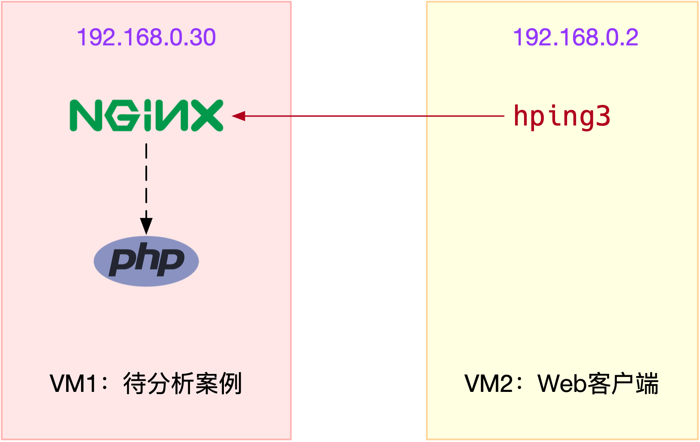

## Linux 中断的两部分

中断处理程序在响应中断时，还会临时关闭中断。这就会导致上一次中断处理完成之前，其他中断都不能响应，也就是说中断有可能会丢失。

为了解决中断处理程序执行过长和中断丢失的问题，Linux 将中断处理过程分成了两个阶段，也就是上半部和下半部：

* **上半部用来快速处理中断**，它在中断禁止模式下运行，主要处理跟硬件紧密相关的或时间敏感的工作。
* **下半部用来延迟处理上半部未完成的工作，通常以内核线程的方式运行**。

网卡接收到数据包后，会通过硬件中断的方式，通知内核有新的数据到了。这时，内核就应该调用中断处理程序来响应它。你可以自己先想一下，这种情况下的上半部和下半部分别负责什么工作呢？

对上半部来说，既然是快速处理，其实就是要把网卡的数据读到内存中，然后更新一下硬件寄存器的状态（表示数据已经读好了），最后再发送一个软中断信号，通知下半部做进一步的处理。

而下半部被软中断信号唤醒后，需要从内存中找到网络数据，再按照网络协议栈，对数据进行逐层解析和处理，直到把它送给应用程序。

* 上半部直接处理硬件请求，也就是我们常说的硬中断，特点是快速执行；
* 下半部则是由内核触发，也就是我们常说的软中断，特点是延迟执行。

实际上，上半部会打断 CPU 正在执行的任务，然后立即执行中断处理程序。而下半部以内核线程的方式执行，并且每个 CPU 都对应一个软中断内核线程，名字为 “`ksoftirqd/CPU 编号`”，比如说， 0 号 CPU 对应的软中断内核线程的名字就是 `ksoftirqd/0`。内核管理的任务一般叫线程是因为它们没有独立的虚拟内存空间，并且它也不会去跟用户空间内存交互。

软中断不只包括了刚刚所讲的硬件设备中断处理程序的下半部，一些内核自定义的事件也属于软中断，比如内核调度和 RCU 锁（Read-Copy Update 的缩写，RCU 是 Linux 内核中最常用的锁之一）等。

所以大量的网络小包会导致导致频繁的硬中断和软中断，带来性能问题。当软中断事件的频率过高时，内核线程也会因为 CPU 使用率过高而导致软中断处理不及时，进而引发网络收发延迟、调度缓慢等性能问题。

软中断 CPU 使用率（softirq）升高是一种很常见的性能问题。虽然软中断的类型很多，但实际生产中，我们遇到的性能瓶颈大多是网络收发类型的软中断，特别是网络接收的软中断。


## 查看软中断和内核线程

* `/proc/softirqs` 提供了软中断的运行情况；
* `/proc/interrupts` 提供了硬中断的运行情况。

```shell
$ cat /proc/softirqs
                    CPU0       CPU1
          HI:          0          0
       TIMER:     811613    1972736
      NET_TX:         49          7
      NET_RX:    1136736    1506885
       BLOCK:          0          0
    IRQ_POLL:          0          0
     TASKLET:     304787       3691
       SCHED:     689718    1897539
     HRTIMER:          0          0
         RCU:    1330771    1354737
```

注意其中软中断的类型，也就是这个界面中第一列的内容。从第一列可以看到，软中断包括了 10 个类别，分别对应不同的工作类型。比如 NET_RX 表示网络接收中断，而 NET_TX 表示网络发送中断。

另外要注意同一种软中断在不同 CPU 上的分布情况，也就是同一行的内容。正常情况下，同一种中断在不同 CPU 上的累积次数应该差不多。比如这个界面中，NET_RX 在 CPU0 和 CPU1 上的中断次数基本是同一个数量级，相差不大。

不过你可能发现，TASKLET  在不同 CPU 上的分布并不均匀。TASKLET 是最常用的软中断实现机制，每个 TASKLET 只运行一次就会结束 ，并且只在调用它的函数所在的 CPU 上运行。

因此，使用 TASKLET 特别简便，当然也会存在一些问题，比如说由于只在一个 CPU 上运行导致的调度不均衡，再比如因为不能在多个 CPU 上并行运行带来了性能限制。

另外，刚刚提到过，软中断实际上是以内核线程的方式运行的，每个 CPU 都对应一个软中断内核线程，这个软中断内核线程就叫做  ksoftirqd/CPU 编号。

用 ps 命令就查看这些线程的运行状态：

```shell
$ ps aux | grep softirq
root         7  0.0  0.0      0     0 ?        S    Oct10   0:01 [ksoftirqd/0]
root        16  0.0  0.0      0     0 ?        S    Oct10   0:01 [ksoftirqd/1]
```

这些线程的名字外面都有中括号，这说明 ps 无法获取它们的命令行参数（cmline）。一般来说，ps  的输出中，名字括在中括号里的，一般都是内核线程。


## 实验

本次案例用到两台虚拟机。



其中一台虚拟机运行 Nginx ，用来模拟待分析的 Web 服务器；而另一台当作 Web 服务器的客户端，用来给 Nginx 增加压力请求。使用两台虚拟机的目的，是为了相互隔离，避免“交叉感染”。

```shell
# 运行Nginx服务并对外开放80端口
$ docker run -itd --name=nginx -p 80:80 nginx

# 确认正常启动
$ curl http://127.0.0.1
<!DOCTYPE html>
<html>
<head>
<title>Welcome to nginx!</title>
```

运行 hping3 命令，来模拟 Nginx 的客户端请求：


```shell
# -S参数表示设置TCP协议的SYN（同步序列号），-p表示目的端口为80
# -i u100表示每隔100微秒发送一个网络帧
# 注：如果你在实践过程中现象不明显，可以尝试把100调小，比如调成10甚至1
$ hping3 -S -p 80 -i u100 192.168.0.30
```

现在应该发现了异常。是不是感觉系统响应明显变慢了，即便只是在终端中敲几个回车，都得很久才能得到响应？

虽然在运行 hping3 命令时，我就已经告诉你，这是一个 SYN FLOOD 攻击，你肯定也会想到从网络方面入手，来分析这个问题。不过，在实际的生产环境中，没人直接告诉你原因。

运行 top 命令，看一下系统整体的资源使用情况。

```shell
# top运行后按数字1切换到显示所有CPU
$ top
top - 10:50:58 up 1 days, 22:10,  1 user,  load average: 0.00, 0.00, 0.00
Tasks: 122 total,   1 running,  71 sleeping,   0 stopped,   0 zombie
%Cpu0  :  0.0 us,  0.0 sy,  0.0 ni, 96.7 id,  0.0 wa,  0.0 hi,  3.3 si,  0.0 st
%Cpu1  :  0.0 us,  0.0 sy,  0.0 ni, 95.6 id,  0.0 wa,  0.0 hi,  4.4 si,  0.0 st
...

  PID USER      PR  NI    VIRT    RES    SHR S  %CPU %MEM     TIME+ COMMAND
    7 root      20   0       0      0      0 S   0.3  0.0   0:01.64 ksoftirqd/0
   16 root      20   0       0      0      0 S   0.3  0.0   0:01.97 ksoftirqd/1
 2663 root      20   0  923480  28292  13996 S   0.3  0.3   4:58.66 docker-containe
 3699 root      20   0       0      0      0 I   0.3  0.0   0:00.13 kworker/u4:0
 3708 root      20   0   44572   4176   3512 R   0.3  0.1   0:00.07 top
    1 root      20   0  225384   9136   6724 S   0.0  0.1   0:23.25 systemd
    2 root      20   0       0      0      0 S   0.0  0.0   0:00.03 kthreadd
...
```

仔细看 top 的输出，两个 CPU 的使用率虽然分别只有 3.3% 和 4.4%，但都用在了软中断上；而从进程列表上也可以看到，CPU 使用率最高的也是软中断进程 ksoftirqd。看起来，软中断有点可疑了。

观察 `/proc/softirqs` 文件的内容，你就能知道各种软中断类型的次数。不过，这里的各类软中断次数，又是什么时间段里的次数呢？它是系统运行以来的累积中断次数。所以我们直接查看文件内容，得到的只是**累积中断次数**，对这里的问题并没有直接参考意义。因为，这些**中断次数的变化速率**才是我们需要关注的。

```shell
$ watch -d cat /proc/softirqs
                    CPU0       CPU1
          HI:          0          0
       TIMER:    1083906    2368646
      NET_TX:         53          9
      NET_RX:    1550643    1916776
       BLOCK:          0          0
    IRQ_POLL:          0          0
     TASKLET:     333637       3930
       SCHED:     963675    2293171
     HRTIMER:          0          0
         RCU:    1542111    1590625
```

通过 `/proc/softirqs` 文件内容的变化情况，你可以发现， TIMER（定时中断）、NET_RX（网络接收）、SCHED（内核调度）、RCU（RCU 锁）等这几个软中断都在不停变化。

其中，NET_RX，也就是网络数据包接收软中断的变化速率最快。而其他几种类型的软中断，是保证 Linux 调度、时钟和临界区保护这些正常工作所必需的，所以它们有一定的变化倒是正常的。

那么接下来，我们就从网络接收的软中断着手，继续分析。

sar 可以用来查看系统的网络收发情况，还有一个好处是，不仅可以观察**网络收发的吞吐量（BPS，每秒收发的字节数）**，还可以观察网络收发的 **PPS，即每秒收发的网络帧数**。

```shell
# -n DEV 表示显示网络收发的报告，间隔1秒输出一组数据
$ sar -n DEV 1
15:03:46        IFACE   rxpck/s   txpck/s    rxkB/s    txkB/s   rxcmp/s   txcmp/s  rxmcst/s   %ifutil
15:03:47         eth0  12607.00   6304.00    664.86    358.11      0.00      0.00      0.00      0.01
15:03:47      docker0   6302.00  12604.00    270.79    664.66      0.00      0.00      0.00      0.00
15:03:47           lo      0.00      0.00      0.00      0.00      0.00      0.00      0.00      0.00
15:03:47    veth9f6bbcd   6302.00  12604.00    356.95    664.66      0.00      0.00      0.00      0.05
```

具体来看输出的内容，你可以发现：

* 对网卡 eth0 来说，每秒接收的网络帧数比较大，达到了 12607，而发送的网络帧数则比较小，只有 6304；每秒接收的千字节数只有 664 KB，而发送的千字节数更小，只有 358 KB。
* docker0 和 veth9f6bbcd 的数据跟 eth0 基本一致，只是发送和接收相反，发送的数据较大而接收的数据较小。这是 Linux 内部网桥转发导致的，你暂且不用深究，只要知道这是系统把 eth0 收到的包转发给 Nginx 服务即可。

既然怀疑是网络接收中断的问题，我们还是重点来看 eth0 ：接收的 PPS 比较大，达到 12607，而接收的 BPS 却很小，只有 664 KB。直观来看网络帧应该都是比较小的，我们稍微计算一下，664*1024/12607 = 54 字节，说明平均每个网络帧只有 54 字节，这显然是很小的网络帧，也就是我们通常所说的小包问题。

那么，有没有办法知道这是一个什么样的网络帧，以及从哪里发过来的呢？

使用 tcpdump 抓取 eth0 上的包就可以了。我们事先已经知道， Nginx 监听在 80 端口，它所提供的 HTTP 服务是基于 TCP 协议的，所以我们可以指定 TCP 协议和 80 端口精确抓包。

```shell
# -i eth0 只抓取eth0网卡，-n不解析协议名和主机名
# tcp port 80表示只抓取tcp协议并且端口号为80的网络帧
$ tcpdump -i eth0 -n tcp port 80
15:11:32.678966 IP 192.168.0.2.18238 > 192.168.0.30.80: Flags [S], seq 458303614, win 512, length 0
...
```

从 tcpdump 的输出中，你可以发现

- 192.168.0.2.18238 > 192.168.0.30.80  ，表示网络帧从 192.168.0.2 的 18238 端口发送到 192.168.0.30 的 80 端口，也就是从运行 hping3 机器的 18238 端口发送网络帧，目的为 Nginx 所在机器的 80 端口。
- Flags [S] 则表示这是一个 SYN 包。

再加上前面用 sar 发现的， PPS 超过 12000 的现象，现在我们可以确认，这就是从 192.168.0.2 这个地址发送过来的 SYN FLOOD 攻击。

SYN FLOOD 问题最简单的解决方法，就是从交换机或者硬件防火墙中封掉来源 IP，这样 SYN FLOOD 网络帧就不会发送到服务器中。


终端卡顿的问题，这个是由于网络延迟增大（甚至是丢包）导致的。比如你可以再拿另外一台机器（也就是第三台）在 hping3 运行的前后 ping 一下案例机器，`ping -c3 <ip>`。

hping3 运行前，你可能看到最长的也不超过 1 ms：

```shell
3 packets transmitted, 3 received, 0% packet loss, time 2028ms
rtt min/avg/max/mdev = 0.815/0.914/0.989/0.081 ms
```

而 hping3 运行时，不仅平均延迟增长到了 245 ms，而且还会有丢包的发生：

```shell
3 packets transmitted, 2 received, 33% packet loss, time 2026ms
rtt min/avg/max/mdev = 240.637/245.758/250.880/5.145 ms
```