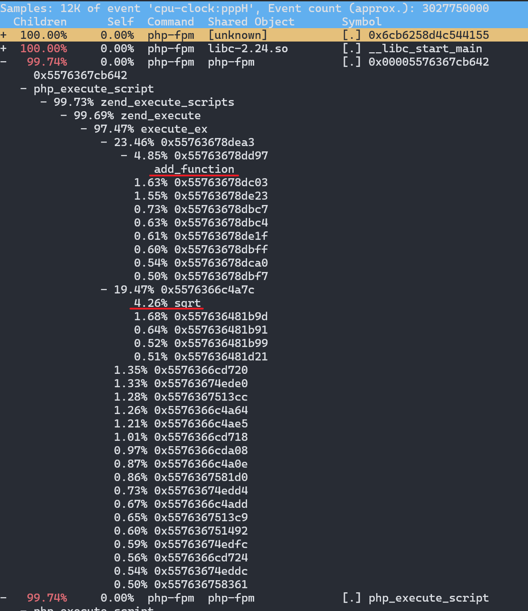
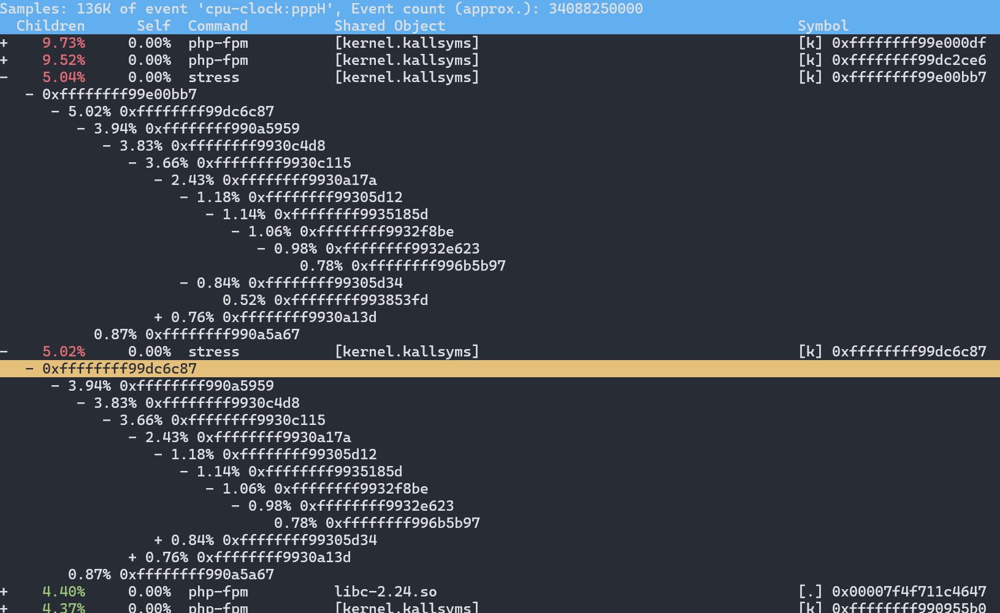

## 内核节拍率和用户态节拍率

为了维护 CPU 时间，Linux 通过事先定义的节拍率（内核中表示为 HZ），触发时间中断，并使用全局变量 Jiffies 记录了开机以来的节拍数。每发生一次时间中断，Jiffies 的值就加 1。

节拍率 HZ 是内核的可配选项，可以设置为 100、250、1000 等。不同的系统可能设置不同数值，你可以通过查询 /boot/config* 内核选项来查看它的配置值。比如在我的系统中，节拍率设置成了 250，也就是每秒钟触发 250 次时间中断。

```shell
$ grep 'CONFIG_HZ=' /boot/config-$(uname -r)
CONFIG_HZ=250
```

正因为节拍率 HZ 是内核选项，所以用户空间程序并不能直接访问。为了方便用户空间程序，内核还提供了一个用户空间节拍率 **USER_HZ**，它总是固定为 100，也就是 1/100 秒。这样，用户空间程序并不需要关心内核中 HZ 被设置成了多少，因为它看到的总是固定值 **USER_HZ**。

## CPU 状态

Linux 通过 /proc 虚拟文件系统，向用户空间提供了系统内部状态的信息，而 /proc/stat 提供的就是系统的 CPU 和任务统计信息。比方说，如果你只关注 CPU 的话，可以执行下面的命令：

```shell
# 只保留各个CPU的数据
$ cat /proc/stat | grep ^cpu
cpu  280580 7407 286084 172900810 83602 0 583 0 0 0
cpu0 144745 4181 176701 86423902 52076 0 301 0 0 0
cpu1 135834 3226 109383 86476907 31525 0 282 0 0 0
```

第一列表示的是 CPU 编号，如 cpu0、cpu1 ，而第一行没有编号的 cpu  ，表示的是所有 CPU 的累加。其他列则表示不同场景下 CPU 的累加节拍数，它的单位是 USER_HZ，也就是 10 ms（1/100 秒），所以这其实就是不同场景下的 CPU 时间。

每一列依次表示如下：

* user（通常缩写为 us），代表用户态 CPU 时间。注意，它不包括下面的 nice 时间，但包括了 guest 时间。
* nice（通常缩写为 ni），代表低优先级用户态 CPU 时间，也就是进程的 nice 值被调整为 1-19 之间时的 CPU 时间。这里注意，nice 可取值范围是 -20 到 19，数值越大，优先级反而越低。
* system（通常缩写为 sys），代表内核态 CPU 时间。
* idle（通常缩写为 id），代表空闲时间。注意，它不包括等待 I/O 的时间（iowait）。
* iowait（通常缩写为 wa），代表等待 I/O 的 CPU 时间。
* irq（通常缩写为 hi），代表处理硬中断的 CPU 时间。
* softirq（通常缩写为 si），代表处理软中断的 CPU 时间。
* steal（通常缩写为 st），代表当系统运行在虚拟机中的时候，被其他虚拟机占用的 CPU 时间。
* guest（通常缩写为 guest），代表通过虚拟化运行其他操作系统的时间，也就是运行虚拟机的 CPU 时间。
* guest_nice（通常缩写为 gnice），代表以低优先级运行虚拟机的时间。

## CPU 使用率

CPU 使用率，就是除了空闲时间外的其他时间占总 CPU 时间的百分比，用公式来表示就是：

$$
\text{CPU 使用率} = 1 - \frac{\text{空闲时间}}{\text{总 CPU 时间}}
$$

为了计算 CPU 使用率，性能工具一般都会取间隔一段时间（比如 3 秒）的两次值，作差后，再计算出这段时间内的平均 CPU 使用率，即

$$
\text{平均 CPU 使用率} = 1 - \frac{\text{空闲时间}_{new} - \text{空闲时间}_{old}}{\text{总 CPU 时间}_{new} - \text{总 CPU 时间}_{old}}
$$


性能分析工具给出的都是间隔一段时间的平均 CPU 使用率，所以要注意间隔时间的设置，特别是用多个工具对比分析时，你一定要保证它们用的是相同的间隔时间。

比如，对比一下 top 和 ps 这两个工具报告的 CPU 使用率，默认的结果很可能不一样，因为 top 默认使用 3 秒时间间隔，而 ps 使用的却是进程的整个生命周期。

## 套路

* 用户 CPU 和 Nice CPU 高，说明用户态进程占用了较多的 CPU，所以应该着重排查进程的性能问题。
* 系统 CPU 高，说明内核态占用了较多的 CPU，所以应该着重排查内核线程或者系统调用的性能问题。
* I/O 等待 CPU 高，说明等待 I/O 的时间比较长，所以应该着重排查系统存储是不是出现了 I/O 问题。
* 软中断和硬中断高，说明软中断或硬中断的处理程序占用了较多的 CPU，所以应该着重排查内核中的中断服务程序。

## 案例

案例机器为阿里云轻量服务器，2 核，1.6G 内存。

### 高 CPU 计算

这个案例要用到两台虚拟机，如下图所示：

其中一台用作 Web 服务器，来模拟性能问题；另一台用作 Web 服务器的客户端，来给 Web 服务增加压力请求。使用两台虚拟机是为了相互隔离，避免“交叉感染”。

运行 Nginx 和 PHP 应用

```shell
$ docker run --name nginx -p 10000:80 -itd feisky/nginx
$ docker run --name phpfpm -itd --network container:nginx feisky/php-fpm
```

访问 `curl http://127.0.0.1:10000/` 返回 `It works` 表明 Nginx 已启动。

来测试一下这个 Nginx 服务的性能。在第二个终端运行下面的 ab 命令：

这里注意不应该用同一台机器压测，会影响压测结果（我是只有一台机器，所以这么做）。

```shell
# 并发10个请求测试Nginx性能，总共测试100个请求
$ ab -c 10 -n 100 http://127.0.0.1:10000/
Benchmarking 127.0.0.1 (be patient).....done


Server Software:        nginx/1.15.4
Server Hostname:        127.0.0.1
Server Port:            10000

Document Path:          /
Document Length:        9 bytes

Concurrency Level:      10
Time taken for tests:   7.141 seconds
Complete requests:      100
Failed requests:        0
Total transferred:      17200 bytes
HTML transferred:       900 bytes
// highlight-start
Requests per second:    14.00 [#/sec] (mean)
Time per request:       714.106 [ms] (mean)
// highlight-end
Time per request:       71.411 [ms] (mean, across all concurrent requests)
Transfer rate:          2.35 [Kbytes/sec] received

Connection Times (ms)
              min  mean[+/-sd] median   max
Connect:        0    0   0.1      0       1
Processing:    79  686 116.8    713     925
Waiting:       76  686 116.9    713     925
Total:         79  686 116.8    713     926

Percentage of the requests served within a certain time (ms)
  50%    713
  66%    722
  75%    731
  80%    739
  90%    760
  95%    774
  98%    904
  99%    926
 100%    926 (longest request)
```

发现 Nginx 能承受的每秒平均请求数只有 14.00 个，平均延迟 714.106 ms。

#### 定位进程

将测试的请求总数增加到 10000。这样当你使用性能分析工具时， Nginx 的压力还是继续。

```shell
$ ab -c 10 -n 10000 http://127.0.0.1:10000/
```

然后执行 top，按下1查看每个 CPU 使用率

```shell
$ top
19:01:54 up  7:02,  3 users,  load average: 4.94, 2.98, 1.30
Tasks: 139 total,   6 running, 133 sleeping,   0 stopped,   0 zombie
%Cpu0  : 99.0 us,  1.0 sy,  0.0 ni,  0.0 id,  0.0 wa,  0.0 hi,  0.0 si,  0.0 st
%Cpu1  : 98.7 us,  1.0 sy,  0.0 ni,  0.0 id,  0.0 wa,  0.0 hi,  0.3 si,  0.0 st
MiB Mem :   1673.0 total,     92.4 free,    361.1 used,   1219.6 buff/cache
MiB Swap:      0.0 total,      0.0 free,      0.0 used.   1100.8 avail Mem

    PID USER      PR  NI    VIRT    RES    SHR S  %CPU  %MEM     TIME+ COMMAND
  42650 daemon    20   0  336700  15128   7452 R  39.9   0.9   1:34.95 php-fpm
  42651 daemon    20   0  336700  15128   7452 R  39.9   0.9   1:34.97 php-fpm
  42649 daemon    20   0  336700  15192   7516 R  39.5   0.9   1:34.59 php-fpm
  42652 daemon    20   0  336700  15128   7452 R  38.9   0.9   1:34.40 php-fpm
  42648 daemon    20   0  336700  15192   7516 R  37.9   0.9   1:35.03 php-fpm
```

系统中有几个 php-fpm 进程的 CPU 使用率加起来接近 200%；而每个 CPU 的用户使用率（us）也已经超过了 98%，接近饱和。这样，我们就可以确认，正是用户空间的 php-fpm 进程，导致 CPU 使用率骤升。

#### 定位函数

怎么知道是 php-fpm 的哪个函数导致了 CPU 使用率升高呢？我们来用 perf 分析一下。在第一个终端运行下面的 perf 命令：

```shell
# -g开启调用关系分析，-p指定php-fpm的进程号42974
$ perf top -g -p 21515
```

然后发现没有符号信息。

由于应用程序运行在容器中，它的依赖也都在容器内部，故而 perf 无法找到 PHP符号表。一个简单的解决方法是使用 perf record 生成 perf.data 拷贝到容器内部 perf report。

这里在容器外直接 `perf record` 和 `perf report` 就直接可以看到符号信息了，不知道为啥。

```shell
$ perf record -g -p 21515
$ perf report
```

用方向键和 e 和 c 键展开调用栈，看到高 CPU 占用率最终掉到 sqrt 和 add_function。




```shell
# 从容器phpfpm中将PHP源码拷贝出来
$ docker cp phpfpm:/app .

# 使用grep查找函数调用
$ grep sqrt -r app/ #找到了sqrt调用
app/index.php:  $x += sqrt($x);
$ grep add_function -r app/ #没找到add_function调用，这其实是PHP内置函数
app/index.php:  $x += sqrt($x);
```

查看源码

```shell
$ cat app/index.php
<?php
// test only.
$x = 0.0001;
for ($i = 0; $i <= 1000000; $i++) {
  $x += sqrt($x);
}

echo "It works!"
```

查看修复后效果

```shell
# 停止原来的应用
$ docker rm -f nginx phpfpm
# 运行优化后的应用
$ docker run --name nginx -p 10000:80 -itd feisky/nginx:cpu-fix
$ docker run --name phpfpm -itd --network container:nginx feisky/php-fpm:cpu-fix
```

RPS 变成 1036.15，平均延迟为 9.651 毫秒

```shell
$ ab -c 10 -n 10000 http://127.0.0.1:10000/
This is ApacheBench, Version 2.3 <$Revision: 1879490 $>

Benchmarking 127.0.0.1 (be patient)
Completed 1000 requests
Completed 2000 requests
Completed 3000 requests
Completed 4000 requests
Completed 5000 requests
Completed 6000 requests
Completed 7000 requests
Completed 8000 requests
Completed 9000 requests
Completed 10000 requests
Finished 10000 requests


Server Software:        nginx/1.15.6
Server Hostname:        127.0.0.1
Server Port:            10000

Document Path:          /
Document Length:        9 bytes

Concurrency Level:      10
Time taken for tests:   9.651 seconds
Complete requests:      10000
Failed requests:        0
Total transferred:      1720000 bytes
HTML transferred:       90000 bytes
// highlight-start
Requests per second:    1036.15 [#/sec] (mean)
Time per request:       9.651 [ms] (mean)
// highlight-end
Time per request:       0.965 [ms] (mean, across all concurrent requests)

Transfer rate:          174.04 [Kbytes/sec] received

Connection Times (ms)
              min  mean[+/-sd] median   max
Connect:        0    0   0.1      0       1
Processing:     1    9   5.6      8      76
Waiting:        1    9   5.2      8      75
Total:          2   10   5.6      8      76

Percentage of the requests served within a certain time (ms)
  50%      8
  66%     10
  75%     11
  80%     12
  90%     15
  95%     18
  98%     25
  99%     31
 100%     76 (longest request)
```

### 整体 CPU 使用率高，但进程 CPU 使用率不高

这个案例要用到两台虚拟机，其中一台用作 Web 服务器，来模拟性能问题；另一台用作 Web 服务器的客户端，来给 Web 服务增加压力请求。使用两台虚拟机是为了相互隔离，避免“交叉感染”。

执行下面的命令运行 Nginx 和 PHP 应用：

```shell
$ docker run --name nginx -p 10000:80 -itd feisky/nginx:sp
$ docker run --name phpfpm -itd --network container:nginx feisky/php-fpm:sp

# 127.0.0.1是第一台虚拟机的IP地址
$ curl http://127.0.0.1:10000/
It works!
```

这里注意不应该用同一台机器压测，会影响压测结果（我是只有一台机器，所以这么做）。

```shell
# 并发100个请求测试Nginx性能，总共测试1000个请求
$ ab -c 100 -n 1000 http://127.0.0.1:10000/
...
Requests per second:    79.26 [#/sec] (mean)
Time per request:       1261.688 [ms] (mean)
...
```

将测试的并发请求数改成 5，同时把请求时长设置为 10 分钟（-t 600）。这样，当你在第一个终端使用性能分析工具时， Nginx 的压力还是继续的。

```shell
$ ab -c 5 -t 600 http://127.0.0.1:10000/
```

top 查看

```shell
$ top
top - 20:21:00 up  8:21,  2 users,  load average: 1.05, 0.32, 0.43
%Cpu(s): 68.7 us, 29.1 sy,  0.0 ni,  1.0 id,  0.0 wa,  0.0 hi,  1.2 si,  0.0 st
MiB Mem :   1673.0 total,     84.0 free,    373.3 used,   1215.7 buff/cache
MiB Swap:      0.0 total,      0.0 free,      0.0 used.   1088.5 avail Mem

    PID USER      PR  NI    VIRT    RES    SHR S  %CPU  %MEM     TIME+ COMMAND
  39487 root      20   0  143120  34568  18888 S   8.3   2.0   2:22.08 AliYunDunMonito
  43784 root      20   0 1819408   5724   2656 S   5.6   0.3   0:01.34 docker-proxy
  43863 systemd+  20   0   33108   3664   2244 S   5.0   0.2   0:01.14 nginx
  46984 daemon    20   0  336700  16368   8688 S   3.3   1.0   0:00.28 php-fpm
  46998 daemon    20   0  336700  16344   8664 S   3.3   1.0   0:00.28 php-fpm
  46978 daemon    20   0  336700  16368   8688 S   3.0   1.0   0:00.29 php-fpm
  46989 daemon    20   0  336700  16432   8752 S   3.0   1.0   0:00.29 php-fpm
  46970 daemon    20   0  336700  16368   8688 S   2.7   1.0   0:00.27 php-fpm
...
```

整体 cpu us 68.7%，sy 29.1%，是比较高的，但是每个进程的CPU占用率都不高。

使用 pidstat 查看

```shell
$ pidstat 1
Linux 5.15.0-107-generic (iZ2ze5ybozvutjqtoe2zk3Z)      09/23/2024      _x86_64_        (2 CPU)

08:25:01 PM   UID       PID    %usr %system  %guest   %wait    %CPU   CPU  Command
08:25:02 PM     0     12755    0.00    0.98    0.00    0.00    0.98     0  aliyun-service
08:25:02 PM     0     38787    0.00    0.98    0.00    0.00    0.98     0  systemd-journal
08:25:02 PM     0     39476    0.98    0.98    0.00    0.00    1.96     1  AliYunDun
08:25:02 PM     0     39487    5.88    2.94    0.00   31.37    8.82     0  AliYunDunMonito
08:25:02 PM     0     42187    0.98    0.00    0.00    0.00    0.98     1  dockerd
08:25:02 PM     0     43784    1.96    3.92    0.00    0.00    5.88     0  docker-proxy
08:25:02 PM     0     43810    2.94    0.00    0.00    0.00    2.94     0  containerd-shim
08:25:02 PM   101     43863    1.96    2.94    0.00    1.96    4.90     1  nginx
08:25:02 PM     0     43918    0.98    0.00    0.00    2.94    0.98     0  php-fpm
08:25:02 PM  1000     46969    0.00    1.96    0.00    0.00    1.96     1  ab
08:25:02 PM     1     46970    0.98    1.96    0.00    2.94    2.94     1  php-fpm
08:25:02 PM     1     46978    0.98    1.96    0.00    1.96    2.94     0  php-fpm
08:25:02 PM     1     46984    0.00    2.94    0.00    1.96    2.94     1  php-fpm
08:25:02 PM     1     46989    0.98    1.96    0.00    1.96    2.94     0  php-fpm
08:25:02 PM     1     46998    0.00    1.96    0.00    2.94    1.96     1  php-fpm
08:25:02 PM  1000    107087    0.00    0.98    0.00    0.00    0.98     1  pidstat
```

发现除了 AliYunDunMonitor iowait 高外😓，其他进程的 CPU 使用率都不高。

再次用 top 仔细观察，发现 7 running，就绪队列中 Running 状态的进程有点多。
然后 nginx 和 php-fpm 进程状态居然都是 Sleep（S），反而有好几个 stress 进程处于 running（R）。

```shell
top - 20:34:01 up  8:34,  2 users,  load average: 4.25, 3.85, 2.81
Tasks: 147 total,   7 running, 140 sleeping,   0 stopped,   0 zombie
%Cpu(s): 70.7 us, 26.7 sy,  0.0 ni,  1.3 id,  0.0 wa,  0.0 hi,  1.3 si,  0.0 st
MiB Mem :   1673.0 total,     90.3 free,    349.5 used,   1233.3 buff/cache
MiB Swap:      0.0 total,      0.0 free,      0.0 used.   1112.3 avail Mem

    PID USER      PR  NI    VIRT    RES    SHR S  %CPU  %MEM     TIME+ COMMAND
  39487 root      20   0  147436  38544  18700 R   8.6   2.2   3:20.76 AliYunDunMonito
  43784 root      20   0 1893780   8464   2720 S   6.0   0.5   0:39.33 docker-proxy
  43863 systemd+  20   0   33108   3664   2244 S   5.3   0.2   0:33.90 nginx
 191129 daemon    20   0  336700  16368   8688 S   3.3   1.0   0:01.89 php-fpm
 191111 daemon    20   0  336700  16368   8688 S   3.0   1.0   0:01.84 php-fpm
 191119 daemon    20   0  336700  16368   8688 S   3.0   1.0   0:01.90 php-fpm
 191126 daemon    20   0  336700  16368   8688 S   3.0   1.0   0:01.84 php-fpm
 191136 daemon    20   0  336700  16368   8688 S   3.0   1.0   0:01.81 php-fpm
 ...
  229114 daemon    20   0    8192   1360    532 R   0.3   0.1   0:00.01 stress
  229116 daemon    20   0    8192   1380    556 R   0.3   0.1   0:00.01 stress
```

用 pidstat 查看 stress 进程。

```shell
$ pidstat -p 229114 1
Linux 5.15.0-107-generic (iZ2ze5ybozvutjqtoe2zk3Z)      09/23/2024      _x86_64_        (2 CPU)

08:38:01 PM   UID       PID    %usr %system  %guest   %wait    %CPU   CPU  Command
```

然后发现什么都没有输出。再用 ps 查看发现这个进程已经没了！

```shell
$ ps aux | grep 229114
admin     288458  0.0  0.1   6480  2476 pts/1    S+   20:39   0:00 grep --color=auto 229114
```

再用 top 查看发现，整体 CPU 负载还是很高，然后又有新的 stress 进程冒出来了，进程号变了。

进程的 PID 在变说明：要么是这些进程在不停地重启，要么就是全新的进程，这无非也就两个原因：

* 第一个原因，进程在不停地崩溃重启，比如因为段错误、配置错误等等，这时，进程在退出后可能又被监控系统自动重启了。
* 第二个原因，这些进程都是短时进程，也就是在其他应用内部通过 exec 调用的外面命令。这些命令一般都只运行很短的时间就会结束，你很难用 top 这种间隔时间比较长的工具发现。

stress 的 PID 在不断变化中，看起来像是被其他进程调用的短时进程。要想继续分析下去，还得找到它们的父进程。

```shell
$ pstree | grep stress -C 3
        |-containerd-shim-+-nginx---2*[nginx]
        |                 `-11*[{containerd-shim}]
        |-containerd-shim-+-php-fpm-+-2*[php-fpm]
// highlight-start
        |                 |         |-php-fpm---sh---stress---stress
// highlight-end
        |                 |         |-php-fpm---sh
        |                 |         `-php-fpm---php-fpm
        |                 `-10*[{containerd-shim}]
```

stress 是被 php-fpm 调用的子进程。找到父进程后，我们能进入 app 的内部分析了。


```shell
# 拷贝源码到本地
$ docker cp phpfpm:/app .

# grep 查找看看是不是有代码在调用stress命令
$ grep stress -r app
app/index.php:// fake I/O with stress (via write()/unlink()).
app/index.php:$result = exec("/usr/local/bin/stress -t 1 -d 1 2>&1", $output, $status);

$ cat app/index.php
<?php
// fake I/O with stress (via write()/unlink()).
$result = exec("/usr/local/bin/stress -t 1 -d 1 2>&1", $output, $status);
if (isset($_GET["verbose"]) && $_GET["verbose"]==1 && $status != 0) {
  echo "Server internal error: ";
  print_r($output);
} else {
  echo "It works!";
}
?>
```

可以看到，源码里对每个请求都会调用一个 stress 命令，模拟 I/O 压力。从注释上看，stress 会通过 `write()` 和 `unlink()` 对 I/O 进程进行压测，看来，这应该就是系统 CPU 使用率升高的根源了。

不过，stress 模拟的是 I/O 压力，而之前在 top 的输出中看到的，却一直是用户 CPU 和系统 CPU 升高，并没见到 iowait 升高。这又是怎么回事呢？stress 到底是不是 CPU 使用率升高的原因呢？

从代码中可以看到，给请求加入 verbose=1 参数后，就可以查看 stress 的输出。

```shell
$ curl http://127.0.0.1:10000/?verbose=1
Server internal error: Array
(
    [0] => stress: info: [351147] dispatching hogs: 0 cpu, 0 io, 0 vm, 1 hdd
    [1] => stress: FAIL: [351151] (563) mkstemp failed: Permission denied
    [2] => stress: FAIL: [351147] (394) <-- worker 351151 returned error 1
    [3] => stress: WARN: [351147] (396) now reaping child worker processes
    [4] => stress: FAIL: [351147] (400) kill error: No such process
    [5] => stress: FAIL: [351147] (451) failed run completed in 0s
)
```

看错误消息 **mkstemp failed: Permission denied** ，以及 **failed run completed in 0s**。原来 stress 命令并没有成功，它因为权限问题失败退出了。看来，我们发现了一个 PHP 调用外部 stress 命令的 bug：没有权限创建临时文件。

从这里我们可以猜测，正是由于权限错误，大量的 stress 进程在启动时初始化失败，进而导致用户 CPU 使用率的升高。

使用 perf 来验证一下猜想

```shell
# 记录性能事件，等待大约15秒后按 Ctrl+C 退出
$ perf record -g

# 查看报告
$ perf report
```



这里不知道为啥没有符号表。借用 [Linux 性能优化实战](https://time.geekbang.org/column/article/70822)课程中的图看一下：


stress 占了所有 CPU 时钟事件的 77%，而 stress 调用调用栈中比例最高的，是随机数生成函数 random()，看来它的确就是 CPU 使用率升高的元凶了。随后的优化就很简单了，只要修复权限问题，并减少或删除 stress 的调用，就可以减轻系统的 CPU 压力。

[execsnoop](https://github.com/brendangregg/perf-tools/blob/master/execsnoop) 是一个专为短时进程设计的工具。它通过 ftrace 实时监控进程的 exec() 行为，并输出短时进程的基本信息，包括进程 PID、父进程 PID、命令行参数以及执行的结果。

这个案例用 execsnoop 就可以直接得到 stress 进程的父进程 PID 以及它的命令行参数，并可以发现大量的 stress 进程在不停启动：

```shell
# 按 Ctrl+C 结束
$ execsnoop
PCOMM            PID    PPID   RET ARGS
sh               30394  30393    0
stress           30396  30394    0 /usr/local/bin/stress -t 1 -d 1
sh               30398  30393    0
stress           30399  30398    0 /usr/local/bin/stress -t 1 -d 1
sh               30402  30400    0
stress           30403  30402    0 /usr/local/bin/stress -t 1 -d 1
sh               30405  30393    0
stress           30407  30405    0 /usr/local/bin/stress -t 1 -d 1
...
```

execsnoop 所用的 ftrace 是一种常用的动态追踪技术，一般用于分析 Linux 内核的运行时行为。
