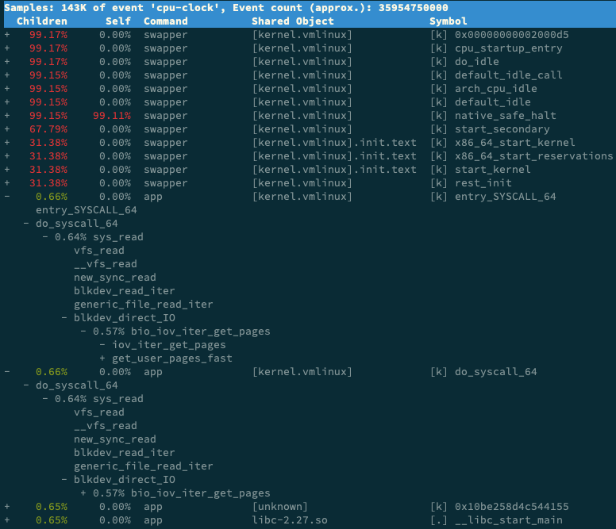

## 进程状态

当 iowait 升高时，进程很可能因为得不到硬件的响应，而长时间处于不可中断状态。从 ps 或者 top 命令的输出中，你可以发现它们都处于 D 状态，也就是不可中断状态（Uninterruptible Sleep）。

 pidstat 中的 `%wait` 跟 top 中的 `iowait%` （缩写为 wa）对比，其实这是没有意义的，因为它们是完全不相关的两个指标。注意这个和 pidstat 中的 `%wait` 不是一个东西：

* pidstat 中， `%wait` 表示进程等待 CPU 的时间百分比。
* top 中 ，`iowait%` 则表示等待 I/O 的 CPU 时间百分比。

等待 CPU 的进程已经在 CPU 的就绪队列中，处于运行状态；而等待 I/O 的进程则处于不可中断状态。

top 和 ps 是最常用的查看进程状态的工具，我们就从 top 的输出开始。下面是一个 top 命令输出的示例，S 列（也就是 Status  列）表示进程的状态。从这个示例里，你可以看到 R、D、Z、S、I 等几个状态，它们分别是什么意思呢？

```shell
$ top
  PID USER      PR  NI    VIRT    RES    SHR S  %CPU %MEM     TIME+ COMMAND
28961 root      20   0   43816   3148   4040 R   3.2  0.0   0:00.01 top
  620 root      20   0   37280  33676    908 D   0.3  0.4   0:00.01 app
    1 root      20   0  160072   9416   6752 S   0.0  0.1   0:37.64 systemd
 1896 root      20   0       0      0      0 Z   0.0  0.0   0:00.00 devapp
    2 root      20   0       0      0      0 S   0.0  0.0   0:00.10 kthreadd
    4 root       0 -20       0      0      0 I   0.0  0.0   0:00.00 kworker/0:0H
    6 root       0 -20       0      0      0 I   0.0  0.0   0:00.00 mm_percpu_wq
    7 root      20   0       0      0      0 S   0.0  0.0   0:06.37 ksoftirqd/0
```

* R 是 Running 或 Runnable 的缩写，表示进程在 CPU 的就绪队列中，正在运行或者正在等待运行。
* D 是 Disk Sleep 的缩写，也就是不可中断状态睡眠（Uninterruptible Sleep），一般表示进程正在跟硬件交互，并且交互过程不允许被其他进程或中断打断。
* Z 是 Zombie 的缩写，它表示僵尸进程，也就是进程实际上已经结束了，但是父进程还没有回收它的资源（比如进程的描述符、PID 等）。
* S 是 Interruptible Sleep 的缩写，也就是可中断状态睡眠，表示进程因为等待某个事件而被系统挂起。当进程等待的事件发生时，它会被唤醒并进入 R 状态。
* I 是 Idle 的缩写，也就是空闲状态，用在不可中断睡眠的内核线程上。前面说了，硬件交互导致的不可中断进程用 D 表示，但对某些内核线程来说，它们有可能实际上并没有任何负载，用 Idle 正是为了区分这种情况。要注意，D 状态的进程会导致平均负载升高， I 状态的进程却不会。
* T 或者 t，也就是 Stopped 或 Traced 的缩写，表示进程处于暂停或者跟踪状态。
  * 向一个进程发送 SIGSTOP 信号，它就会因响应这个信号变成暂停状态（Stopped）；再向它发送 SIGCONT 信号，进程又会恢复运行（如果进程是终端里直接启动的，则需要你用 fg 命令，恢复到前台运行）。
  * 而当你用调试器（如 gdb）调试一个进程时，在使用断点中断进程后，进程就会变成跟踪状态，这其实也是一种特殊的暂停状态，只不过你可以用调试器来跟踪并按需要控制进程的运行。
* X 也就是 Dead 的缩写，表示进程已经消亡，所以你不会在 top 或者 ps 命令中看到它。

先看不可中断状态，这其实是为了保证进程数据与硬件状态一致，并且正常情况下，不可中断状态在很短时间内就会结束。所以，短时的不可中断状态进程，我们一般可以忽略。

但如果系统或硬件发生了故障，进程可能会在不可中断状态保持很久，甚至导致系统中出现大量不可中断进程。这时，你就得注意下，系统是不是出现了 I/O 等性能问题。

再看僵尸进程，这是多进程应用很容易碰到的问题。正常情况下，当一个进程创建了子进程后，它应该通过系统调用 wait() 或者 waitpid() 等待子进程结束，回收子进程的资源；而子进程在结束时，会向它的父进程发送 SIGCHLD 信号，所以，父进程还可以注册 SIGCHLD 信号的处理函数，异步回收资源。

如果父进程没这么做，或是子进程执行太快，父进程还没来得及处理子进程状态，子进程就已经提前退出，那这时的子进程就会变成僵尸进程。换句话说，父亲应该一直对儿子负责，善始善终，如果不作为或者跟不上，都会导致“问题少年”的出现。

僵尸进程持续的时间都比较短，在父进程回收它的资源后就会消亡；或者在父进程退出后，由 init 进程回收后也会消亡。

一旦父进程没有处理子进程的终止，还一直保持运行状态，那么子进程就会一直处于僵尸状态。大量的僵尸进程会用尽 PID 进程号，导致新进程不能创建，所以这种情况一定要避免。

## 套路

下面这个案例是磁盘 I/O 导致了 iowait 升高，不过， **iowait 高不一定代表 I/O 有性能瓶颈。当系统中只有 I/O 类型的进程在运行时，iowait 也会很高，但实际上，磁盘的读写远没有达到性能瓶颈的程度。**

因此，碰到 iowait 升高时，需要先用 dstat、pidstat 等工具，确认是不是磁盘 I/O 的问题，然后再找是哪些进程导致了 I/O。

等待 I/O 的进程一般是不可中断状态，所以用 ps 命令找到的 D 状态（即不可中断状态）的进程，多为可疑进程。但这个案例中，在 I/O 操作后，进程又变成了僵尸进程，所以不能用 strace 直接分析这个进程的系统调用。

这种情况下，我们用了 perf 工具，来分析系统的 CPU 时钟事件，最终发现是直接 I/O 导致的问题。这时，再检查源码中对应位置的问题，就很轻松了。

而僵尸进程的问题相对容易排查，使用 pstree 找出父进程后，去查看父进程的代码，检查 wait() / waitpid() 的调用，或是 SIGCHLD 信号处理函数的注册就行了。

## 案例

### 大量不可中断状态和僵尸状态进程问题

案例机器为阿里云轻量服务器，2 核，1.6G 内存。

```shell
$ sudo docker run --privileged --name=app -itd feisky/app:iowait /app -d /dev/vda3
```

验证应用已经启动

```shell
$ ps aux | grep /app
root      623318  0.0  0.0   4516   820 pts/0    Ss+  21:46   0:00 /app -d /dev/vda3
root      623348  0.2  3.8  70056 65784 pts/0    D+   21:46   0:00 /app -d /dev/vda3
root      623349  0.2  3.8  70056 65776 pts/0    D+   21:46   0:00 /app -d /dev/vda3
root      623356  0.2  3.8  70056 65772 pts/0    D+   21:47   0:00 /app -d /dev/vda3
root      623357  0.2  3.8  70056 65764 pts/0    D+   21:47   0:00 /app -d /dev/vda3
...
```

它们的状态分别是 Ss+ 和 D+。s 表示这个进程是一个会话的领导进程，而 + 表示前台进程组。

进程组表示一组相互关联的进程，比如每个子进程都是父进程所在组的成员；而会话是指共享同一个控制终端的一个或多个进程组。

机器被打爆了😰，直接用[Linux 性能优化实战](https://time.geekbang.org/column/article/71064)原文中的输出结果看：

```shell
# 按下数字 1 切换到所有 CPU 的使用情况，观察一会儿按 Ctrl+C 结束
$ top
top - 05:56:23 up 17 days, 16:45,  2 users,  load average: 2.00, 1.68, 1.39
Tasks: 247 total,   1 running,  79 sleeping,   0 stopped, 115 zombie
%Cpu0  :  0.0 us,  0.7 sy,  0.0 ni, 38.9 id, 60.5 wa,  0.0 hi,  0.0 si,  0.0 st
%Cpu1  :  0.0 us,  0.7 sy,  0.0 ni,  4.7 id, 94.6 wa,  0.0 hi,  0.0 si,  0.0 st
...

  PID USER      PR  NI    VIRT    RES    SHR S  %CPU %MEM     TIME+ COMMAND
 4340 root      20   0   44676   4048   3432 R   0.3  0.0   0:00.05 top
 4345 root      20   0   37280  33624    860 D   0.3  0.0   0:00.01 app
 4344 root      20   0   37280  33624    860 D   0.3  0.4   0:00.01 app
    1 root      20   0  160072   9416   6752 S   0.0  0.1   0:38.59 systemd
...
```

发现负载在升高，已经到达CPU核数。发现 zombie 有 115 个，每个核的 iowait 分别是 60.5% 和 94.6%，都比较高。另外 app 的进程状态是 D（Disk Sleep）。

在终端中运行 dstat 命令，观察 CPU 和 I/O 的使用情况

```shell
# 间隔1秒输出10组数据
$ dstat 1 10
You did not select any stats, using -cdngy by default.
--total-cpu-usage-- -dsk/total- -net/total- ---paging-- ---system--
usr sys idl wai stl| read  writ| recv  send|  in   out | int   csw
  0   0  96   4   0|1219k  408k|   0     0 |   0     0 |  42   885
  0   0   2  98   0|  34M    0 | 198B  790B|   0     0 |  42   138
  0   0   0 100   0|  34M    0 |  66B  342B|   0     0 |  42   135
  0   0  84  16   0|5633k    0 |  66B  342B|   0     0 |  52   177
  0   3  39  58   0|  22M    0 |  66B  342B|   0     0 |  43   144
  0   0   0 100   0|  34M    0 | 200B  450B|   0     0 |  46   147
  0   0   2  98   0|  34M    0 |  66B  342B|   0     0 |  45   134
  0   0   0 100   0|  34M    0 |  66B  342B|   0     0 |  39   131
  0   0  83  17   0|5633k    0 |  66B  342B|   0     0 |  46   168
  0   3  39  59   0|  22M    0 |  66B  342B|   0     0 |  37   134
```

从 dstat 的输出，我们可以看到，每当 iowait 升高（wai）时，磁盘的读请求（read）都会很大。这说明 iowait 的升高跟磁盘的读请求有关，很可能就是磁盘读导致的。

运行 top 命令，观察 D 状态的进程

```shell
# 观察一会儿按 Ctrl+C 结束
$ top
...
  PID USER      PR  NI    VIRT    RES    SHR S  %CPU %MEM     TIME+ COMMAND
 4340 root      20   0   44676   4048   3432 R   0.3  0.0   0:00.05 top
 4345 root      20   0   37280  33624    860 D   0.3  0.0   0:00.01 app
 4344 root      20   0   37280  33624    860 D   0.3  0.4   0:00.01 app
...
```

我们从 top 的输出找到 D 状态进程的 PID，你可以发现，这个界面里有两个 D 状态的进程，PID 分别是 4344 和 4345。

一般要查看某一个进程的资源使用情况，都可以用 pidstat，不过这次记得加上 -d 参数，以便输出 I/O 使用情况。

以 4344 为例，我们在终端里运行下面的 pidstat 命令，并用 -p 4344 参数指定进程号：

```shell
# -d 展示 I/O 统计数据，-p 指定进程号，间隔 1 秒输出 3 组数据
$ pidstat -d -p 4344 1 3
06:38:50      UID       PID   kB_rd/s   kB_wr/s kB_ccwr/s iodelay  Command
06:38:51        0      4344      0.00      0.00      0.00       0  app
06:38:52        0      4344      0.00      0.00      0.00       0  app
06:38:53        0      4344      0.00      0.00      0.00       0  app
```

在这个输出中，kB_rd 表示每秒读的 KB 数， kB_wr 表示每秒写的 KB 数，iodelay 表示 I/O 的延迟（单位是时钟周期）。它们都是 0，那就表示此时没有任何的读写，说明问题不是 4344 进程导致的。可是，用同样的方法分析进程 4345，你会发现，它也没有任何磁盘读写。

我们继续使用 pidstat，但这次去掉进程号，干脆就来观察所有进程的 I/O 使用情况。

```shell
# 间隔 1 秒输出多组数据 (这里是 20 组)
$ pidstat -d 1 20
...
06:48:46      UID       PID   kB_rd/s   kB_wr/s kB_ccwr/s iodelay  Command
06:48:47        0      4615      0.00      0.00      0.00       1  kworker/u4:1
06:48:47        0      6080  32768.00      0.00      0.00     170  app
06:48:47        0      6081  32768.00      0.00      0.00     184  app

06:48:47      UID       PID   kB_rd/s   kB_wr/s kB_ccwr/s iodelay  Command
06:48:48        0      6080      0.00      0.00      0.00     110  app

06:48:48      UID       PID   kB_rd/s   kB_wr/s kB_ccwr/s iodelay  Command
06:48:49        0      6081      0.00      0.00      0.00     191  app

06:48:49      UID       PID   kB_rd/s   kB_wr/s kB_ccwr/s iodelay  Command

06:48:50      UID       PID   kB_rd/s   kB_wr/s kB_ccwr/s iodelay  Command
06:48:51        0      6082  32768.00      0.00      0.00       0  app
06:48:51        0      6083  32768.00      0.00      0.00       0  app

06:48:51      UID       PID   kB_rd/s   kB_wr/s kB_ccwr/s iodelay  Command
06:48:52        0      6082  32768.00      0.00      0.00     184  app
06:48:52        0      6083  32768.00      0.00      0.00     175  app

06:48:52      UID       PID   kB_rd/s   kB_wr/s kB_ccwr/s iodelay  Command
06:48:53        0      6083      0.00      0.00      0.00     105  app
...
```

观察一会儿可以发现，的确是 app 进程在进行磁盘读，并且每秒读的数据有 32 MB，看来就是 app 的问题。不过，app 进程到底在执行啥 I/O 操作呢？

进程想要访问磁盘，就必须使用系统调用，所以接下来，重点就是找出  app 进程的系统调用了。

strace 正是最常用的跟踪进程系统调用的工具。所以，我们从 pidstat 的输出中拿到进程的 PID 号，比如 6082，然后在终端中运行 strace 命令，并用 -p 参数指定 PID 号：

```shell
$ strace -p 6082
strace: attach: ptrace(PTRACE_SEIZE, 6082): Operation not permitted
```

这儿出现了一个奇怪的错误，strace 命令居然失败了，并且命令报出的错误是没有权限。按理来说，我们所有操作都已经是以 root 用户运行了，为什么还会没有权限呢？

一般遇到这种问题时，先检查一下进程的状态是否正常。比如，继续在终端中运行 ps 命令，并使用 grep 找出刚才的 6082 号进程：

```
$ ps aux | grep 6082
root      6082  0.0  0.0      0     0 pts/0    Z+   13:43   0:00 [app] <defunct>
```

果然，进程 6082 已经变成了 Z 状态，也就是僵尸进程。僵尸进程都是已经退出的进程，所以就没法儿继续分析它的系统调用。

系统 iowait 的问题还在继续，但是  top、pidstat  这类工具已经不能给出更多的信息了。这时，我们就应该求助那些基于事件记录的动态追踪工具了。

在终端中运行 perf record，持续一会儿（例如 15 秒），然后按 Ctrl+C 退出，再运行 perf report 查看报告：

```shell
$ perf record -g
$ perf report
```

找到我们关注的 app 进程，按回车键展开调用栈，你就会得到下面这张调用关系图：



这个图里的 swapper 是内核中的调度进程，可以先忽略掉。

我们来看其他信息，你可以发现， app 的确在通过系统调用 `sys_read()` 读取数据。并且从 `new_sync_read` 和 `blkdev_direct_IO`  能看出，进程正在对磁盘进行**直接读**，也就是绕过了系统缓存，每个读请求都会从磁盘直接读，这就可以解释我们观察到的 iowait 升高了。

看来，罪魁祸首是 app 内部进行了磁盘的直接 I/O 啊！

查看源码文件 [app.c](https://github.com/feiskyer/linux-perf-examples/blob/master/high-iowait-process/app.c)，你会发现它果然使用了 `O_DIRECT` 选项打开磁盘，于是绕过了系统缓存，直接对磁盘进行读写。

```c
open(disk, O_RDONLY|O_DIRECT|O_LARGEFILE, 0755)
```

直接读写磁盘，对 I/O 敏感型应用（比如数据库系统）是很友好的，因为你可以在应用中，直接控制磁盘的读写。但在大部分情况下，我们最好还是通过系统缓存来优化磁盘 I/O，换句话说，删除 O_DIRECT 这个选项就是了。

删除 O_DIRECT 后再次尝试 top

```shell
$ top
top - 14:59:32 up 19 min,  1 user,  load average: 0.15, 0.07, 0.05
Tasks: 137 total,   1 running,  72 sleeping,   0 stopped,  12 zombie
%Cpu0  :  0.0 us,  1.7 sy,  0.0 ni, 98.0 id,  0.3 wa,  0.0 hi,  0.0 si,  0.0 st
%Cpu1  :  0.0 us,  1.3 sy,  0.0 ni, 98.7 id,  0.0 wa,  0.0 hi,  0.0 si,  0.0 st
...

  PID USER      PR  NI    VIRT    RES    SHR S  %CPU %MEM     TIME+ COMMAND
 3084 root      20   0       0      0      0 Z   1.3  0.0   0:00.04 app
 3085 root      20   0       0      0      0 Z   1.3  0.0   0:00.04 app
    1 root      20   0  159848   9120   6724 S   0.0  0.1   0:09.03 systemd
    2 root      20   0       0      0      0 S   0.0  0.0   0:00.00 kthreadd
    3 root      20   0       0      0      0 I   0.0  0.0   0:00.40 kworker/0:0
...
```

iowait 已经非常低了，只有 0.3%，说明刚才的改动已经成功修复了 iowait 高的问题。不过，仔细观察僵尸进程的数量，你会郁闷地发现，僵尸进程还在不断的增长中。

既然僵尸进程是因为父进程没有回收子进程的资源而出现的，那么，要解决掉它们，就要找到它们的根儿，**也就是找出父进程，然后在父进程里解决**。

最简单的就是运行 pstree 命令：

```shell
# -a 表示输出命令行选项
# p表PID
# s表示指定进程的父进程
$ pstree -aps 3084
systemd,1
  └─dockerd,15006 -H fd://
      └─docker-containe,15024 --config /var/run/docker/containerd/containerd.toml
          └─docker-containe,3991 -namespace moby -workdir...
              └─app,4009
                  └─(app,3084)
```

运行完，你会发现 3084 号进程的父进程是 4009，也就是 app 应用。

所以，我们接着查看 app 应用程序的代码，看看子进程结束的处理是否正确，比如有没有调用 wait() 或 waitpid() ，抑或是，有没有注册 SIGCHLD 信号的处理函数。

现在我们查看修复 iowait 后的源码文件 [app-fix1.c](https://github.com/feiskyer/linux-perf-examples/blob/master/high-iowait-process/app-fix1.c) ，找到子进程的创建和清理的地方：

```shell
int status = 0;
  for (;;) {
    for (int i = 0; i < 2; i++) {
      if(fork()== 0) {
        sub_process();
      }
    }
    sleep(5);
  }

  while(wait(&status)>0);
```

这段代码虽然看起来调用了 wait() 函数等待子进程结束，但却错误地把 wait() 放到了 for 死循环的外面，也就是说，wait() 函数实际上并没被调用到，我们把它挪到 for 循环的里面就可以了。
