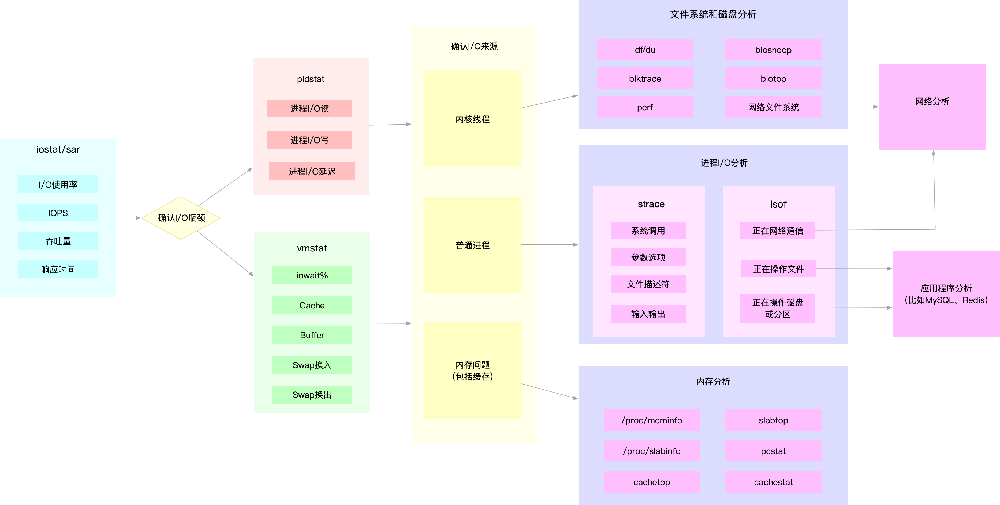

## 文件系统 I/O 性能指标

首先，最容易想到的是**存储空间的使用情况**，包括**容量、使用量以及剩余空间**等。我们通常也称这些为磁盘空间的使用量，因为文件系统的数据最终还是存储在磁盘上。

不过要注意，这些只是文件系统向外展示的空间使用，而非在磁盘空间的真实用量，因为文件系统的元数据也会占用磁盘空间。

如果你配置了 RAID，从文件系统看到的使用量跟实际磁盘的占用空间，也会因为 RAID 级别的不同而不一样。比方说，配置 RAID10 后，你从文件系统最多也只能看到所有磁盘容量的一半。

除了数据本身的存储空间，还有一个**容易忽略的是索引节点的使用情况，它也包括容量、使用量以及剩余量等三个指标**。如果文件系统中存储过多的小文件，就可能碰到索引节点容量已满的问题。

**其次，你应该想到的是前面多次提到过的缓存使用情况，包括页缓存、目录项缓存、索引节点缓存以及各个具体文件系统（如 ext4、XFS 等）的缓存**。这些缓存会使用速度更快的内存，用来临时存储文件数据或者文件系统的元数据，从而可以减少访问慢速磁盘的次数。

此外文件 I/O 也是很重要的性能指标，包括 IOPS（包括 r/s 和 w/s）、响应时间（延迟）以及吞吐量（B/s）等。在考察这类指标时，通常还要考虑实际文件的读写情况。比如，结合文件大小、文件数量、I/O 类型等，综合分析文件 I/O 的性能。

## 磁盘 I/O 性能指标

* 使用率，是指磁盘忙处理 I/O 请求的百分比。过高的使用率（比如超过 60%）通常意味着磁盘 I/O 存在性能瓶颈。
* IOPS（Input/Output Per Second），是指每秒的 I/O 请求数。
* 吞吐量，是指每秒的 I/O 请求大小。
* 响应时间，是指从发出 I/O 请求到收到响应的间隔时间。

考察这些指标时，一定要注意综合 I/O 的具体场景来分析，比如读写类型（顺序还是随机）、读写比例、读写大小、存储类型（有无 RAID 以及 RAID 级别、本地存储还是网络存储）等。

这里有个大忌，就是把不同场景的 I/O 性能指标，直接进行分析对比。这是很常见的一个误区，你一定要避免。

**缓冲区（Buffer）**也是要重点掌握的指标，它经常出现在内存和磁盘问题的分析中。

## 性能工具

### 根据指标找工具

| 性能指标 | 工具 | 说明 |
| --- | --- | --- |
| 文件系统空间容量、使用量以及剩余空间 | `df` | 详细文档见 `info coreutils 'df invocation'` |
| 索引节点容量、使用量以及剩余量 | `df` | 使用 `-i` 选项 |
| 页缓存和可回收 Slab 缓存 | `/proc/meminfo`、`sar`、`vmstat` | 使用 `sar -r` 选项 |
| 缓冲区 | `/proc/meminfo`、`sar`、`vmstat` | 使用 `sar -r` 选项 |
| 目录项、索引节点以及文件系统的缓存 | `/proc/slabinfo`、`slabtop` | `slabtop` 更直观 |
| 磁盘 I/O 使用率、IOPS、吞吐量、响应时间、I/O 平均大小以及等待队列长度 | `iostat` `sar`、`dstat` | 使用 `iostat -d -x` 或 `sar -d` 选项 |
| 进程 I/O 大小以及 I/O 延迟 | `pidstat`、`iotop` | 使用 `pidstat -d` 选项 |
| 块设备 I/O 事件跟踪 | `blktrace` | 示例: `blktrace -d /dev/sda -o- \| blkparse -i- ` |
| 进程 I/O 系统调用跟踪 | `strace` | 通过系统调用跟踪进程的 I/O |
| 进程块设备 I/O 大小跟踪 | `biosnoop`、`biotop` | 需要安装 `bcc` 软件包 |

### 根据工具查指标

当然可以，以下是修改后的表格：

| 性能工具 | 性能指标 |
| --- | --- |
| `iostat` | 磁盘 I/O 使用率、 IOPS、 吞吐量、 响应时间、 I/O 平均大小以及等待队列长度 |
| `pidstat` | 进程 I/O 大小以及 I/O 延迟 |
| `sar` | 磁盘 I/O 使用率、 IOPS、 吞吐量以及响应时间 |
| `dstat` | 磁盘 I/O 使用率、 IOPS以及吞吐量 |
| `iotop` | 按 I/O 大小对进程排序 |
| `slabtop` | 目录项、 索引节点以及文件系统的缓存 |
| `/proc/slabinfo` | 目录项、 索引节点以及文件系统的缓存 |
| `/proc/meminfo` | 页缓存和可回收 Slab 缓存 |
| `/proc/diskstats` | 磁盘的 IOPS、 吞吐量以及延迟 |
| `/proc/pid/io` | 进程 IOPS、 I/O 大小以及 I/O 延迟 |
| `vmstat` | 缓存和缓冲区用量汇总 |
| `blktrace` | 跟踪块设备 I/O 事件 |
| `biosnoop` | 跟踪进程的块设备 I/O 大小 |
| `biotop` | 跟踪进程块 I/O 并按 I/O 大小排序 |
| `strace` | 跟踪进程的 I/O 系统调用 |
| `perf` | 跟踪内核中的 I/O 事件 |
| `df` | 磁盘空间和索引节点使用量和剩余量 |
| `mount` | 文件系统的挂载路径以及挂载参数 |
| `du` | 目录占用的磁盘空间大小 |
| `tune2fs` | 显示和设置文件系统参数 |
| `hdparm` | 显示和设置磁盘参数 |

## 解决问题套路

从 I/O 角度来分析，最开始的分析思路基本上类似，都是：

1. 先用 iostat 发现磁盘 I/O 性能瓶颈；
2. 再借助 pidstat ，定位出导致瓶颈的进程；
3. 随后分析进程的 I/O 行为；
4. 最后，结合应用程序的原理，分析这些 I/O 的来源。

为了缩小排查范围，通常会先运行那几个支持指标较多的工具，如 iostat、vmstat、pidstat 等。

例如，MySQL 和 Redis 案例中，我们就是通过 iostat 确认磁盘出现 I/O 性能瓶颈，然后用 pidstat 找出 I/O 最大的进程，接着借助 strace 找出该进程正在读写的文件，最后结合应用程序的原理，找出大量 I/O 的原因。

再如，当你用 iostat 发现磁盘有 I/O 性能瓶颈后，再用 pidstat 和 vmstat 检查，可能会发现 I/O 来自内核线程，如 Swap 使用大量升高。这种情况下，你就得进行内存分析了，先找出占用大量内存的进程，再设法减少内存的使用。

## I/O 基准测试

fio 可以测试顺序、随机读写。

另外通过 blktrace+fio 的组合使用，可以重放应用 IO，得到应用程序 I/O 模式的基准测试报告。具体可以参考 [fio](../tool/benchmark/fio)。

## I/O 性能优化

### 应用程序优化

- 可以用追加写代替随机写，减少寻址开销，加快 I/O 写的速度。
- 可以借助缓存 I/O ，充分利用系统缓存，降低实际 I/O 的次数。
- 可以在应用程序内部构建自己的缓存，或者用 Redis 这类外部缓存系统。这样，一方面，能在应用程序内部，控制缓存的数据和生命周期；另一方面，也能降低其他应用程序使用缓存对自身的影响。
    - MySQL 案例中，我们已经见识过，只是因为一个干扰应用清理了系统缓存，就会导致 MySQL 查询有数百倍的性能差距（0.1s vs 15s）。再如， C 标准库提供的 fopen、fread 等库函数，都会利用标
    - C 标准库提供的 fopen、fread 等库函数，都会利用标准库的缓存，减少磁盘的操作。而你直接使用 open、read 等系统调用时，就只能利用操作系统提供的页缓存和缓冲区等，而没有库函数的缓存可用。
- 在需要频繁读写同一块磁盘空间时，可以用 mmap 代替 read/write，减少内存的拷贝次数。
- **在需要同步写的场景中，尽量将写请求合并，而不是让每个请求都同步写入磁盘，即可以用 fsync() 取代 O_SYNC。**
- 在多个应用程序共享相同磁盘时，为了保证 I/O 不被某个应用完全占用，推荐你使用 cgroups 的 I/O 子系统，来限制进程 / 进程组的 IOPS 以及吞吐量。
- 在使用 CFQ 调度器时，可以用 ionice 来调整进程的 I/O 调度优先级，特别是提高核心应用的 I/O 优先级。ionice 支持三个优先级类：Idle、Best-effort 和 Realtime。其中， Best-effort 和 Realtime 还分别支持 0-7 的级别，数值越小，则表示优先级别越高。

### 文件系统优化

- 根据实际负载场景的不同，选择最适合的文件系统。比如 Ubuntu 默认使用 ext4 文件系统，而 CentOS 7 默认使用 xfs 文件系统。
  - 相比于 ext4 ，xfs 支持更大的磁盘分区和更大的文件数量，如 xfs 支持大于 16TB 的磁盘。但是 xfs 文件系统的缺点在于无法收缩，而 ext4 则可以。
- 在选好文件系统后，还可以进一步优化文件系统的配置选项，包括文件系统的特性（如 ext_attr、dir_index）、日志模式（如 journal、ordered、writeback）、挂载选项（如 noatime）等等。
  - 比如， 使用 tune2fs 这个工具，可以调整文件系统的特性（tune2fs 也常用来查看文件系统超级块的内容）。 而通过 /etc/fstab ，或者 mount 命令行参数，我们可以调整文件系统的日志模式和挂载选项等。
- 可以优化文件系统的缓存。
  - 比如，你可以优化 pdflush 脏页的刷新频率（比如设置 dirty_expire_centisecs 和 dirty_writeback_centisecs）以及脏页的限额（比如调整 dirty_background_ratio 和 dirty_ratio 等）。
  - 再如，你还可以优化内核回收目录项缓存和索引节点缓存的倾向，即调整 vfs_cache_pressure（/proc/sys/vm/vfs_cache_pressure，默认值 100），数值越大，就表示越容易回收。
- 在不需要持久化时，你还可以用内存文件系统  tmpfs，以获得更好的 I/O 性能 。tmpfs 把数据直接保存在内存中，而不是磁盘中。比如 /dev/shm/ ，就是大多数 Linux 默认配置的一个内存文件系统，它的大小默认为总内存的一半。

### 磁盘优化

- 最简单有效的优化方法，就是换用性能更好的磁盘，比如用 SSD 替代 HDD。
- 我们可以使用 RAID ，把多块磁盘组合成一个逻辑磁盘，构成冗余独立磁盘阵列。这样做既可以提高数据的可靠性，又可以提升数据的访问性能。
- 针对磁盘和应用程序 I/O 模式的特征，我们可以选择最适合的 I/O 调度算法。比方说，SSD 和虚拟机中的磁盘，通常用的是 noop 调度算法。而数据库应用，我更推荐使用 deadline 算法。
- 我们可以对应用程序的数据，进行磁盘级别的隔离。比如，我们可以为日志、数据库等 I/O 压力比较重的应用，配置单独的磁盘。
- 在顺序读比较多的场景中，我们可以增大磁盘的预读数据，比如，你可以通过下面两种方法，调整 /dev/sdb 的预读大小。
  - 调整内核选项 /sys/block/sdb/queue/read_ahead_kb，默认大小是 128 KB，单位为 KB。
  - 使用 blockdev 工具设置，比如 blockdev --setra 8192 /dev/sdb，注意这里的单位是 512B（0.5KB），所以它的数值总是 read_ahead_kb 的两倍。
- 我们可以优化内核块设备 I/O 的选项。比如，可以调整磁盘队列的长度 /sys/block/sdb/queue/nr_requests，适当增大队列长度，可以提升磁盘的吞吐量（当然也会导致 I/O 延迟增大）。
- 磁盘本身出现硬件错误，也会导致 I/O 性能急剧下降，所以发现磁盘性能急剧下降时，你还需要确认，磁盘本身是不是出现了硬件错误。
  - 比如，你可以查看 dmesg 中是否有硬件 I/O 故障的日志。 还可以使用 badblocks、smartctl 等工具，检测磁盘的硬件问题，或用 e2fsck 等来检测文件系统的错误。如果发现问题，你可以使用 fsck 等工具来修复。

