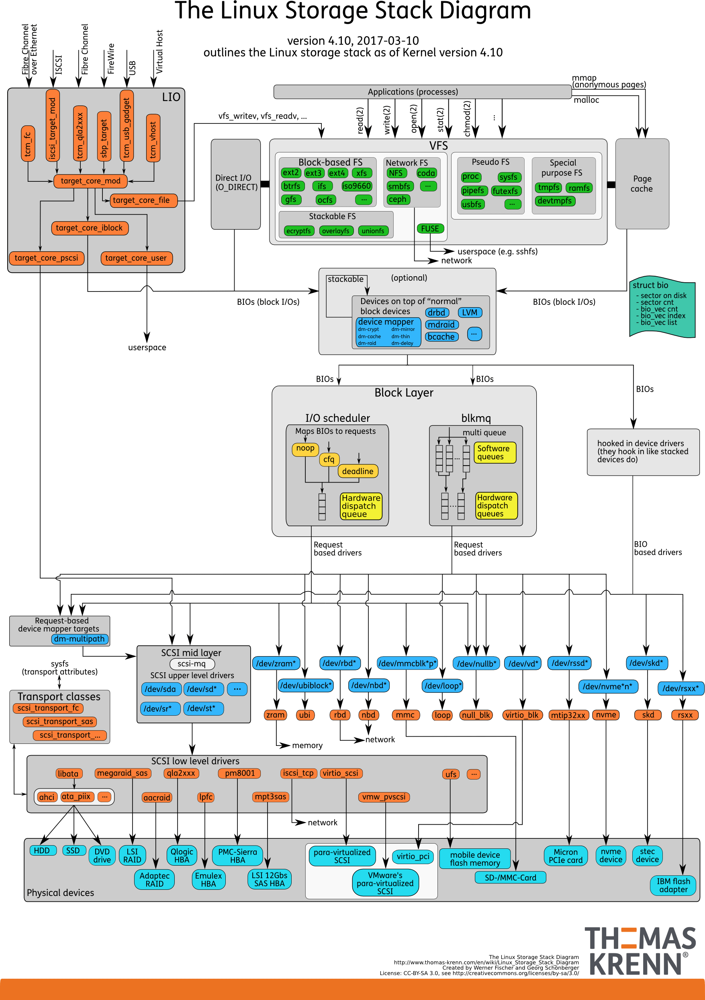

## 磁盘

对固态磁盘来说，虽然它的随机性能比机械硬盘好很多，但同样存在“先擦除再写入”的限制。随机读写会导致大量的垃圾回收，所以相对应的，随机 I/O 的性能比起连续 I/O 来，也还是差了很多。

连续 I/O 还可以通过预读的方式，来减少 I/O 请求的次数，这也是其性能优异的一个原因。很多性能优化的方案，也都会从这个角度出发，来优化 I/O 性能。

机械磁盘和固态磁盘还分别有一个最小的读写单位。

* 机械磁盘的最小读写单位是**扇区**，一般大小为 512 字节。
* 而固态磁盘的最小读写单位是**页**，通常大小是 4KB、8KB 等。

如果每次都读写 512 字节这么小的单位的话，效率很低。所以，文件系统会把连续的扇区或页，组成逻辑块，然后以逻辑块作为最小单元来管理数据。常见的逻辑块的大小是 4KB，也就是说，连续 8 个扇区，或者单独的一个页，都可以组成一个逻辑块。


按照接口来分类，比如可以把硬盘分为 IDE（Integrated Drive Electronics）、SCSI（Small Computer System Interface） 、SAS（Serial Attached SCSI） 、SATA（Serial ATA） 、FC（Fibre Channel） 等。

除了磁盘本身的分类外，当你把磁盘接入服务器后，按照不同的使用方式，又可以把它们划分为多种不同的架构。

最简单的，就是直接作为独立磁盘设备来使用。这些磁盘，往往还会根据需要，划分为不同的逻辑分区，每个分区再用数字编号。比如我们前面多次用到的 /dev/sda ，还可以分成两个分区 /dev/sda1 和 /dev/sda2。

另一个比较常用的架构，是把多块磁盘组合成一个逻辑磁盘，构成冗余独立磁盘阵列，也就是 RAID（Redundant Array of Independent Disks），从而可以提高数据访问的性能，并且增强数据存储的可靠性。

根据容量、性能和可靠性需求的不同，RAID 一般可以划分为多个级别，如 RAID0、RAID1、RAID5、RAID10 等。

* RAID0 有最优的读写性能，但不提供数据冗余的功能。
* 而其他级别的 RAID，在提供数据冗余的基础上，对读写性能也有一定程度的优化。

最后一种架构，是把这些磁盘组合成一个网络存储集群，再通过 NFS、SMB、iSCSI 等网络存储协议，暴露给服务器使用。

在 Linux 中，**磁盘实际上是作为一个块设备来管理的**，也就是**以块为单位读写数据**，并且**支持随机读写**。每个块设备都会被赋予两个设备号，分别是主、次设备号。主设备号用在驱动程序中，用来区分设备类型；而次设备号则是用来给多个同类设备编号。

## 通用块层

为了减小不同块设备的差异带来的影响，Linux 通过一个统一的通用块层，来管理各种不同的块设备。

通用块层，其实是处在文件系统和磁盘驱动中间的一个块设备抽象层。它主要有两个功能 。

- 第一个功能跟虚拟文件系统的功能类似。向上，为文件系统和应用程序，提供访问块设备的标准接口；向下，把各种异构的磁盘设备抽象为统一的块设备，并提供统一框架来管理这些设备的驱动程序。
- 第二个功能，通用块层还会给文件系统和应用程序发来的 I/O 请求排队，并通过重新排序、请求合并等方式，提高磁盘读写的效率。

对 I/O 请求排序的过程，也就是我们熟悉的 I/O 调度。事实上，Linux 内核支持四种 I/O 调度算法，分别是 NONE、NOOP、CFQ 以及 DeadLine。

- NONE ，更确切来说，并不能算 I/O 调度算法。因为它完全不使用任何 I/O 调度器，对文件系统和应用程序的 I/O 其实不做任何处理，常用在虚拟机中（此时磁盘 I/O 调度完全由物理机负责）。
- NOOP ，是最简单的一种 I/O 调度算法。它实际上是一个先入先出的队列，只做一些最基本的请求合并，常用于 SSD 磁盘。
- CFQ（Completely Fair Scheduler），也被称为完全公平调度器，是现在很多发行版的默认 I/O 调度器，它为每个进程维护了一个 I/O 调度队列，并按照时间片来均匀分布每个进程的 I/O 请求。类似于进程 CPU 调度，CFQ 还支持进程 I/O 的优先级调度，所以它适用于运行大量进程的系统，像是桌面环境、多媒体应用等。
- DeadLine 调度算法，分别为读、写请求创建了不同的 I/O 队列，可以提高机械磁盘的吞吐量，并确保达到最终期限（deadline）的请求被优先处理。DeadLine 调度算法，多用在 I/O 压力比较重的场景，比如数据库等。

## I/O 栈

我们可以把 Linux 存储系统的 I/O 栈，由上到下分为三个层次，分别是文件系统层、通用块层和设备层。这三个 I/O 层的关系如下图所示，这其实也是 [Linux 存储系统的 I/O 栈全景图](https://www.thomas-krenn.com/en/wiki/Linux_Storage_Stack_Diagram)。



根据这张 I/O 栈的全景图，我们可以更清楚地理解，存储系统 I/O 的工作原理。

* 文件系统层，包括虚拟文件系统和其他各种文件系统的具体实现。它为上层的应用程序，提供标准的文件访问接口；对下会通过通用块层，来存储和管理磁盘数据。
* 通用块层，包括块设备 I/O 队列和 I/O 调度器。它会对文件系统的 I/O 请求进行排队，再通过重新排序和请求合并，然后才要发送给下一级的设备层。
* 设备层，包括存储设备和相应的驱动程序，负责最终物理设备的 I/O 操作。

存储系统的 I/O ，通常是整个系统中最慢的一环。所以， Linux 通过多种缓存机制来优化 I/O 效率。

比方说，为了优化文件访问的性能，会使用页缓存、索引节点缓存、目录项缓存等多种缓存机制，以减少对下层块设备的直接调用。

同样，为了优化块设备的访问效率，会使用缓冲区，来缓存块设备的数据。

## 磁盘性能指标

五个常见指标

- 使用率，是指磁盘处理 I/O 的时间百分比。过高的使用率（比如超过 80%），通常意味着磁盘 I/O 存在性能瓶颈。
- 饱和度，是指磁盘处理 I/O 的繁忙程度。过高的饱和度，意味着磁盘存在严重的性能瓶颈。当饱和度为 100% 时，磁盘无法接受新的 I/O 请求。
- IOPS（Input/Output Per Second），是指每秒的 I/O 请求数。
- 吞吐量，是指每秒的 I/O 请求大小。
- 响应时间，是指 I/O 请求从发出到收到响应的间隔时间。

使用率只考虑有没有 I/O，而不考虑 I/O 的大小。换句话说，当使用率是 100% 的时候，磁盘依然有可能接受新的 I/O 请求。

不要孤立地去比较某一指标，而要结合读写比例、I/O 类型（随机还是连续）以及 I/O 的大小，综合来分析。

例如，在数据库、大量小文件等这类随机读写比较多的场景中，IOPS 更能反映系统的整体性能；而在多媒体等顺序读写较多的场景中，吞吐量才更能反映系统的整体性能。

一般来说，我们在为应用程序的服务器选型时，要先对磁盘的 I/O 性能进行基准测试，以便可以准确评估，磁盘性能是否可以满足应用程序的需求。

推荐用性能测试工具 fio ，来测试磁盘的 IOPS、吞吐量以及响应时间等核心指标。但还是那句话，因地制宜，灵活选取。在基准测试时，一定要注意根据应用程序 I/O 的特点，来具体评估指标。

用性能工具得到的这些指标，可以作为后续分析应用程序性能的依据。一旦发生性能问题，你就可以把它们作为磁盘性能的极限值，进而评估磁盘 I/O 的使用情况。

##  磁盘 I/O 观测

观测每块磁盘的使用情况。

```shell
# -d -x表示显示所有磁盘I/O的指标
$ iostat -d -x 1 
Device            r/s     w/s     rkB/s     wkB/s   rrqm/s   wrqm/s  %rrqm  %wrqm r_await w_await aqu-sz rareq-sz wareq-sz  svctm  %util 
loop0            0.00    0.00      0.00      0.00     0.00     0.00   0.00   0.00    0.00    0.00   0.00     0.00     0.00   0.00   0.00 
loop1            0.00    0.00      0.00      0.00     0.00     0.00   0.00   0.00    0.00    0.00   0.00     0.00     0.00   0.00   0.00 
sda              0.00    0.00      0.00      0.00     0.00     0.00   0.00   0.00    0.00    0.00   0.00     0.00     0.00   0.00   0.00 
sdb              0.00    0.00      0.00      0.00     0.00     0.00   0.00   0.00    0.00    0.00   0.00     0.00     0.00   0.00   0.00 
```

指标具体含义参考 [iostat](../tool/iostat)。

## 进程 I/O 观测

```bash
$ pidstat -d 1 
13:39:51      UID       PID   kB_rd/s   kB_wr/s kB_ccwr/s iodelay  Command 
13:39:52      102       916      0.00      4.00      0.00       0  rsyslogd
```

* 每秒读取的数据大小（kB_rd/s） ，单位是 KB。
* 每秒发出的写请求数据大小（kB_wr/s） ，单位是 KB。
* 每秒取消的写请求数据大小（kB_ccwr/s） ，单位是 KB。
* 块 I/O 延迟（iodelay），包括等待同步块 I/O 和换入块 I/O 结束的时间，单位是时钟周期。


```shell
$ iotop
Total DISK READ :       0.00 B/s | Total DISK WRITE :       7.85 K/s 
Actual DISK READ:       0.00 B/s | Actual DISK WRITE:       0.00 B/s 
  TID  PRIO  USER     DISK READ  DISK WRITE  SWAPIN     IO>    COMMAND 
15055 be/3 root        0.00 B/s    7.85 K/s  0.00 %  0.00 % systemd-journald 
```

指标具体含义参考 [iotop](../tool/iotop)。
