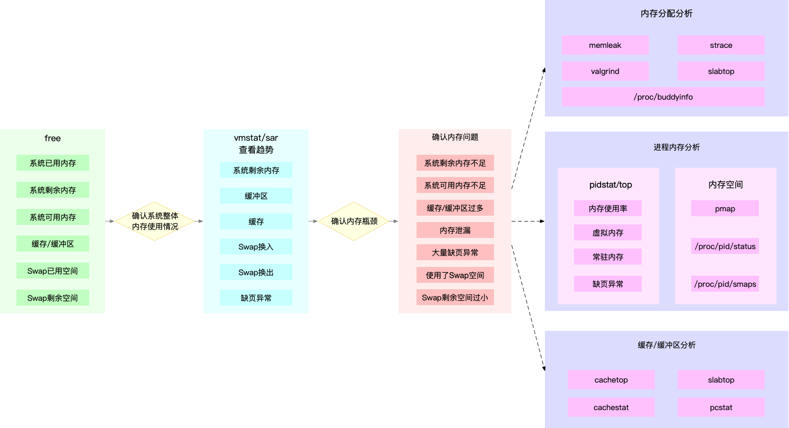

## 内存性能指标

### 系统内存使用情况

- 已用内存和剩余内存很容易理解，就是已经使用和还未使用的内存。
- 共享内存是通过 tmpfs 实现的，所以它的大小也就是 tmpfs 使用的内存大小。tmpfs 其实也是一种特殊的缓存。
- 可用内存是新进程可以使用的最大内存，它包括剩余内存和可回收缓存。
- 缓存包括两部分，一部分是磁盘读取文件的页缓存，用来缓存从磁盘读取的数据，可以加快以后再次访问的速度。另一部分，则是 Slab 分配器中的可回收内存。
- 缓冲区是对原始磁盘块的临时存储，用来缓存将要写入磁盘的数据。这样，内核就可以把分散的写集中起来，统一优化磁盘写入。

### 进程内存使用情况

- 虚拟内存，包括了进程代码段、数据段、共享内存、已经申请的堆内存和已经换出的内存等。这里要注意，已经申请的内存，即使还没有分配物理内存，也算作虚拟内存。
- 常驻内存是进程实际使用的物理内存，不过，它不包括 Swap 和共享内存。
- 共享内存，既包括与其他进程共同使用的真实的共享内存，还包括了加载的动态链接库以及程序的代码段等。
- Swap 内存，是指通过 Swap 换出到磁盘的内存。

这些指标中，常驻内存一般会换算成占系统总内存的百分比，也就是进程的内存使用率。

#### 缺页异常

缺页异常又分为下面两种场景。

- 可以直接从物理内存中分配时，被称为**次缺页异常(Minor Page Faults)**。
- 需要磁盘 I/O 介入（比如 Swap）时，被称为**主缺页异常（Major Page Faults）**。
  - 文件映射：当进程访问映射到虚拟内存中的文件（例如，通过 mmap）时，如果相关数据不在内存中，会导致主缺页异常。
  - 共享库加载：访问未加载的共享库时，系统需要从磁盘加载库文件，这也会导致主缺页异常。
  - 大文件访问：处理超出当前物理内存的文件时，系统可能需要将部分文件页从磁盘读入内存。

主缺页异常升高，就意味着需要磁盘 I/O，那么内存访问也会慢很多。

使用 top 按下 f，可以配置显示这 2 个数据

```shell
* nMaj    = Major Page Faults
* nMin    = Minor Page Faults
* vMj     = Major Faults delta # 指定时间内的主缺页中断次数增量
* vMn     = Minor Faults delta # 指定时间内的次缺页中断次数增量
```

### Swap 的使用情况

比如 Swap 的已用空间、剩余空间、换入速度和换出速度等。

## 根据指标找工具

| 内存指标 | 性能工具 |
| --- | --- |
| 系统已用、可用、剩余内存 | free<br/>vmstat<br/>sar<br/> `/proc/meminfo` |
| 进程虚拟内存、常驻内存、共享内存 | ps<br/>top |
| 进程内存分布 | pmap |
| 进程 Swap 换出内存 | top<br/> `/proc/pid/status` |
| 进程缺页异常 | ps<br/>top |
| 系统换页情况 | sar |
| 缓存/缓冲区用量 | free<br/>vmstat<br/>sar<br/>cachestat |
| 缓存/缓冲区命中率 | cachetop |
| SWAP 已用空间和剩余空间 | free<br/>sar |
| Swap 换入换出 | vmstat |
| 内存泄漏检测 | memleak<br/>valgrind |
| 指定文件的缓存大小 | pcstat |

## 根据指标找工具

| 性能工具 | 内存指标 |
| --- | --- |
| free<br/> `/proc/meminfo` | 系统已用、可用、剩余内存以及缓存和缓冲区 的使用量 |
| top<br/>ps | 进程虚拟、常驻、共享内存以及缺页异常 |
| vmstat | 系统剩余内存、缓存、缓冲区、换入、换出 |
| sar | 系统内存换页情况、内存使用率、缓存和缓冲 区用量以及 Swap 使用情况 |
| cachest at | 系统缓存和缓冲区的命中率 |
| cachetop | 进程缓存和缓冲区的命中率 |
| slabtop | 系统 Slab 缓存使用情况 |
| `/proc/pid/status` | 进程 Swap 内存等 |
| `/proc/pid/smaps` <br/>pmap | 进程地址空间和内存状态 |
| valgrind | 进程内存错误检查器,用来检测内存初始化、 泄漏、越界访问等各种内存错误 |
| memleak | 内存泄漏检测 |
| pcstat | 查看指定文件的缓存情况 |

##  内存问题定位思路

为了迅速定位内存问题，通常会先运行几个覆盖面比较大的性能工具，比如 free、top、vmstat、pidstat 等。

1. 先用 free 和 top，查看系统整体的内存使用情况。
2. 再用 vmstat 和 pidstat，查看一段时间的趋势，从而判断出内存问题的类型。
3. 最后进行详细分析，比如内存分配分析、缓存 / 缓冲区分析、具体进程的内存使用分析等。



第一个例子，当你通过 free，发现大部分内存都被缓存占用后，可以使用 vmstat 或者 sar 观察一下缓存的变化趋势，确认缓存的使用是否还在继续增大。

如果继续增大，则说明导致缓存升高的进程还在运行，那你就能用缓存 / 缓冲区分析工具（比如 cachetop、slabtop 等），分析这些缓存到底被哪里占用。

第二个例子，当你 free 一下，发现系统可用内存不足时，首先要确认内存是否被缓存 / 缓冲区占用。排除缓存 / 缓冲区后，你可以继续用 pidstat 或者 top，定位占用内存最多的进程。

找出进程后，再通过进程内存空间工具（比如 pmap），分析进程地址空间中内存的使用情况就可以了。

第三个例子，当你通过 vmstat 或者 sar 发现内存在不断增长后，可以分析中是否存在内存泄漏的问题。

比如你可以使用内存分配分析工具 memleak ，检查是否存在内存泄漏。如果存在内存泄漏问题，memleak 会为你输出内存泄漏的进程以及调用堆栈。

## 优化手段

内存调优最重要的就是，保证应用程序的热点数据放到内存中，并尽量减少换页和交换。

- 最好禁止 Swap。如果必须开启 Swap，降低 swappiness 的值，减少内存回收时 Swap 的使用倾向。
- 减少内存的动态分配。比如，可以使用内存池、大页（HugePage）等。
- 尽量使用缓存和缓冲区来访问数据。比如，可以使用堆栈明确声明内存空间，来存储需要缓存的数据；或者用 Redis 这类的外部缓存组件，优化数据的访问。
- 使用 cgroups 等方式限制进程的内存使用情况。这样，可以确保系统内存不会被异常进程耗尽。
- 通过 /proc/pid/oom_adj ，调整核心应用的 oom_score。这样，可以保证即使内存紧张，核心应用也不会被 OOM 杀死。

