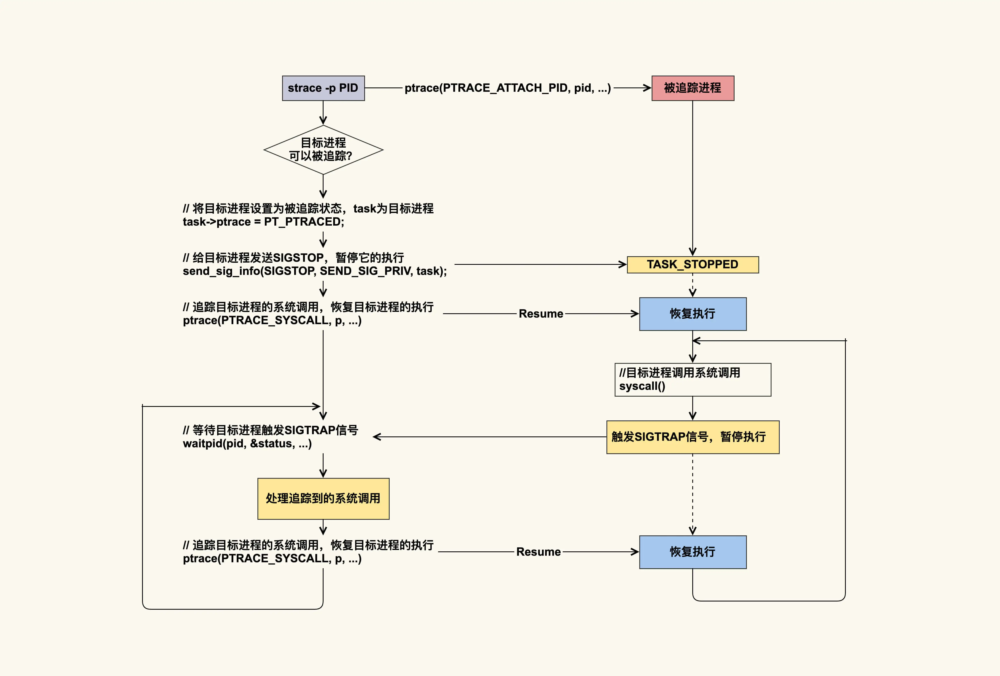

#### 统计5秒内
```bash
# -c 表示统计每个系统调用的时间和次数
$ timeout 5 strace -c -fp 7504
strace: Process 7504 attached with 7 threads
strace: Process 7504 detached
strace: Process 7505 detached
strace: Process 7506 detached
strace: Process 7507 detached
strace: Process 7508 detached
strace: Process 7509 detached
strace: Process 7510 detached
% time     seconds  usecs/call     calls    errors syscall
------ ----------- ----------- --------- --------- ----------------
 42.31    0.000033           8         4           epoll_pwait
 41.03    0.000032          16         2           write
 16.67    0.000013           6         2           read
------ ----------- ----------- --------- --------- ----------------
100.00    0.000078                     8           total
```

#### 分进程号输出 strace

- `-T`：显示每个系统调用所花费的时间。
- `-tt`：在输出的每一行前加上时间戳，精确到微秒。
- `-ff`：如果跟踪多个进程（通过 `-p` 指定多个 PID 或跟踪一个进程组），为每个进程的跟踪输出生成单独的文件，文件名的形式为 `strace.out.PID`。
- `-p pid`：指定要跟踪的进程 ID。

```bash
$ sudo strace -T -tt -ff -p 71991 -o strace.out

$ ls strace.out.*
strace.out.71991  strace.out.71993  strace.out.71995  strace.out.71998  strace.out.72000  strace.out.72002  strace.out.72369  strace.out.91169
strace.out.71992  strace.out.71994  strace.out.71997  strace.out.71999  strace.out.72001  strace.out.72054  strace.out.91107  strace.out.91180

$ head strace.out.71991
21:49:52.673362 epoll_pwait(14, [], 1024, 149, NULL, 8) = 0 <0.149267>
21:49:52.822866 epoll_pwait(14, [], 1024, 0, NULL, 8) = 0 <0.000032>
21:49:52.822956 epoll_pwait(14, [], 1024, 330, NULL, 8) = 0 <0.330523>
21:49:53.153805 futex(0x55efaac, FUTEX_WAKE_PRIVATE, 1) = 1 <0.000092>
21:49:53.154073 epoll_pwait(14, [], 1024, 0, NULL, 8) = 0 <0.000180>
21:49:53.154300 epoll_pwait(14, [{EPOLLIN, {u32=17, u64=17}}], 1024, 147, NULL, 8) = 1 <0.000523>
21:49:53.154868 read(17, "\1\0\0\0\0\0\0\0", 1024) = 8 <0.000027>
21:49:53.155117 write(17, "\1\0\0\0\0\0\0\0", 8) = 8 <0.000021>
21:49:53.155262 futex(0x55efaac, FUTEX_WAKE_PRIVATE, 1) = 1 <0.000215>
21:49:53.155531 futex(0x55efa40, FUTEX_WAKE_PRIVATE, 1) = 0 <0.000092>
```

## 原理



目标进程每执行一次系统调用都会被打断，等 strace 处理完后，目标进程才能继续执行，这就会给目标进程带来比较明显的延迟。因此，在生产环境中不建议使用该命令，如果你要使用该命令来追踪生产环境的问题，那就一定要做好预案。