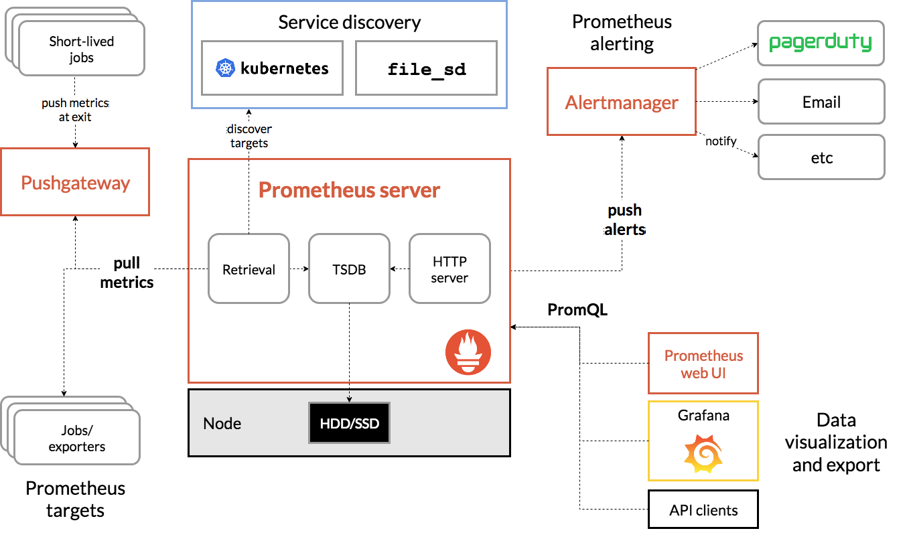
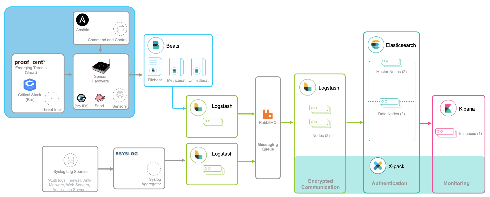

## 系统监控

### USE 法

性能监控的 USE（Utilization Saturation and Errors）法。USE 法把**系统资源**的性能指标，简化成了三个类别，即**使用率**、**饱和度**以及**错误数**。

- 使用率（Utilization），表示资源用于服务的时间或容量百分比。100% 的使用率，表示容量已经用尽或者全部时间都用于服务。
- 饱和度（Saturation），表示资源的繁忙程度，通常与等待队列的长度相关。100% 的饱和度，表示资源无法接受更多的请求。
- 错误数（Errors）表示发生错误的事件个数。错误数越多，表明系统的问题越严重。

### 常见指标分类 (USE 法)

| 资源 | 类型 | 性能指标 |
| --- | --- | --- |
| CPU | 使用率 | CPU 使用率 |
| CPU | 饱和度 | 运行队列长度或平均负载 |
| CPU | 错误数 | 硬件 CPU 错误数 |
| 内存 | 使用率 | 已用内存百分比或 SWAP 用量百分比 |
| 内存 | 饱和度 | 内存换页量 |
| 内存 | 错误数 | 内存分配失败或 OOM（Out Of Memory） |
| 存储设备 I/O | 使用率 | 设备 I/O 时间百分比 |
| 存储设备 I/O | 饱和度 | 等待队列长度或延迟 |
| 存储设备 I/O | 错误数 | I/O 错误数 |
| 文件系统 | 使用率 | 已用容量百分比 |
| 文件系统 | 饱和度 | 已用容量百分比 |
| 文件系统 | 错误数 | 文件读写错误数 |
| 网络 | 使用率 | 带宽使用率 |
| 网络 | 饱和度 | 重传报文数 |
| 网络 | 错误数 | 网卡收发错误数、丢包数 |
| 文件描述符 | 使用率 | 已用文件描述符数百分比 |
| 连接跟踪 | 使用率 | 已用连接跟踪数百分比 |
| 连接数 | 饱和度 | TIME_WAIT 状态连接数 |

USE 方法只关注能体现系统资源性能瓶颈的核心指标，但这并不是说其他指标不重要。诸如系统日志、进程资源使用量、缓存使用量等其他各类指标，也都需要我们监控起来。只不过，它们通常用作辅助性能分析，而 USE 方法的指标，则直接表明了系统的资源瓶颈。

### 监控系统

Prometheus targets 就是数据采集的对象，而 Retrieval 则负责采集这些数据。从图中你也可以看到，Prometheus 同时支持 Push 和 Pull 两种数据采集模式。

- Pull 模式，由服务器端的采集模块来触发采集。只要采集目标提供了 HTTP 接口，就可以自由接入（这也是最常用的采集模式）。
- Push 模式，则是由各个采集目标主动向 Push Gateway（用于防止数据丢失）推送指标，再由服务器端从 Gateway 中拉取过去（这是移动应用中最常用的采集模式）。

Prometheus 还提供了服务发现的机制，可以自动根据预配置的规则，动态发现需要监控的对象。这在 Kubernetes 等容器平台中非常有效。

数据存储模块。为了保持监控数据的持久化，图中的 TSDB（Time series database）模块，负责将采集到的数据持久化到 SSD 等磁盘设备中。TSDB 是专门为时间序列数据设计的一种数据库，特点是以时间为索引、数据量大并且以追加的方式写入。

数据查询和处理模块。刚才提到的 TSDB，在存储数据的同时，其实还提供了数据查询和基本的数据处理功能，而这也就是 PromQL 语言。PromQL 提供了简洁的查询、过滤功能，并且支持基本的数据处理方法，是告警系统和可视化展示的基础。

告警模块。右上角的 AlertManager 提供了告警的功能，包括基于 PromQL 语言的触发条件、告警规则的配置管理以及告警的发送等。不过，虽然告警是必要的，但过于频繁的告警显然也不可取。所以，AlertManager 还支持通过分组、抑制或者静默等多种方式来聚合同类告警，并减少告警数量。

最后一个是可视化展示模块。Prometheus 的 web UI 提供了简单的可视化界面，用于执行 PromQL 查询语句，但结果的展示比较单调。不过，一旦配合 Grafana，就可以构建非常强大的图形界面了。

## 应用监控

- 黄金指标：**请求数、错误率和响应时间**
- 其他
  - 应用进程的**资源使用情况**。比如进程占用的 CPU、内存、磁盘 I/O、网络等。使用过多的系统资源，导致应用程序响应缓慢或者错误数升高，是一个最常见的性能问题。
  - 应用程序之间**调用情况**。比如调用频率、错误数、延时等。由于应用程序并不是孤立的，如果其依赖的其他应用出现了性能问题，应用自身性能也会受到影响。
  - 应用程序**内部核心逻辑的运行**情况。比如关键环节的耗时以及执行过程中的错误等。由于这是应用程序内部的状态，从外部通常无法直接获取到详细的性能数据。所以，应用程序在设计和开发时，就应该把这些指标提供出来，以便监控系统可以了解其内部运行状态。

追踪

## 日志监控

ELK 技术栈，即 Elasticsearch、Logstash 和 Kibana 这三个组件的组合。

Logstash 资源消耗比较大。在资源紧张的环境中，往往使用资源消耗更低的 Fluentd，来替代 Logstash（也就是所谓的 EFK 技术栈）。

